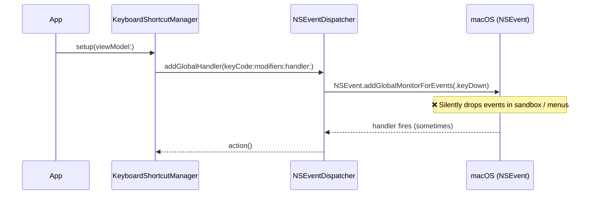
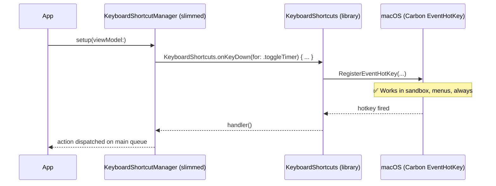
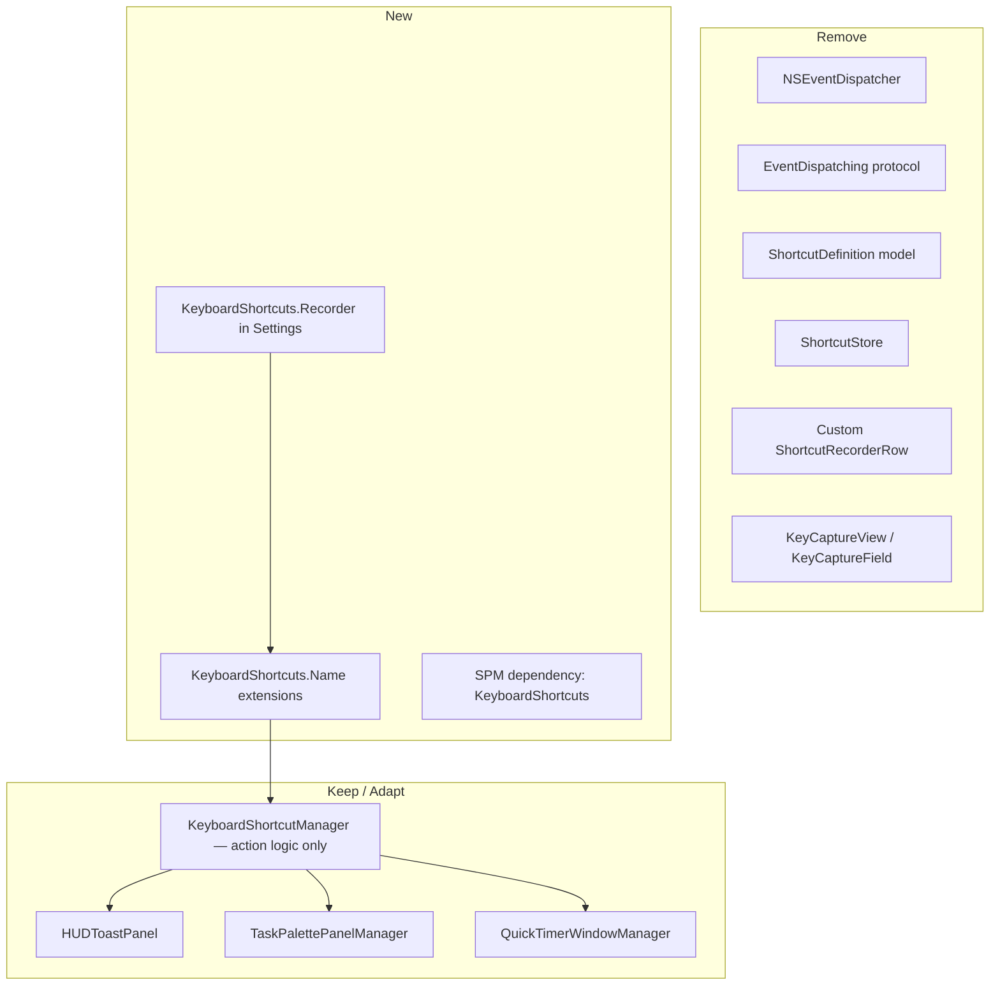

# Global Shortcuts — Migrate to KeyboardShortcuts Library

## Overview

The current global shortcut implementation uses `NSEvent.addGlobalMonitorForEvents()`, which silently fails in common macOS scenarios: when the app is sandboxed, when a menu is open, or before Accessibility permission is granted. The [KeyboardShortcuts](https://github.com/sindresorhus/KeyboardShortcuts) library by Sindre Sorhus uses Carbon-level event taps that work reliably in all these cases, including sandbox environments, without requiring any special entitlements. This migration replaces the custom `NSEventDispatcher` / `KeyboardShortcutManager` stack with the library while keeping the existing Settings UI and action logic intact.

## Root Cause: Why the Current Approach Fails

`NSEvent.addGlobalMonitorForEvents()` has several hard limits:

| Scenario | NSEvent global monitor | KeyboardShortcuts (Carbon) |
|---|---|---|
| Sandboxed app | Silently ignored | Works |
| Menu open | Events not delivered | Works |
| Accessibility not granted yet | Silently ignored | Works (uses different API path) |
| App is frontmost | Requires separate local monitor | Handled automatically |

The library internally registers a `Carbon EventHotKey` (via `RegisterEventHotKey`) which is a system-level hot-key mechanism that bypasses the event tap restrictions that affect `NSEvent`.

## UI / Flow

No UI changes are visible to the user. The Settings keyboard shortcut panel replaces the custom `ShortcutRecorderRow` with `KeyboardShortcuts.Recorder`, which looks nearly identical but handles conflict detection with system shortcuts automatically.

```
┌─────────────────────────────────────────────────────────┐
│  Settings > Shortcuts                                   │
├─────────────────────────────────────────────────────────┤
│  Toggle Timer      [ ⌘I ]  ← KeyboardShortcuts.Recorder│
│  Task Switcher     [ ⌘L ]                               │
│  Set Timer         [ ⌘⇧T ]                              │
│  Open Notes        [ ⌘N ]                               │
└─────────────────────────────────────────────────────────┘
```

The recorder already stores shortcuts to `UserDefaults` automatically — no `ShortcutStore` serialization needed.

## Architecture

### Before (current)



### After (KeyboardShortcuts library)



### Component changes



## Open Questions

- Should the 5 default shortcuts (⌘I, ⌘L, ⌘⇧T, ⌘N, ⌘O) be pre-seeded the first time the user runs the updated build, or start blank and let the user assign them? The library stores `nil` by default; seeding requires a one-time migration call.
- The existing unit tests mock `EventDispatching` — those tests will be deleted since the library is a black box. Do you want equivalent integration-level tests, or is manual verification sufficient?
- `AXChecking` / `axChecker.requestPermission()` in the current manager — the library does not need Accessibility permission, so this block can be removed entirely. Confirm?

---

## Implementation Phases

### Phase 1 — Add SPM Dependency

**What it covers:** Add `KeyboardShortcuts` package to the Xcode project via SPM; confirm it builds.

**Tests to write first (Red):**
- [ ] None — pure dependency wiring, verified by successful build

**Production code to write (Green):**
- [ ] In Xcode: File > Add Package Dependencies → `https://github.com/sindresorhus/KeyboardShortcuts` (Up to Next Major from 2.0.0)
- [ ] Link `KeyboardShortcuts` to the `TimeControl` target
- [ ] Build succeeds with `import KeyboardShortcuts`

**Done when:** `import KeyboardShortcuts` compiles in any source file.

---

### Phase 2 — Define Shortcut Names & Wire Handlers

**What it covers:** Create `KeyboardShortcuts.Name` extensions for the 4 actions and register handlers in `KeyboardShortcutManager`, replacing `NSEventDispatcher`.

**Tests to write first (Red):**
- [ ] Test: `KeyboardShortcutManager.setup()` does not crash when called on a background thread (dispatch to main)
- [ ] Test: Calling `setup()` twice does not double-register handlers (idempotent)

**Production code to write (Green):**
- [ ] New file `ShortcutNames.swift`:
  ```swift
  import KeyboardShortcuts
  extension KeyboardShortcuts.Name {
      static let toggleTimer   = Self("toggleTimer",   default: .init(.o, modifiers: .command))
      static let taskSwitcher  = Self("taskSwitcher",  default: .init(.l, modifiers: .command))
      static let setTimer      = Self("setTimer",      default: .init(.t, modifiers: [.command, .shift]))
      static let openNotes     = Self("openNotes",     default: .init(.n, modifiers: .command))
  }
  ```
- [ ] `KeyboardShortcutManager.setup(viewModel:)` rewritten to use `KeyboardShortcuts.onKeyDown(for:action:)` for each name
- [ ] Remove `store: ShortcutStore` parameter (library owns persistence)
- [ ] Remove `axChecker.requestPermission()` block

**Done when:** Pressing the 4 default shortcuts triggers the correct actions while the app is in the background.

---

### Phase 3 — Replace Settings UI

**What it covers:** Swap `ShortcutRecorderRow` + `KeyCaptureView` for `KeyboardShortcuts.Recorder` in the Settings view.

**Tests to write first (Red):**
- [ ] Snapshot/UI test: Settings shortcuts section renders 4 rows with labels

**Production code to write (Green):**
- [ ] Replace `ShortcutRecorderRow` usage in `ShortcutsSettingsView` (or equivalent) with:
  ```swift
  KeyboardShortcuts.Recorder("Toggle Timer", name: .toggleTimer)
  KeyboardShortcuts.Recorder("Task Switcher", name: .taskSwitcher)
  KeyboardShortcuts.Recorder("Set Timer", name: .setTimer)
  KeyboardShortcuts.Recorder("Open Notes", name: .openNotes)
  KeyboardShortcuts.Recorder("Complete Task", name: .completeTask)
  ```
- [ ] Remove `ShortcutRecorderRow.swift`, `KeyCaptureView`, `KeyCaptureField`

**Done when:** User can click a recorder row, press a new shortcut, and the new shortcut fires correctly.

---

### Phase 4 — Delete Dead Code

**What it covers:** Remove files and types that are no longer needed after the migration.

**Tests to write first (Red):**
- [ ] None — deletion is verified by successful build and no compiler warnings

**Production code to write (Green):**
- [ ] Delete `ShortcutDefinition.swift`
- [ ] Delete `ShortcutStore.swift`
- [ ] Delete `NSEventDispatcher` and `EventDispatching` protocol from `KeyboardShortcutManager.swift`
- [ ] Delete `AXChecking`, `SystemAXChecker` from `KeyboardShortcutManager.swift`
- [ ] Delete `KeyboardShortcutManagerTests.swift`, `ShortcutStoreTests.swift`, `ShortcutRecorderTests.swift` (or update to cover new surface)
- [ ] Confirm `AppDelegate` no longer calls `setup(viewModel:)` with old parameters

**Done when:** Project builds cleanly with zero references to `NSEventDispatcher`, `ShortcutDefinition`, or `ShortcutStore`.
