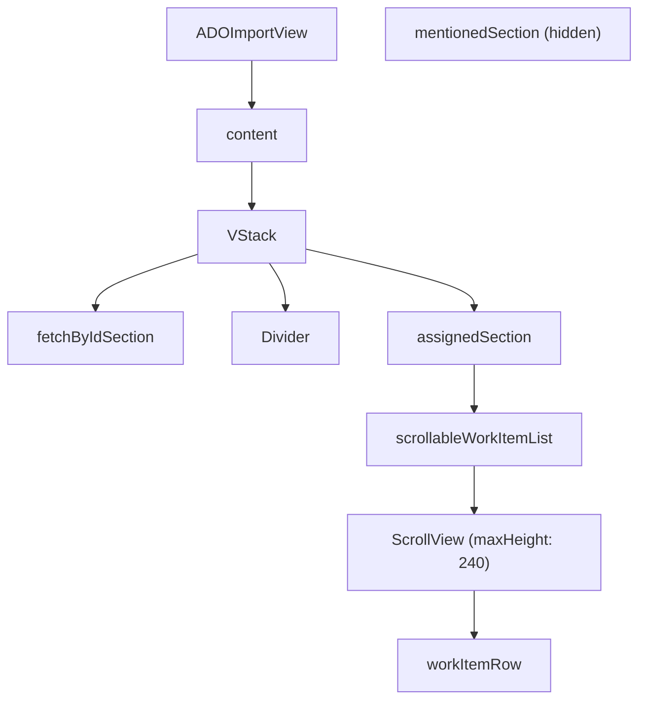

# ADO Import View Reorder & Scrollable Assigned List

## Overview

Reorder the sections in `ADOImportView` so that "Fetch by ID" appears first (primary action), followed by "Assigned to me" (scrollable, capped height). The "Mentioned in" section is hidden for now as it is not working.

## UI / Flow

### Current layout

```
┌──────────────────────────────────────┐
│  Cancel   Import from Azure DevOps   Import  │
├──────────────────────────────────────┤
│  Assigned to me           [Refresh]  │
│  ┌────────────────────────────────┐  │
│  │ ☑ #1234  Active  Task title   │  │
│  │─────────────────────────────── │  │
│  │ ☐ #5678  Active  Another task │  │
│  └────────────────────────────────┘  │
│  ──────────────────────────────────  │
│  Mentioned in             [Refresh]  │
│  ┌────────────────────────────────┐  │
│  │ ☐ #9012  Active  Some task    │  │
│  └────────────────────────────────┘  │
│  ──────────────────────────────────  │
│  or fetch by ID                      │
│  Work Item ID or URL                 │
│  [ e.g. 12345 or paste full URL ] [Fetch] │
└──────────────────────────────────────┘
```

### New layout

```
┌──────────────────────────────────────┐
│  Cancel   Import from Azure DevOps   Import  │
├──────────────────────────────────────┤
│  or fetch by ID                      │  ← moved to top
│  Work Item ID or URL                 │
│  [ e.g. 12345 or paste full URL ] [Fetch] │
│  ┌────── result preview ───────────┐ │
│  │ ✓ Found work item               │ │
│  │ #1234  My Task Title            │ │
│  └─────────────────────────────────┘ │
│  ──────────────────────────────────  │
│  Assigned to me           [Refresh]  │  ← below fetch-by-ID
│  ┌────────────────────────────────┐  │  ← fixed-height, independently scrollable
│  │ ☑ #1234  Active  Task title   │  │
│  │─────────────────────────────── │  │
│  │ ☐ #5678  Active  Another task │  │
│  │─────────────────────────────── │  │
│  │ ☐ #9012  Active  More tasks   │  │  ← scrolls within its own box
│  └────────────────────────────────┘  │
│                                      │
│  [Mentioned in — hidden]             │
└──────────────────────────────────────┘
```

## Architecture



No new models, view models, or services are needed. Changes are purely in `ADOImportView.swift`.

## Open Questions

_(none)_

## High-Level Steps

1. Reorder `content` VStack: move `fetchByIdSection` before the `Divider` and `assignedSection`
2. Remove `mentionedSection` from the `content` VStack (leave its VM logic and view builder intact)
3. Remove the `Divider` that previously separated `mentionedSection` from `fetchByIdSection` (now only one divider between fetch-by-ID and assigned)
4. Replace the plain `workItemList()` call inside `assignedSection` with a `ScrollView`-wrapped version capped at `maxHeight: 240`
5. Update the outer `ScrollView` in `content` — verify it still works correctly with the new inner scroll (ensure no scroll conflict on macOS)

---

## Implementation Phases

### Phase 1 — Reorder sections and hide Mentioned

**What it covers:** Move fetch-by-ID to the top of the content area, remove mentionedSection from the layout, and keep a single divider between fetch-by-ID and assigned.

**Tests (Red) — write these first:**

```swift
// File: TimeControlTests/ADOImportViewLayoutTests.swift

import XCTest
import SwiftUI
@testable import TimeControl

/// Snapshot/structural tests for ADOImportView section ordering.
/// We test the ViewModel state surface (not pixel snapshots) since
/// SwiftUI view hierarchy inspection is not available without ViewInspector.
/// These tests verify that the ViewModel correctly exposes data that
/// drives the new ordering, and that mentionedItems is still loaded
/// but simply not displayed (VM stays intact).
final class ADOImportViewLayoutTests: XCTestCase {

    // MARK: - ViewModel still loads mentioned items (hidden, not deleted)

    func test_mentionedItems_areLoadedInViewModel_evenThoughHiddenInUI() async {
        let vm = ADOImportViewModel()
        // mentionedItems starts empty — VM still has the property
        XCTAssertNotNil(vm.mentionedItems as [ADOWorkItem]?,
            "mentionedItems must still exist on the VM even though the section is hidden")
    }

    func test_loadMentioned_doesNotCrash_whenCalled() async {
        // Ensures the VM method still compiles and runs without crashing
        // (section is hidden in UI but the underlying call must remain valid)
        let vm = ADOImportViewModel()
        // loadMentioned will fail gracefully (no credentials) — we only care it doesn't crash
        await vm.loadMentioned()
        // If we reach this line, the method exists and didn't crash
        XCTAssertTrue(true)
    }

    // MARK: - fetchedItem drives the fetch-by-ID result area

    func test_fetchedItem_isNilInitially() {
        let vm = ADOImportViewModel()
        XCTAssertNil(vm.fetchedItem,
            "fetchedItem must be nil on init so the result area is empty at launch")
    }

    func test_workItemIdText_isEmptyInitially() {
        let vm = ADOImportViewModel()
        XCTAssertEqual(vm.workItemIdText, "",
            "workItemIdText must be empty so the fetch-by-ID field shows its placeholder")
    }
}
```

**Production code (Green):**

No new production code — this phase is purely a view reorder. Apply these changes to `ADOImportView.swift`:

```swift
// In ADOImportView.swift — replace the `content` computed property:

private var content: some View {
    ScrollView {
        VStack(alignment: .leading, spacing: 20) {
            fetchByIdSection       // ← first
            Divider()
            assignedSection        // ← second
            // mentionedSection removed from layout (VM logic kept intact)
        }
        .padding()
    }
}
```

Remove the `.task` body call to `vm.loadMentioned()` if you want to skip the network call entirely while the section is hidden, or leave it so data is ready when the section is unhidden later. Recommended: **keep the call** so re-enabling the section later requires no VM changes:

```swift
// In ADOImportView body — keep as-is:
.task {
    async let assigned: () = vm.loadAssigned()
    async let mentioned: () = vm.loadMentioned()
    _ = await (assigned, mentioned)
}
```

**Done when:**
- Opening the import sheet shows the fetch-by-ID input field at the top
- "Assigned to me" appears below a divider
- "Mentioned in" section is not visible anywhere in the sheet
- The VM's `mentionedItems` property and `loadMentioned()` method still compile without changes

---

### Phase 2 — Make "Assigned to me" list independently scrollable

**What it covers:** Wrap the assigned work item list in its own `ScrollView` with a `maxHeight` cap so that a long assigned list scrolls within its own box rather than expanding the window.

**Tests (Red) — write these first:**

```swift
// Add to TimeControlTests/ADOImportViewLayoutTests.swift

// MARK: - Assigned items scrollable list behaviour

func test_assignedItems_canHoldManyItems() {
    let vm = ADOImportViewModel()
    // Simulate a large assigned list being set
    let manyItems = (1...20).map { i in
        ADOWorkItem(id: i, title: "Task \(i)", description: "", state: "Active")
    }
    vm.assignedItems = manyItems
    XCTAssertEqual(vm.assignedItems.count, 20,
        "ViewModel must hold all 20 assigned items so the scrollable list can display them")
}

func test_assignedItems_filteredByExistingAdoIds() {
    let vm = ADOImportViewModel()
    vm.assignedItems = [
        ADOWorkItem(id: 1, title: "Already imported", description: "", state: "Active"),
        ADOWorkItem(id: 2, title: "New item", description: "", state: "Active"),
    ]
    let existingIds: Set<String> = ["1"]
    let visible = vm.assignedItems.filter { !existingIds.contains(String($0.id)) }
    XCTAssertEqual(visible.count, 1)
    XCTAssertEqual(visible.first?.id, 2)
}
```

**Production code (Green):**

```swift
// In ADOImportView.swift — replace the workItemList call inside assignedSection.
// Change this block (inside assignedSection, the `else` branch):

// BEFORE:
} else {
    workItemList(visibleAssignedItems)
}

// AFTER:
} else {
    ScrollView {
        workItemList(visibleAssignedItems)
    }
    .frame(maxHeight: 240)
}
```

The outer `ScrollView` in `content` remains unchanged — macOS `ScrollView` nesting is fine as long as axes differ or the inner scroll has a fixed frame, which `maxHeight: 240` provides.

**Done when:**
- With 1–3 assigned items the list shows all items without a scrollbar
- With 4+ assigned items the list caps at ~240pt height and shows a scrollbar inside the rounded box
- Scrolling the assigned list does not scroll the whole sheet
- The fetch-by-ID section and its result area remain visible above the assigned list without being pushed off screen by a long assigned list

---

## Feature Acceptance Checklist

- [ ] "or fetch by ID" input is the first thing visible when the sheet opens
- [ ] Fetch result preview appears directly below the ID input
- [ ] A single divider separates the fetch-by-ID area from "Assigned to me"
- [ ] "Mentioned in" section is not visible anywhere in the sheet
- [ ] Assigning 10+ items to the user causes the assigned list to scroll within its own bounded box
- [ ] Selecting items from the scrollable assigned list and clicking Import works correctly
- [ ] The sheet's overall height does not grow unboundedly when there are many assigned items
- [ ] All existing ADOImportViewModel tests still pass
