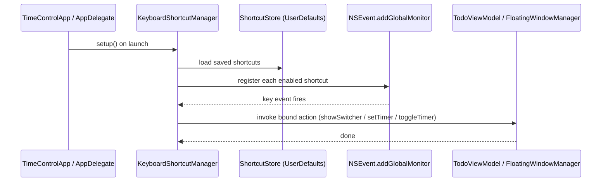
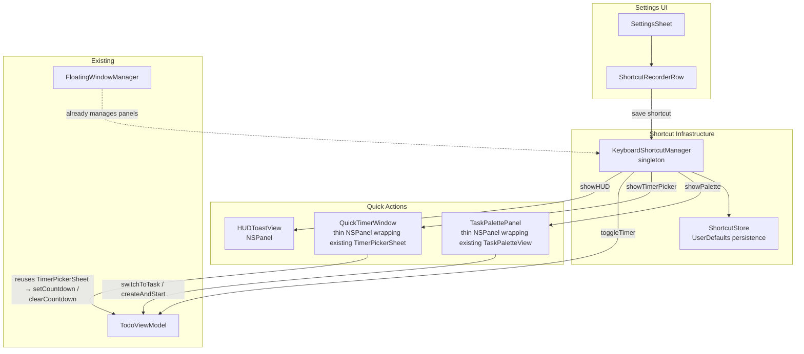

# Keyboard Shortcuts

## Overview

A system-wide hotkey layer that lets you interact with TimeControl without switching to the app — or even having it open. Three global shortcuts cover the highest-friction interactions: surfacing the current task quickly, setting a timer on the fly, and toggling the task timer. All shortcuts are user-configurable from a new Shortcuts section in Settings, and the app requests Accessibility permission the first time any global shortcut is registered.

---

## UI / Flow

### Shortcut 1 — Quick Task Switcher (Cmd + L, system-wide)

Reuses the existing `TaskPaletteView` (already has search, keyboard nav, ▶ running indicator, + Create row). Instead of opening as a popover attached to the floating window's title bar button, it opens as a standalone `NSPanel` that can be triggered from anywhere — even when the floating task window is closed.

The only UI additions are elapsed time per row (already requested to keep) and the standalone panel chrome.

```
╔══════════════════════════════════════════════════════╗
║                                                      ║
║   🔍  Search or create a task…                       ║
║  ────────────────────────────────────────────────    ║
║  ▶  Fix login crash                        1h 23m    ║
║     Write release notes                      45m    ║
║     Review PR #48210                         12m    ║
║     Design settings screen                          ║
║  ────────────────────────────────────────────────    ║
║  + Create "Design settings screen" and start        ║
║                                                      ║
╚══════════════════════════════════════════════════════╝
```

**States (unchanged from existing palette):**
- **Empty query** — all incomplete tasks, running task at top with ▶
- **Typed query (matches)** — live-filters; Enter switches to that task
- **Typed query (no match)** — "+ Create 'X' and start" row; Enter creates and starts
- **Esc / click outside** — dismisses without action

**Changes to `TaskPaletteView`:**
- Add elapsed time display to each row (already shown in the floating window; just expose it in the palette row layout)
- Accept an optional `onDismiss` callback so the standalone panel can close itself

**New `TaskPalettePanel`** (thin NSPanel wrapper):
- Centred on screen, fixed width ~380pt, no title bar
- `canBecomeKey = true` so the search field is immediately focused
- Dismissed on Esc or click-outside via `NSEvent.addLocalMonitorForEvents`
- The existing title-bar button in `FloatingTaskWindowView` continues to work — it just presents `TaskPaletteView` as a popover as before

### Shortcut 2 — Quick Timer Set (Cmd + Shift + T, system-wide)

Reuses the existing `TimerPickerSheet` component and `viewModel.setCountdown()` / `viewModel.clearCountdown()` — no new timer logic needed. The shortcut simply opens `TimerPickerSheet` as a floating panel, pre-focused on the current task.

```
╔═══════════════════════════════════════╗
║   Set timer — Fix login crash         ║
║                                       ║
║    Hours          Minutes             ║
║   ┌──────┐       ┌──────┐             ║
║   │   0  │       │  25  │             ║
║   └──────┘       └──────┘             ║
║                                       ║
║   [Clear timer]          [Set ↵]      ║
╚═══════════════════════════════════════╝
```

- Shows current task name in the title bar
- If no task is running, shows "No active task" and disables Set
- Clear button calls `viewModel.clearCountdown()` and dismisses
- Enter/Return confirms; Esc cancels
- Reuses `TimerPickerSheet` directly — same hours/minutes pickers, same `setCountdown()` call path

### Shortcut 3 — Toggle Current Task Timer (Cmd + O, system-wide)

No UI — fires a play/pause on the currently running task (or the most recently played task if none running). A brief HUD toast appears in the corner.

```
╭──────────────────────────────╮
│  ⏸  "Fix login crash" paused │
╰──────────────────────────────╯
```

---

### Settings — Keyboard Shortcuts Section

New section inside the existing SettingsSheet, between "Behaviour" and "Appearance".

```
──────────────────────────────────────────────────────
  Keyboard Shortcuts
──────────────────────────────────────────────────────

  Quick Task Switcher        [⌘ L]        [Record] [✕]
  Set Timer                  [⌘ ⇧ T]     [Record] [✕]
  Toggle Task Timer          [⌘ O]        [Record] [✕]

  ⚠  Accessibility access is required for system-wide
     shortcuts.  [Open System Settings →]

──────────────────────────────────────────────────────
```

- **[Record]** — click to enter recording mode; next key combo pressed becomes the new shortcut; Esc cancels recording
- **[✕]** — clears the shortcut (disables it)
- Conflict detection: if the combo is already registered by the system or another shortcut row, shows a red warning inline
- Accessibility banner is hidden once permission is granted

---

## Architecture

### Data Flow — Global Hotkey Registration



### Component Diagram



### New Files

| File | Purpose |
|------|---------|
| `Services/KeyboardShortcutManager.swift` | Singleton; owns `NSEvent` global monitors; maps `ShortcutDefinition` → action closure |
| `Models/ShortcutDefinition.swift` | `Codable` struct: `id`, `keyCode`, `modifiers`, `isEnabled`; three static defaults |
| `Services/ShortcutStore.swift` | Loads/saves `[ShortcutDefinition]` to UserDefaults; emits change notifications |
| `Views/TaskPalettePanel.swift` | Thin NSPanel wrapper that presents the existing `TaskPaletteView` as a standalone floating panel; triggered by the global shortcut |
| `Views/QuickTimerWindow.swift` | Thin NSPanel wrapper that presents the existing `TimerPickerSheet` as a floating panel triggered by the shortcut |
| `Views/HUDToastView.swift` | Transient floating label for play/pause feedback |
| `Views/ShortcutRecorderRow.swift` | SwiftUI row that captures a key combo via NSView key event |

### Modified Files

| File | Change |
|------|--------|
| `WindowManagement/AppDelegate.swift` | Call `KeyboardShortcutManager.shared.setup(viewModel:)` on launch |
| `Views/SettingsSheet.swift` | Add `KeyboardShortcutsSection` between Behaviour and Appearance |
| `WindowManagement/FloatingWindowManager.swift` | Expose `showPalette()` and `showQuickTimer()` helpers |
| `Views/FloatingTaskWindowView.swift` (TaskPaletteView) | Add elapsed time column to palette rows; accept optional `onDismiss` callback |

---

## Open Questions

- **Accessibility permission UX** — should we prompt at launch (if any shortcut is enabled) or lazily on first use? Lazy is less intrusive but the first trigger silently fails if denied.
- **Conflict detection scope** — detect only within our own shortcuts, or also check system-reserved combos? System check requires `CGEventTap` or heuristics; in-app only is simpler.
- **Quick Switcher — start on select?** — should selecting an existing task always start it, or just open the floating window? Intent says "start", but could be surprising if the task is already running. Proposal: start if not running, do nothing extra if already running.
- **HUD toast position** — bottom-right corner (like macOS notifications) vs. near the menu bar item?
- **Shortcut storage format** — `keyCode + CGEventFlags` (raw) vs. a string encoding (human-readable in UserDefaults). Raw is more reliable across keyboard layouts.

---

## Implementation Phases

### Phase 1 — ShortcutDefinition model + ShortcutStore persistence

**What it covers:** The pure data layer — a `Codable` model for a shortcut and a store that saves/loads the three defaults from UserDefaults. No UI, no monitors yet.

**Tests to write first (Red):**
- [ ] `testDefaultsContainThreeShortcuts` → `ShortcutStore().shortcuts` has exactly 3 entries
- [ ] `testDefaultShortcutIds` → ids are `"taskSwitcher"`, `"setTimer"`, `"toggleTimer"`
- [ ] `testDefaultKeyBindings` → switcher is Cmd+L, timer is Cmd+Shift+T, toggle is Cmd+O
- [ ] `testAllDefaultsEnabled` → all three `isEnabled == true` out of the box
- [ ] `testSaveAndReload` → mutate a shortcut, init a new store with the same UserDefaults suite, values persist
- [ ] `testDisableShortcut` → set `isEnabled = false`, reload, still false
- [ ] `testUpdateKeyBinding` → change `keyCode` + `modifiers`, reload, new values returned
- [ ] `testResetToDefaults` → call `resetToDefaults()`, all three back to factory values

**Production code to write (Green):**
- [ ] `Models/ShortcutDefinition.swift` — `Codable` struct with `id: String`, `keyCode: UInt16`, `modifiers: UInt64` (raw `CGEventFlags`), `isEnabled: Bool`; three static `default*` constants
- [ ] `Services/ShortcutStore.swift` — `ObservableObject`; `@Published var shortcuts: [ShortcutDefinition]`; `save()`, `resetToDefaults()`; uses injected `UserDefaults` suite for testability

**Done when:** All 8 tests green; `ShortcutStore` can be initialised with an isolated `UserDefaults` suite in tests with no side-effects.

---

### Phase 2 — KeyboardShortcutManager (registration + action dispatch)

**What it covers:** The singleton that owns `NSEvent` global monitors, maps stored shortcuts to closures, and re-registers when the store changes. No UI panels yet — actions are simple callbacks.

**Tests to write first (Red):**
- [ ] `testRegisterFiresAction` → register a shortcut definition + closure, synthesise a matching `NSEvent` key-down, closure is called once
- [ ] `testNonMatchingEventDoesNotFire` → different key combo, closure not called
- [ ] `testDisabledShortcutDoesNotFire` → `isEnabled = false`, event ignored
- [ ] `testReregisterAfterStoreChange` → update store, old combo no longer fires, new combo fires
- [ ] `testClearAllRemovesMonitors` → after `clearAll()`, no action fires

**Production code to write (Green):**
- [ ] `Services/KeyboardShortcutManager.swift` — `final class KeyboardShortcutManager` singleton; `register(shortcuts:actions:)` tears down old monitors and installs new `NSEvent.addGlobalMonitorForEvents`; `clearAll()`; `setup(viewModel:)` wires the three real actions (stubs for now — panels don't exist yet)

**Done when:** All 5 tests green; manager can be exercised in tests by injecting a fake event-posting helper rather than real `NSEvent` global monitors (use a protocol seam or a `@testable` internal method).

---

### Phase 3 — HUD toast (Toggle Timer action, end-to-end)

**What it covers:** The simplest shortcut action — Cmd+O play/pauses the running task and shows a brief HUD. Delivers the first working shortcut the user can feel.

**Tests to write first (Red):**
- [ ] `testToggleTimerStartsTask` → no task running, call action with a task, `viewModel.runningTaskId` becomes that task's id
- [ ] `testToggleTimerPausesRunningTask` → task is running, call action, `runningTaskId` becomes nil
- [ ] `testToggleTimerNoOpWhenNoTasks` → empty task list, action does nothing, no crash
- [ ] `testHUDMessagePaused` → after pause action, HUD text contains task name and "paused"
- [ ] `testHUDMessageResumed` → after resume action, HUD text contains "resumed"
- [ ] `testHUDDismissesAfterDelay` → HUD `isVisible` becomes false within 2.5s

**Production code to write (Green):**
- [ ] `Views/HUDToastView.swift` — small SwiftUI view; auto-dismisses after ~2s via `DispatchQueue.main.asyncAfter`; hosted in a borderless `NSPanel` at bottom-right of main screen
- [ ] Wire `toggleTimer` action in `KeyboardShortcutManager.setup()` to call `viewModel.toggleTimer` then show HUD

**Done when:** Pressing Cmd+O from any app plays/pauses the running task and a toast briefly appears.

---

### Phase 4 — TaskPalettePanel (Task Switcher shortcut, Cmd+L)

**What it covers:** Lift `TaskPaletteView` into a standalone `NSPanel` launchable from anywhere; add elapsed time to palette rows.

**Tests to write first (Red):**
- [ ] `testElapsedTimeNonZeroForRunningTask` → task with `totalTimeSpent = 3600`, palette row data shows "1:00:00"
- [ ] `testElapsedTimeZeroHidden` → task with zero time, elapsed display is empty/hidden
- [ ] `testPaletteSelectSwitchesToTask` → select a task in palette, `viewModel.switchToTask` called with correct task
- [ ] `testPaletteSelectStartsTaskIfNotRunning` → selected task not running → becomes running after selection
- [ ] `testPaletteSelectNoDoubleStartIfAlreadyRunning` → selected task already running → no duplicate session started
- [ ] `testPaletteCreateAndStart` → no match search text submitted → new `TodoItem` added and running

**Production code to write (Green):**
- [ ] Add `totalTimeSpent` elapsed column to `TaskPaletteView` row layout (formatted via `TimeFormatter`)
- [ ] Add optional `onDismiss: (() -> Void)?` parameter to `TaskPaletteView`
- [ ] `Views/TaskPalettePanel.swift` — `NSPanel` subclass; `canBecomeKey = true`; hosts `TaskPaletteView` in an `NSHostingView`; centres on screen; local monitor dismisses on click-outside or Esc
- [ ] Wire `showPalette` action in `KeyboardShortcutManager.setup()`

**Done when:** Cmd+L from any app opens the palette, search + keyboard nav works, selecting a task switches and starts it, Esc dismisses.

---

### Phase 5 — QuickTimerWindow (Set Timer shortcut, Cmd+Shift+T)

**What it covers:** Wrap `TimerPickerSheet` in a standalone `NSPanel` triggered by the shortcut. Reuses all existing timer logic.

**Tests to write first (Red):**
- [ ] `testQuickTimerSetsCountdown` → submit hours=0 minutes=25, `viewModel.countdownTime` for running task == 1500s
- [ ] `testQuickTimerClearsCountdown` → task has existing countdown, clear action → `countdownTime == 0`
- [ ] `testQuickTimerDisabledWhenNoRunningTask` → no running task, Set button disabled (isEnabled == false)
- [ ] `testQuickTimerShowsRunningTaskName` → running task named "Fix crash", window title contains "Fix crash"

**Production code to write (Green):**
- [ ] `Views/QuickTimerWindow.swift` — `NSPanel` wrapper; hosts `TimerPickerSheet` (or a slim equivalent that calls same `setCountdown`/`clearCountdown`); passes running task id; Esc dismisses
- [ ] Wire `showQuickTimer` action in `KeyboardShortcutManager.setup()`

**Done when:** Cmd+Shift+T opens the timer picker pre-labelled with the current task; Set/Clear work; window closes after action.

---

### Phase 6 — Settings UI (Keyboard Shortcuts section + ShortcutRecorderRow)

**What it covers:** The customisation UI in Settings — the record-a-new-shortcut row, conflict detection, and Accessibility permission banner. No new tests (views are not unit-tested in this project).

**Production code to write:**
- [ ] `Views/ShortcutRecorderRow.swift` — SwiftUI row with label, current shortcut chip, Record button (enters capture mode via `NSViewRepresentable` key interceptor), and ✕ clear button; shows red "conflict" text if another row uses the same combo
- [ ] Add `KeyboardShortcutsSection` to `SettingsSheet.swift` between Behaviour and Appearance; lists all three rows; shows Accessibility banner (`AXIsProcessTrusted()` == false) with "Open System Settings" deep-link
- [ ] `KeyboardShortcutManager.setup()` requests Accessibility permission on first launch if any shortcut is enabled (lazy prompt)
- [ ] `AppDelegate` calls `KeyboardShortcutManager.shared.setup(viewModel:)` on `applicationDidFinishLaunching`

**Done when:** User can open Settings, see the three shortcuts, click Record, press a new combo, see it saved, and the shortcut fires with the new combo. Accessibility banner appears and links to System Settings when permission is missing.
