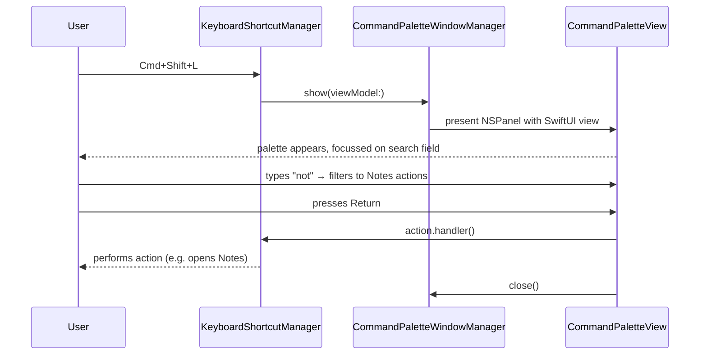
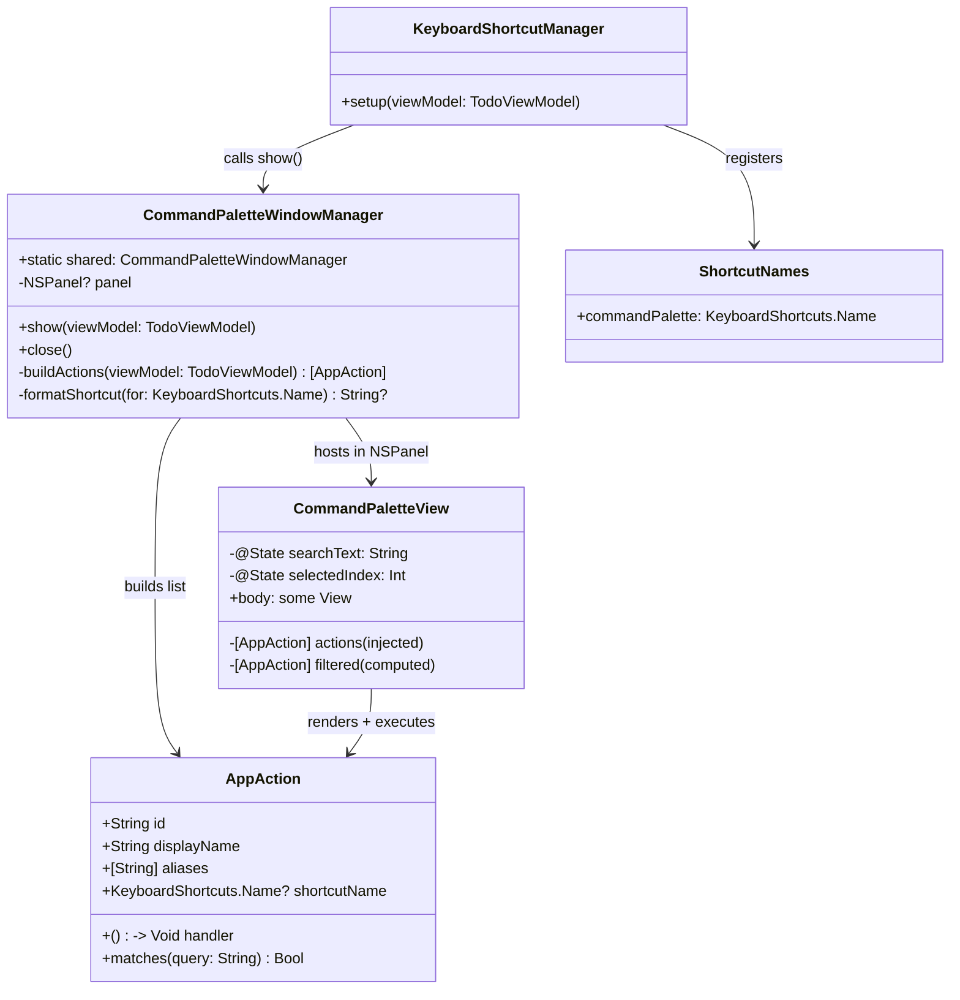

# Command Palette

## Overview

A Spotlight-style command palette (Cmd+Shift+L) that lists every keyboard-shortcut-bound action in the app alongside its currently assigned shortcut. The user types to filter, navigates with arrow keys, and presses Return to execute the action. This gives a discoverable, keyboard-driven alternative to memorising all 11 shortcuts.

---

## UI / Flow

### Default state (palette opens)
```
┌──────────────────────────────────────────────────┐
│  🔍  Search actions…                             │
├──────────────────────────────────────────────────┤
│ ▶  Play / Pause Timer              ⌘ I           │
│    Switch Task                     ⌘ L           │
│    Set Countdown Timer             ⌘ ⇧ T         │
│    Open Notes                      ⌘ D           │
│    Open Notes Viewer               ⌘ ⇧ D         │
│    Complete Task                   ⌘ O           │
│    Collapse / Expand Window        ⌘ ⇧ E         │
│    Open ADO Comment                ⌥ W           │
│    Add Subtask                     ⌥ R           │
│    Open History                    ⌥ H           │
│    Show / Hide Main Window         ⌥ B           │
└──────────────────────────────────────────────────┘
```
First row is highlighted. Arrow keys move the selection.

### Filtered state (user typed "not")
```
┌──────────────────────────────────────────────────┐
│  🔍  not                                         │
├──────────────────────────────────────────────────┤
│ ▶  Open Notes                      ⌘ D           │
│    Open Notes Viewer               ⌘ ⇧ D         │
└──────────────────────────────────────────────────┘
```

### Empty result
```
┌──────────────────────────────────────────────────┐
│  🔍  zzz                                         │
├──────────────────────────────────────────────────┤
│                                                  │
│              No matching actions                 │
│                                                  │
└──────────────────────────────────────────────────┘
```

### Interaction model
- **Return** — execute highlighted action, dismiss palette
- **Escape** — dismiss without action
- **↑ / ↓** — move selection
- **Click** — execute + dismiss
- Palette is a floating `NSPanel` (non-activating), centered on screen, same visual style as the existing Task Switcher

---

## Architecture





### New files
| File | Purpose |
|------|---------|
| `Services/AppAction.swift` | `AppAction` struct |
| `WindowManagement/CommandPaletteWindowManager.swift` | NSPanel lifecycle + action registry |
| `Views/CommandPaletteView.swift` | SwiftUI palette UI |

### Changed files
| File | Change |
|------|--------|
| `Services/ShortcutNames.swift` | Add `commandPalette` (default Cmd+Shift+L) |
| `Services/KeyboardShortcutManager.swift` | Register `commandPalette` shortcut + `performShowCommandPalette()` |
| `Views/SettingsSheet.swift` | Add `commandPalette` recorder + include in reset |

### Action registry — display names and aliases

| Action | Display name | Aliases (for search) |
|--------|-------------|----------------------|
| `toggleTimer` | Play / Pause Timer | play, pause, resume, start, stop, timer |
| `taskSwitcher` | Switch Task | switch, change, task |
| `setTimer` | Set Countdown Timer | countdown, timer, set |
| `openNotes` | Open Notes | notes, note |
| `openNotesViewer` | Open Notes Viewer | notes viewer, viewer |
| `completeTask` | Complete Task | complete, done, finish, close |
| `toggleFloatingWindowCollapse` | Collapse / Expand Window | collapse, expand, minimize |
| `openADOComment` | Open ADO Comment | ado, comment |
| `openSubtaskInput` | Add Subtask | subtask, add |
| `openHistory` | Open History | history |
| `showMainWindow` | Show / Hide Main Window | main, window, show, hide |

### Shortcut display helper

`CommandPaletteWindowManager.formatShortcut(for:)` reads `KeyboardShortcuts.getShortcut(for:)` and formats it as Unicode symbols (⌘ ⌥ ⌃ ⇧ + uppercased key letter), matching the existing Settings sheet style.

---

## Open Questions

_None — scope is clear._

---

## High-Level Steps

1. Add `commandPalette` shortcut to `ShortcutNames.swift` (default Cmd+Shift+L)
2. Create `AppAction` struct in `Services/AppAction.swift`
3. Create `CommandPaletteWindowManager` in `WindowManagement/CommandPaletteWindowManager.swift` with action registry and NSPanel management
4. Create `CommandPaletteView` in `Views/CommandPaletteView.swift` with search field, filtered list, keyboard navigation, and shortcut label display
5. Register `commandPalette` shortcut in `KeyboardShortcutManager` and add `performShowCommandPalette(viewModel:)` handler
6. Add `commandPalette` recorder to `SettingsSheet.swift` and include it in the shortcut reset action

---

## Implementation Phases

### Phase 1 — AppAction struct + CommandPaletteFilter
**What it covers:** Pure value types for the action model and filter logic. No UI, no dependencies — fully testable in isolation.

**Tests (Red) — write these first:**
```swift
// TimeControlTests/AppActionTests.swift

import XCTest
@testable import TimeControl

final class AppActionTests: XCTestCase {

    private func makeAction(name: String, aliases: [String] = []) -> AppAction {
        AppAction(id: name, displayName: name, aliases: aliases, shortcutName: nil, handler: {})
    }

    // MARK: - AppAction.matches

    func test_matches_emptyQuery_returnsTrue() {
        let action = makeAction(name: "Open Notes")
        XCTAssertTrue(action.matches(""))
    }

    func test_matches_displayNameContainsQuery_returnsTrue() {
        let action = makeAction(name: "Open Notes")
        XCTAssertTrue(action.matches("notes"))
    }

    func test_matches_displayNameDoesNotContainQuery_returnsFalse() {
        let action = makeAction(name: "Open Notes")
        XCTAssertFalse(action.matches("timer"))
    }

    func test_matches_aliasContainsQuery_returnsTrue() {
        let action = makeAction(name: "Complete Task", aliases: ["done", "finish"])
        XCTAssertTrue(action.matches("done"))
    }

    func test_matches_caseInsensitive_displayName() {
        let action = makeAction(name: "Play / Pause Timer")
        XCTAssertTrue(action.matches("PLAY"))
    }

    func test_matches_caseInsensitive_alias() {
        let action = makeAction(name: "Complete Task", aliases: ["DONE"])
        XCTAssertTrue(action.matches("done"))
    }

    func test_matches_partialAlias_returnsTrue() {
        let action = makeAction(name: "Open History", aliases: ["history"])
        XCTAssertTrue(action.matches("hist"))
    }

    // MARK: - CommandPaletteFilter.filter

    func test_filter_emptySearch_returnsAll() {
        let actions = [makeAction(name: "A"), makeAction(name: "B"), makeAction(name: "C")]
        XCTAssertEqual(CommandPaletteFilter.filter(actions: actions, searchText: "").count, 3)
    }

    func test_filter_matchingSearch_returnsOnlyMatches() {
        let actions = [
            makeAction(name: "Open Notes"),
            makeAction(name: "Set Timer"),
            makeAction(name: "Open History")
        ]
        let result = CommandPaletteFilter.filter(actions: actions, searchText: "open")
        XCTAssertEqual(result.count, 2)
        XCTAssertTrue(result.allSatisfy { $0.displayName.lowercased().contains("open") })
    }

    func test_filter_noMatch_returnsEmpty() {
        let actions = [makeAction(name: "Open Notes"), makeAction(name: "Set Timer")]
        XCTAssertTrue(CommandPaletteFilter.filter(actions: actions, searchText: "xyz").isEmpty)
    }

    func test_filter_preservesOrder() {
        let actions = [makeAction(name: "Zebra"), makeAction(name: "Apple"), makeAction(name: "Mango")]
        let result = CommandPaletteFilter.filter(actions: actions, searchText: "")
        XCTAssertEqual(result.map(\.displayName), ["Zebra", "Apple", "Mango"])
    }

    func test_filter_byAlias_returnsMatch() {
        let actions = [
            makeAction(name: "Complete Task", aliases: ["done"]),
            makeAction(name: "Open Notes")
        ]
        let result = CommandPaletteFilter.filter(actions: actions, searchText: "done")
        XCTAssertEqual(result.count, 1)
        XCTAssertEqual(result[0].displayName, "Complete Task")
    }

    func test_filter_caseInsensitive() {
        let actions = [makeAction(name: "Open Notes"), makeAction(name: "Set Timer")]
        let result = CommandPaletteFilter.filter(actions: actions, searchText: "NOTES")
        XCTAssertEqual(result.count, 1)
    }
}
```

**Production code (Green):**
```swift
// TimeControl/Services/AppAction.swift

import KeyboardShortcuts

struct AppAction: Identifiable {
    let id: String
    let displayName: String
    let aliases: [String]
    let shortcutName: KeyboardShortcuts.Name?
    let handler: () -> Void

    func matches(_ query: String) -> Bool {
        guard !query.isEmpty else { return true }
        let q = query.lowercased()
        if displayName.lowercased().contains(q) { return true }
        return aliases.contains { $0.lowercased().contains(q) }
    }
}

enum CommandPaletteFilter {
    static func filter(actions: [AppAction], searchText: String) -> [AppAction] {
        guard !searchText.isEmpty else { return actions }
        return actions.filter { $0.matches(searchText) }
    }
}
```

**Done when:** All `AppActionTests` pass; `AppAction` and `CommandPaletteFilter` compile cleanly with no warnings.

---

### Phase 2 — CommandPaletteWindowManager
**What it covers:** NSPanel lifecycle, action registry (the 11 actions with display names, aliases, and shortcut names), and the shortcut formatter. Follows the `TaskPaletteWindowManager` pattern exactly.

**Tests (Red) — write these first:**
```swift
// TimeControlTests/CommandPaletteWindowManagerTests.swift

import XCTest
import KeyboardShortcuts
@testable import TimeControl

final class CommandPaletteWindowManagerTests: XCTestCase {

    private var manager: CommandPaletteWindowManager!

    override func setUp() {
        super.setUp()
        manager = CommandPaletteWindowManager()
    }

    override func tearDown() {
        manager.dismiss()
        manager = nil
        super.tearDown()
    }

    // MARK: - Visibility

    func testShow_makesWindowVisible() {
        let (vm, _, _) = makeViewModel()
        manager.show(viewModel: vm)
        XCTAssertTrue(manager.isVisible)
    }

    func testDismiss_hidesWindow() {
        let (vm, _, _) = makeViewModel()
        manager.show(viewModel: vm)
        manager.dismiss()
        XCTAssertFalse(manager.isVisible)
    }

    func testShowTwice_doesNotStackPanels() {
        let (vm, _, _) = makeViewModel()
        manager.show(viewModel: vm)
        manager.show(viewModel: vm)
        XCTAssertTrue(manager.isVisible)
    }

    // MARK: - onDismiss callback

    func testDismiss_callsOnDismissCallback() {
        let (vm, _, _) = makeViewModel()
        var called = false
        manager.onDismiss = { called = true }
        manager.show(viewModel: vm)
        manager.dismiss()
        XCTAssertTrue(called)
    }

    func testOnDismiss_notCalledIfNeverShown() {
        var called = false
        manager.onDismiss = { called = true }
        manager.dismiss()
        XCTAssertFalse(called)
    }

    // MARK: - buildActions

    func testBuildActions_returns11Actions() {
        let (vm, _, _) = makeViewModel()
        XCTAssertEqual(manager.buildActions(viewModel: vm).count, 11)
    }

    func testBuildActions_allHaveUniqueIds() {
        let (vm, _, _) = makeViewModel()
        let actions = manager.buildActions(viewModel: vm)
        let ids = actions.map(\.id)
        XCTAssertEqual(Set(ids).count, ids.count)
    }

    func testBuildActions_allHaveNonEmptyDisplayNames() {
        let (vm, _, _) = makeViewModel()
        XCTAssertTrue(manager.buildActions(viewModel: vm).allSatisfy { !$0.displayName.isEmpty })
    }

    func testBuildActions_allHaveShortcutName() {
        let (vm, _, _) = makeViewModel()
        XCTAssertTrue(manager.buildActions(viewModel: vm).allSatisfy { $0.shortcutName != nil })
    }

    func testBuildActions_containsOpenNotesAction() {
        let (vm, _, _) = makeViewModel()
        XCTAssertTrue(manager.buildActions(viewModel: vm).contains(where: { $0.id == "openNotes" }))
    }

    func testBuildActions_openNotes_hasNotesAlias() {
        let (vm, _, _) = makeViewModel()
        let action = manager.buildActions(viewModel: vm).first(where: { $0.id == "openNotes" })!
        XCTAssertTrue(action.aliases.contains("notes"))
    }

    func testBuildActions_completeTask_hasDoneAlias() {
        let (vm, _, _) = makeViewModel()
        let action = manager.buildActions(viewModel: vm).first(where: { $0.id == "completeTask" })!
        XCTAssertTrue(action.aliases.contains("done"))
    }

    // MARK: - formatShortcut

    @MainActor
    func testFormatShortcut_returnsNonNilForAllDefaultShortcuts() {
        let names: [KeyboardShortcuts.Name] = [
            .toggleTimer, .taskSwitcher, .setTimer, .openNotes, .openNotesViewer,
            .completeTask, .toggleFloatingWindowCollapse, .openADOComment,
            .openSubtaskInput, .openHistory, .showMainWindow
        ]
        for name in names {
            KeyboardShortcuts.reset(name)
            XCTAssertNotNil(
                CommandPaletteWindowManager.formatShortcut(for: name),
                "Expected non-nil for \(name)"
            )
        }
    }

    @MainActor
    func testFormatShortcut_toggleTimer_containsCommandSymbol() {
        KeyboardShortcuts.reset(.toggleTimer)
        let result = CommandPaletteWindowManager.formatShortcut(for: .toggleTimer)
        XCTAssertTrue(result?.contains("⌘") ?? false)
    }

    @MainActor
    func testFormatShortcut_setTimer_containsShiftSymbol() {
        KeyboardShortcuts.reset(.setTimer)
        let result = CommandPaletteWindowManager.formatShortcut(for: .setTimer)
        XCTAssertTrue(result?.contains("⇧") ?? false)
    }

    @MainActor
    func testFormatShortcut_openHistory_containsOptionSymbol() {
        KeyboardShortcuts.reset(.openHistory)
        let result = CommandPaletteWindowManager.formatShortcut(for: .openHistory)
        XCTAssertTrue(result?.contains("⌥") ?? false)
    }

    @MainActor
    func testFormatShortcut_clearedShortcut_returnsNil() {
        KeyboardShortcuts.setShortcut(nil, for: .commandPalette)
        XCTAssertNil(CommandPaletteWindowManager.formatShortcut(for: .commandPalette))
    }
}
```

**Production code (Green):**
```swift
// TimeControl/WindowManagement/CommandPaletteWindowManager.swift

import AppKit
import SwiftUI
import KeyboardShortcuts

// MARK: - Standalone wrapper

private struct StandaloneCommandPaletteView: View {
    let actions: [AppAction]
    let onDismiss: () -> Void

    var body: some View {
        CommandPaletteView(actions: actions, onDismiss: onDismiss)
            .background(
                RoundedRectangle(cornerRadius: 12, style: .continuous)
                    .fill(Color(NSColor.windowBackgroundColor))
                    .shadow(color: .black.opacity(0.25), radius: 16, x: 0, y: 6)
            )
            .clipShape(RoundedRectangle(cornerRadius: 12, style: .continuous))
            .padding(1)
    }
}

// MARK: - Window manager

final class CommandPaletteWindowManager {
    static let shared = CommandPaletteWindowManager()

    private var panel: NSPanel?
    private var outsideClickMonitor: Any?

    var onDismiss: (() -> Void)?
    var isVisible: Bool { panel?.isVisible ?? false }

    func show(viewModel: TodoViewModel) {
        dismiss()
        let actions = buildActions(viewModel: viewModel)
        let width: CGFloat = 440
        let height: CGFloat = 380
        let screen = NSScreen.main ?? NSScreen.screens[0]
        let origin = CGPoint(
            x: screen.visibleFrame.midX - width / 2,
            y: screen.visibleFrame.midY + 60
        )

        let paletteView = StandaloneCommandPaletteView(
            actions: actions,
            onDismiss: { [weak self] in self?.dismiss() }
        )

        let newPanel = NSPanel(
            contentRect: NSRect(origin: origin, size: CGSize(width: width, height: height)),
            styleMask: [.titled, .fullSizeContentView, .nonactivatingPanel],
            backing: .buffered,
            defer: false
        )
        newPanel.titleVisibility = .hidden
        newPanel.titlebarAppearsTransparent = true
        newPanel.level = .floating
        newPanel.collectionBehavior = [.canJoinAllSpaces, .fullScreenAuxiliary]
        newPanel.isMovableByWindowBackground = true
        newPanel.hidesOnDeactivate = false
        newPanel.isOpaque = false
        newPanel.backgroundColor = .clear
        newPanel.hasShadow = true
        newPanel.becomesKeyOnlyIfNeeded = false

        let hostingController = NSHostingController(rootView: paletteView)
        hostingController.view.frame = NSRect(x: 0, y: 0, width: width, height: height)
        newPanel.contentViewController = hostingController

        panel = newPanel
        newPanel.orderFrontRegardless()
        DispatchQueue.main.async {
            newPanel.makeKey()
            if let textField = hostingController.view.firstDescendant(ofType: NSTextField.self) {
                newPanel.makeFirstResponder(textField)
            }
        }

        outsideClickMonitor = NSEvent.addGlobalMonitorForEvents(
            matching: [.leftMouseDown, .rightMouseDown]
        ) { [weak self] _ in self?.dismiss() }
    }

    func dismiss() {
        if let monitor = outsideClickMonitor {
            NSEvent.removeMonitor(monitor)
            outsideClickMonitor = nil
        }
        guard panel != nil else { return }
        panel?.close()
        panel = nil
        onDismiss?()
    }

    func buildActions(viewModel: TodoViewModel) -> [AppAction] {
        let mgr = KeyboardShortcutManager.shared
        return [
            AppAction(id: "toggleTimer",      displayName: "Play / Pause Timer",
                      aliases: ["play", "pause", "resume", "start", "stop", "timer"],
                      shortcutName: .toggleTimer,
                      handler: { mgr.performToggleTimerKeepWindow(viewModel: viewModel) }),
            AppAction(id: "taskSwitcher",     displayName: "Switch Task",
                      aliases: ["switch", "change", "task"],
                      shortcutName: .taskSwitcher,
                      handler: { mgr.performShowTaskSwitcher(viewModel: viewModel) }),
            AppAction(id: "setTimer",         displayName: "Set Countdown Timer",
                      aliases: ["countdown", "timer", "set"],
                      shortcutName: .setTimer,
                      handler: { mgr.performShowQuickTimer(viewModel: viewModel) }),
            AppAction(id: "openNotes",        displayName: "Open Notes",
                      aliases: ["notes", "note"],
                      shortcutName: .openNotes,
                      handler: { mgr.performToggleNotes() }),
            AppAction(id: "openNotesViewer",  displayName: "Open Notes Viewer",
                      aliases: ["notes viewer", "viewer"],
                      shortcutName: .openNotesViewer,
                      handler: { mgr.performToggleNotesViewer() }),
            AppAction(id: "completeTask",     displayName: "Complete Task",
                      aliases: ["complete", "done", "finish", "close"],
                      shortcutName: .completeTask,
                      handler: { mgr.performCompleteTask(viewModel: viewModel) }),
            AppAction(id: "collapse",         displayName: "Collapse / Expand Window",
                      aliases: ["collapse", "expand", "minimize"],
                      shortcutName: .toggleFloatingWindowCollapse,
                      handler: { mgr.performToggleFloatingWindowCollapse() }),
            AppAction(id: "openADOComment",   displayName: "Open ADO Comment",
                      aliases: ["ado", "comment"],
                      shortcutName: .openADOComment,
                      handler: { mgr.performOpenADOComment() }),
            AppAction(id: "openSubtaskInput", displayName: "Add Subtask",
                      aliases: ["subtask", "add"],
                      shortcutName: .openSubtaskInput,
                      handler: { mgr.performOpenSubtaskInput() }),
            AppAction(id: "openHistory",      displayName: "Open History",
                      aliases: ["history"],
                      shortcutName: .openHistory,
                      handler: { mgr.performOpenHistory() }),
            AppAction(id: "showMainWindow",   displayName: "Show / Hide Main Window",
                      aliases: ["main", "window", "show", "hide"],
                      shortcutName: .showMainWindow,
                      handler: { mgr.performShowMainWindow() }),
        ]
    }

    @MainActor
    static func formatShortcut(for name: KeyboardShortcuts.Name) -> String? {
        KeyboardShortcuts.getShortcut(for: name)?.description
    }
}

private extension NSView {
    func firstDescendant<T: NSView>(ofType type: T.Type) -> T? {
        for sub in subviews {
            if let match = sub as? T { return match }
            if let match = sub.firstDescendant(ofType: type) { return match }
        }
        return nil
    }
}
```

**Done when:** All `CommandPaletteWindowManagerTests` pass; palette opens and closes without crash when `show(viewModel:)` / `dismiss()` are called directly.

---

### Phase 3 — CommandPaletteView
**What it covers:** SwiftUI view with search field, filtered action list, shortcut labels, and keyboard navigation. Follows the same `NSEvent.addLocalMonitorForEvents` pattern as `TaskPaletteView` (macOS 13 compatible).

**Tests (Red) — write these first:**
```swift
// TimeControlTests/CommandPaletteViewTests.swift

import XCTest
import SwiftUI
@testable import TimeControl

final class CommandPaletteViewTests: XCTestCase {

    private func makeActions() -> [AppAction] {
        [
            AppAction(id: "testA", displayName: "Test Action A", aliases: ["alpha"], shortcutName: nil, handler: {}),
            AppAction(id: "testB", displayName: "Test Action B", aliases: ["beta"],  shortcutName: nil, handler: {}),
        ]
    }

    func testCommandPaletteView_instantiatesWithoutCrashing() {
        let view = CommandPaletteView(actions: makeActions(), onDismiss: {})
        XCTAssertNoThrow(_ = view.body)
    }

    func testCommandPaletteView_emptyActions_instantiatesWithoutCrashing() {
        let view = CommandPaletteView(actions: [], onDismiss: {})
        XCTAssertNoThrow(_ = view.body)
    }

    func testCommandPaletteView_singleAction_instantiatesWithoutCrashing() {
        let actions = [AppAction(id: "x", displayName: "Only Action", aliases: [], shortcutName: nil, handler: {})]
        let view = CommandPaletteView(actions: actions, onDismiss: {})
        XCTAssertNoThrow(_ = view.body)
    }
}
```

**Production code (Green):**
```swift
// TimeControl/Views/CommandPaletteView.swift

import SwiftUI
import KeyboardShortcuts

struct CommandPaletteView: View {
    let actions: [AppAction]
    let onDismiss: () -> Void

    @State private var searchText: String = ""
    @State private var selectedIndex: Int = 0
    @FocusState private var searchFocused: Bool
    @State private var keyMonitor: Any? = nil

    private var filtered: [AppAction] {
        CommandPaletteFilter.filter(actions: actions, searchText: searchText)
    }

    var body: some View {
        VStack(spacing: 0) {
            HStack(spacing: 8) {
                Image(systemName: "magnifyingglass")
                    .foregroundColor(.secondary)
                    .font(.subheadline)
                TextField("Search actions…", text: $searchText)
                    .textFieldStyle(.plain)
                    .font(.body)
                    .focused($searchFocused)
                    .onSubmit { commitSelection() }
                if !searchText.isEmpty {
                    Button { searchText = "" } label: {
                        Image(systemName: "xmark.circle.fill")
                            .foregroundColor(.secondary)
                    }
                    .buttonStyle(.plain)
                }
            }
            .padding(.horizontal, 12)
            .padding(.vertical, 10)

            Divider()

            if filtered.isEmpty {
                Spacer()
                Text("No matching actions")
                    .foregroundColor(.secondary)
                    .font(.system(size: 14))
                Spacer()
            } else {
                ScrollViewReader { proxy in
                    ScrollView {
                        LazyVStack(spacing: 0) {
                            ForEach(Array(filtered.enumerated()), id: \.element.id) { index, action in
                                actionRow(
                                    action: action,
                                    isSelected: index == selectedIndex,
                                    shortcutLabel: action.shortcutName.flatMap {
                                        CommandPaletteWindowManager.formatShortcut(for: $0)
                                    }
                                ) {
                                    execute(action)
                                }
                                .id(index)
                            }
                        }
                    }
                    .frame(maxHeight: 300)
                    .onChange(of: selectedIndex) { idx in
                        withAnimation(.easeInOut(duration: 0.1)) {
                            proxy.scrollTo(idx, anchor: .center)
                        }
                    }
                }
            }
        }
        .frame(width: 420)
        .onAppear {
            searchFocused = true
            keyMonitor = NSEvent.addLocalMonitorForEvents(matching: .keyDown) { event in
                switch event.keyCode {
                case 125: // down arrow
                    if selectedIndex < filtered.count - 1 { selectedIndex += 1 }
                    return nil
                case 126: // up arrow
                    if selectedIndex > 0 { selectedIndex -= 1 }
                    return nil
                case 53: // Escape
                    onDismiss()
                    return nil
                default:
                    return event
                }
            }
        }
        .onDisappear {
            if let monitor = keyMonitor {
                NSEvent.removeMonitor(monitor)
                keyMonitor = nil
            }
        }
        .onExitCommand { onDismiss() }
        .onChange(of: searchText) { _ in selectedIndex = 0 }
    }

    private func commitSelection() {
        guard filtered.indices.contains(selectedIndex) else { return }
        execute(filtered[selectedIndex])
    }

    private func execute(_ action: AppAction) {
        onDismiss()
        action.handler()
    }

    @ViewBuilder
    private func actionRow(
        action: AppAction,
        isSelected: Bool,
        shortcutLabel: String?,
        onTap: @escaping () -> Void
    ) -> some View {
        Button(action: onTap) {
            HStack(spacing: 8) {
                Text(action.displayName)
                    .font(.subheadline)
                    .foregroundColor(.primary)
                    .lineLimit(1)
                    .frame(maxWidth: .infinity, alignment: .leading)
                if let label = shortcutLabel {
                    Text(label)
                        .font(.system(size: 12, design: .monospaced))
                        .foregroundColor(.secondary)
                }
            }
            .padding(.horizontal, 12)
            .padding(.vertical, 7)
            .background(isSelected ? Color.accentColor.opacity(0.15) : Color.clear)
            .contentShape(Rectangle())
        }
        .buttonStyle(.plain)
    }
}
```

**Done when:** All `CommandPaletteViewTests` pass; when `CommandPaletteWindowManager.show(viewModel:)` is called, the panel appears with a search field and the 11 action rows each showing a display name and shortcut label; typing filters the list; arrow keys move selection; Return executes and closes; Escape closes without executing.

---

### Phase 4 — ShortcutNames + KeyboardShortcutManager registration
**What it covers:** Wires the Cmd+Shift+L shortcut into the existing shortcut infrastructure so the palette can be triggered globally.

**Tests (Red) — write these first:**
```swift
// Add to TimeControlTests/KeyboardShortcutManagerTests.swift
// Also update tearDown to add: CommandPaletteWindowManager.shared.dismiss()

// MARK: - performShowCommandPalette

func testPerformShowCommandPalette_makesPaletteVisible() {
    let (vm, _, _) = makeViewModel()

    sut.performShowCommandPalette(viewModel: vm)

    XCTAssertTrue(CommandPaletteWindowManager.shared.isVisible)
}

// MARK: - commandPalette shortcut default

func testCommandPaletteShortcut_defaultIsCmdShiftL() {
    KeyboardShortcuts.reset(.commandPalette)
    XCTAssertEqual(
        KeyboardShortcuts.getShortcut(for: .commandPalette),
        .init(.l, modifiers: [.command, .shift])
    )
}

func testResetCommandPaletteShortcut_restoresDefault() {
    KeyboardShortcuts.setShortcut(.init(.a, modifiers: .control), for: .commandPalette)
    KeyboardShortcuts.reset(.commandPalette)
    XCTAssertEqual(
        KeyboardShortcuts.getShortcut(for: .commandPalette),
        .init(.l, modifiers: [.command, .shift])
    )
}

func testSetup_registersCommandPaletteWithoutCrashing() {
    let (vm, _, _) = makeViewModel()
    let manager = KeyboardShortcutManager()
    XCTAssertNoThrow(manager.setup(viewModel: vm))
}
```

**Production code (Green):**

In `TimeControl/Services/ShortcutNames.swift`, add one line inside the extension:
```swift
static let commandPalette = Self("commandPalette", default: .init(.l, modifiers: [.command, .shift]))
```

In `TimeControl/Services/KeyboardShortcutManager.swift`, add inside `setup(viewModel:)`:
```swift
KeyboardShortcuts.onKeyDown(for: .commandPalette) { [weak self] in
    DispatchQueue.main.async { self?.performShowCommandPalette(viewModel: viewModel) }
}
```

And add the handler method:
```swift
func performShowCommandPalette(viewModel: TodoViewModel) {
    CommandPaletteWindowManager.shared.show(viewModel: viewModel)
}
```

**Done when:** All new `KeyboardShortcutManagerTests` pass; pressing Cmd+Shift+L anywhere in the app opens the palette.

---

### Phase 5 — SettingsSheet update
**What it covers:** Exposes the command palette shortcut in the Settings UI so users can rebind it, and includes it in the "Reset shortcuts to defaults" button.

**Tests (Red) — write these first:**
```swift
// Add to TimeControlTests/KeyboardShortcutManagerTests.swift

func testResetAllShortcuts_includesCommandPalette_doesNotCrash() {
    KeyboardShortcuts.setShortcut(.init(.a, modifiers: .control), for: .commandPalette)
    XCTAssertNoThrow(KeyboardShortcuts.reset(.commandPalette))
    XCTAssertEqual(
        KeyboardShortcuts.getShortcut(for: .commandPalette),
        .init(.l, modifiers: [.command, .shift])
    )
}
```

**Production code (Green):**

In `TimeControl/Views/SettingsSheet.swift`, inside `KeyboardShortcutsSection.body`, add after the last existing `Recorder`:
```swift
KeyboardShortcuts.Recorder("Command Palette", name: .commandPalette)
```

And inside the `Button("Reset shortcuts to defaults")` action, add `.commandPalette` to the `KeyboardShortcuts.reset(...)` call:
```swift
KeyboardShortcuts.reset(
    .toggleTimer,
    .taskSwitcher,
    .setTimer,
    .openNotes,
    .openNotesViewer,
    .completeTask,
    .toggleFloatingWindowCollapse,
    .openADOComment,
    .openSubtaskInput,
    .openHistory,
    .showMainWindow,
    .commandPalette      // ← add this
)
```

**Done when:** The Settings sheet shows a "Command Palette" shortcut recorder set to Cmd+Shift+L; "Reset shortcuts to defaults" restores it to Cmd+Shift+L if changed.

---

## Feature Acceptance Checklist

- [ ] Pressing Cmd+Shift+L opens the command palette from anywhere in the app
- [ ] All 11 actions appear in the default list, each with its current shortcut label (e.g., ⌘I, ⌥H)
- [ ] Typing "not" filters the list to "Open Notes" and "Open Notes Viewer"
- [ ] Typing "done" filters the list to "Complete Task" (alias match)
- [ ] Arrow keys move the highlighted selection; the list scrolls to follow
- [ ] Pressing Return executes the highlighted action and closes the palette
- [ ] Clicking a row executes that action and closes the palette
- [ ] Pressing Escape closes the palette without executing any action
- [ ] Clicking outside the palette closes it without executing any action
- [ ] If the user remaps a shortcut in Settings, the new label appears in the palette
- [ ] "Command Palette" recorder appears in Settings and "Reset shortcuts to defaults" restores Cmd+Shift+L
- [ ] All existing shortcut tests still pass (no regressions)
