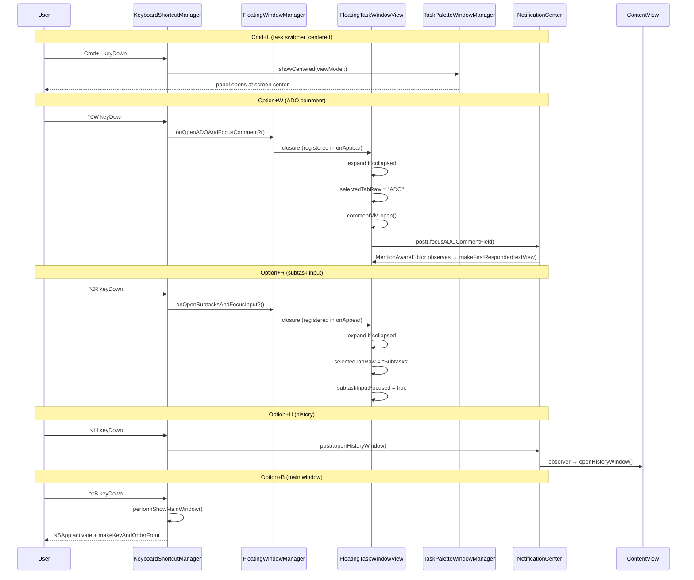

# Keyboard Shortcuts Expansion

## Overview
Add five keyboard shortcut behaviors to the TimeControl macOS app: fix Cmd+L to open the task switcher panel centered on screen (instead of near the mouse) when triggered via keyboard, and add four new Option-key shortcuts for quick ADO comment entry, quick subtask creation, opening the history view, and showing the main window.

## UI / Flow

### Cmd+L — Task Switcher (centered)

**Current behavior (near mouse):**
```
 ┌─────────────────────────────────────┐
 │  Current Task window                │
 │  [↑] Task Name          [+] [▶] [✓]│
 │  [📚] Focus │ Timers │ Subtasks │…  │
 └─────────────────────────────────────┘
                              ↓ mouse cursor
              ┌───────────────────────────┐
              │ 🔍 Search tasks…          │
              ├───────────────────────────┤
              │ ▶ Current Task            │
              │   Another Task            │
              └───────────────────────────┘
```

**New behavior (keyboard shortcut → centered on screen):**
```
 ┌──────────────────────────────────────────────────────┐
 │                     Screen                           │
 │                                                      │
 │          ┌───────────────────────────┐               │
 │          │ 🔍 Search tasks…          │   ← centered  │
 │          ├───────────────────────────┤               │
 │          │ ▶ Current Task            │               │
 │          │   Another Task            │               │
 │          └───────────────────────────┘               │
 │                                                      │
 └──────────────────────────────────────────────────────┘
```

Click on task title switcher button inside the floating window still uses a SwiftUI `.popover` (unchanged).

---

### Option+W — Open ADO Tab + Focus Comment Field

**State: collapsed → expanded, ADO tab selected, compose open, cursor in text field**
```
 ┌─────────────────────────────────────────┐
 │  Current Task window (EXPANDED)         │
 │  [↑] Task Name              [+] [▶] [✓]│
 │  [📚] Focus │ Timers │ Subtasks │ ADO ← selected
 │  ─────────────────────────────────────  │
 │  🔗 ADO #1234                           │
 │  ┌─────────────────────────────────────┐│
 │  │ (comments scroll area)              ││
 │  └─────────────────────────────────────┘│
 │  ┌─────────────────────────────────────┐│
 │  │ Write a comment…   ← FOCUSED cursor ││
 │  └─────────────────────────────────────┘│
 │  [Cancel]                       [Send ↑]│
 └─────────────────────────────────────────┘
```

If task has no ADO link: show a HUD toast "No ADO link on this task" using `HUDToastPanel`.

---

### Option+R — Open Subtasks Tab + Focus Input

**State: collapsed → expanded, Subtasks tab selected, cursor in "Subtask title…" field**
```
 ┌─────────────────────────────────────────┐
 │  Current Task window (EXPANDED)         │
 │  [↑] Task Name              [+] [▶] [✓]│
 │  [📚] Focus │ Timers │ Subtasks ← selected │ Notes
 │  ─────────────────────────────────────  │
 │  Subtasks                               │
 │  ○  Existing subtask 1       0:00 ▶ ↗ 🗑│
 │  ┌────────────────────────┐             │
 │  │ Subtask title…         │ ← FOCUSED  [+]
 │  └────────────────────────┘             │
 └─────────────────────────────────────────┘
```

---

### Option+H — Open History View

Opens the time-tracking calendar/gantt history window (same as clicking History in the toolbar).
```
 ┌──────────────────────────────────────────────────────────┐
 │ History                                              [X] │
 │ ┌──────────┐  ┌────────────────────────────────────────┐ │
 │ │  May 2026│  │  Mon  Tue  Wed  Thu  Fri  Sat  Sun     │ │
 │ │ calendar │  │                                        │ │
 │ │ grid     │  │  (gantt bars per task)                 │ │
 │ └──────────┘  └────────────────────────────────────────┘ │
 └──────────────────────────────────────────────────────────┘
```

---

### Option+B — Show Main App Window

Brings the main TimeControl task list window to the front and focuses it.
```
 ┌──────────────────────────────────────┐
 │ TimeControl              [⚙] [📓] … │
 │ ┌──────────────────────────────────┐ │
 │ │ Search / filter tasks…           │ │
 │ ├──────────────────────────────────┤ │
 │ │ □  Task A             0:05 ▶ ↗ 🗑│ │
 │ │ □  Task B             0:10 ▶ ↗ 🗑│ │
 │ └──────────────────────────────────┘ │
 └──────────────────────────────────────┘
```

---

## Architecture



### New/Modified Components

| Component | Change |
|-----------|--------|
| `ShortcutNames.swift` | Add `.openADOComment`, `.openSubtaskInput`, `.openHistory`, `.showMainWindow` |
| `KeyboardShortcutManager.swift` | Register 4 new shortcuts; add `performShowTaskSwitcherCentered`, `performOpenADOComment`, `performOpenSubtaskInput`, `performOpenHistory`, `performShowMainWindow` |
| `TaskPaletteWindowManager.swift` | Add `showCentered(viewModel:)` method with screen-center origin |
| `FloatingWindowManager.swift` | Add `onOpenADOAndFocusComment: (() -> Void)?` and `onOpenSubtasksAndFocusInput: (() -> Void)?` callbacks |
| `FloatingTaskWindowView.swift` | Register two new callbacks in `onAppear`; handle collapse + tab switch + focus |
| `NotificationNames.swift` | Add `.focusADOCommentField` and `.openHistoryWindow` |
| `MentionAwareEditor` (in ADOCommentPane.swift) | Observe `.focusADOCommentField` notification in `makeNSView` to focus the text view |
| `ContentView.swift` | Observe `.openHistoryWindow` notification and call `openHistoryWindow()` |

---

## Open Questions

_None — all questions resolved._

---

## High-Level Steps


1. Add `.focusADOCommentField` and `.openHistoryWindow` to `NotificationNames.swift`
2. Add four new shortcut names to `ShortcutNames.swift`: `.openADOComment` (⌥W), `.openSubtaskInput` (⌥R), `.openHistory` (⌥H), `.showMainWindow` (⌥B)
3. Add `showCentered(viewModel:)` to `TaskPaletteWindowManager` that positions the panel at screen center instead of near the mouse
4. Update `KeyboardShortcutManager.performShowTaskSwitcher` to call `showCentered` instead of `show`
5. Add `onOpenADOAndFocusComment` and `onOpenSubtasksAndFocusInput` callbacks to `FloatingWindowManager`
6. Register the two new callbacks in `FloatingTaskWindowView.onAppear`; implement the expand-if-collapsed + tab-switch + focus logic for each
7. Add `.focusADOCommentField` notification observation inside `MentionAwareEditor.makeNSView` so the NSTextView becomes first responder when the notification fires
8. Add `performOpenADOComment`, `performOpenSubtaskInput`, `performOpenHistory`, and `performShowMainWindow` to `KeyboardShortcutManager`, and register all four shortcuts in `setup(viewModel:)`
9. Add a `.openHistoryWindow` notification observer in `ContentView.onAppear` that calls `openHistoryWindow()`

---

## Implementation Phases

### Phase 1 — Notification Names, Shortcut Names, Centered Task Switcher
**What it covers:** Add the two new `Notification.Name` constants, the four new `KeyboardShortcuts.Name` entries, refactor `TaskPaletteWindowManager` to support a centered origin, and update `performShowTaskSwitcher` to use it.

**Tests (Red) — write these first:**
```swift
// File: TimeControlTests/KeyboardShortcutManagerTests.swift
// Add to existing KeyboardShortcutManagerTests class

// Also update tearDown to add:
//   TaskPaletteWindowManager.shared.dismiss()  ← already there
//   FloatingWindowManager.shared.onOpenADOAndFocusComment = nil
//   FloatingWindowManager.shared.onOpenSubtasksAndFocusInput = nil

func testShowCentered_makesPaletteVisible() {
    let (vm, _, _) = makeViewModel()
    vm.todos = [makeTodo(text: "A")]

    TaskPaletteWindowManager.shared.showCentered(viewModel: vm)

    XCTAssertTrue(TaskPaletteWindowManager.shared.isVisible)
}

func testPerformShowTaskSwitcher_stillMakesPaletteVisible_afterCenteredRefactor() {
    let (vm, _, _) = makeViewModel()
    vm.todos = [makeTodo(text: "A")]

    sut.performShowTaskSwitcher(viewModel: vm)

    XCTAssertTrue(TaskPaletteWindowManager.shared.isVisible)
}
```

**Production code (Green):**

`NotificationNames.swift` — add two names:
```swift
// TimeControl/Services/NotificationNames.swift
import Foundation

extension Notification.Name {
    static let focusNotesViewerSearch = Notification.Name("focusNotesViewerSearch")
    static let focusADOCommentField   = Notification.Name("focusADOCommentField")
    static let openHistoryWindow      = Notification.Name("openHistoryWindow")
}
```

`ShortcutNames.swift` — add four shortcuts:
```swift
// TimeControl/Services/ShortcutNames.swift
import KeyboardShortcuts

extension KeyboardShortcuts.Name {
    static let toggleTimer  = Self("toggleTimer",  default: .init(.i, modifiers: .command))
    static let taskSwitcher = Self("taskSwitcher", default: .init(.l, modifiers: .command))
    static let setTimer     = Self("setTimer",     default: .init(.t, modifiers: [.command, .shift]))
    static let openNotes    = Self("openNotes",    default: .init(.d, modifiers: .command))
    static let completeTask = Self("completeTask", default: .init(.o, modifiers: .command))
    static let toggleFloatingWindowCollapse = Self("toggleFloatingWindowCollapse", default: .init(.e, modifiers: [.command, .shift]))
    static let openNotesViewer = Self("openNotesViewer", default: .init(.d, modifiers: [.command, .shift]))
    static let openADOComment   = Self("openADOComment",   default: .init(.w, modifiers: .option))
    static let openSubtaskInput = Self("openSubtaskInput", default: .init(.r, modifiers: .option))
    static let openHistory      = Self("openHistory",      default: .init(.h, modifiers: .option))
    static let showMainWindow   = Self("showMainWindow",   default: .init(.b, modifiers: .option))
}
```

`TaskPaletteWindowManager.swift` — extract shared panel creation, add `showCentered`:
```swift
// TimeControl/WindowManagement/TaskPaletteWindowManager.swift
// Replace the existing show(viewModel:) method and add showCentered + _showPanel

final class TaskPaletteWindowManager {
    static let shared = TaskPaletteWindowManager()

    private var panel: NSPanel?
    private var outsideClickMonitor: Any?

    var onDismiss: (() -> Void)?
    var isVisible: Bool { panel?.isVisible ?? false }

    func show(viewModel: TodoViewModel) {
        dismiss()
        let panelWidth: CGFloat = 340
        let panelHeight: CGFloat = 360
        _showPanel(viewModel: viewModel, origin: originNearMouse(width: panelWidth, height: panelHeight),
                   panelWidth: panelWidth, panelHeight: panelHeight)
    }

    func showCentered(viewModel: TodoViewModel) {
        dismiss()
        let panelWidth: CGFloat = 340
        let panelHeight: CGFloat = 360
        let screen = NSScreen.main ?? NSScreen.screens[0]
        let origin = CGPoint(
            x: screen.visibleFrame.midX - panelWidth / 2,
            y: screen.visibleFrame.midY - panelHeight / 2
        )
        _showPanel(viewModel: viewModel, origin: origin, panelWidth: panelWidth, panelHeight: panelHeight)
    }

    private func _showPanel(viewModel: TodoViewModel, origin: CGPoint, panelWidth: CGFloat, panelHeight: CGFloat) {
        let tasks = TaskPaletteWindowManager.availableTasks(for: viewModel)
        let currentTaskId = viewModel.todos.first(where: { $0.isRunning })?.id ?? UUID()
        print("[TaskPalette] todos=\(viewModel.todos.count) tasks=\(tasks.count)")

        let paletteView = StandaloneTaskPaletteView(
            tasks: tasks,
            currentTaskId: currentTaskId,
            onSelect: { [weak self] task in
                viewModel.switchToTask(task)
                self?.dismiss()
            },
            onCreate: { [weak self] text in
                viewModel.filterText = text
                viewModel.addTodo()
                if let created = viewModel.todos.last {
                    viewModel.switchToTask(created)
                }
                self?.dismiss()
            },
            onDismiss: { [weak self] in
                self?.dismiss()
            }
        )

        let newPanel = NSPanel(
            contentRect: NSRect(origin: origin, size: CGSize(width: panelWidth, height: panelHeight)),
            styleMask: [.titled, .fullSizeContentView, .nonactivatingPanel],
            backing: .buffered,
            defer: false
        )
        newPanel.titleVisibility = .hidden
        newPanel.titlebarAppearsTransparent = true
        newPanel.level = .floating
        newPanel.collectionBehavior = [.canJoinAllSpaces, .fullScreenAuxiliary]
        newPanel.isMovableByWindowBackground = true
        newPanel.hidesOnDeactivate = false
        newPanel.isOpaque = false
        newPanel.backgroundColor = .clear
        newPanel.hasShadow = true
        newPanel.becomesKeyOnlyIfNeeded = false

        let hostingController = NSHostingController(rootView: paletteView)
        hostingController.view.frame = NSRect(x: 0, y: 0, width: panelWidth, height: panelHeight)
        newPanel.contentViewController = hostingController

        panel = newPanel
        newPanel.orderFrontRegardless()
        DispatchQueue.main.async {
            newPanel.makeKey()
            if let textField = hostingController.view.firstDescendant(ofType: NSTextField.self) {
                newPanel.makeFirstResponder(textField)
            }
        }

        outsideClickMonitor = NSEvent.addGlobalMonitorForEvents(matching: [.leftMouseDown, .rightMouseDown]) { [weak self] _ in
            self?.dismiss()
        }
    }

    func dismiss() {
        if let monitor = outsideClickMonitor {
            NSEvent.removeMonitor(monitor)
            outsideClickMonitor = nil
        }
        guard panel != nil else { return }
        panel?.close()
        panel = nil
        onDismiss?()
    }

    private func originNearMouse(width: CGFloat, height: CGFloat) -> CGPoint {
        let mouse = NSEvent.mouseLocation
        let screen = NSScreen.screens.first { NSMouseInRect(mouse, $0.frame, false) }
            ?? NSScreen.main
            ?? NSScreen.screens[0]
        let padding: CGFloat = 12
        var x = mouse.x - width / 2
        var y = mouse.y - height - padding
        let frame = screen.visibleFrame
        x = max(frame.minX + padding, min(x, frame.maxX - width - padding))
        y = max(frame.minY + padding, min(y, frame.maxY - height - padding))
        return CGPoint(x: x, y: y)
    }

    static func availableTasks(for viewModel: TodoViewModel) -> [TodoItem] {
        // (unchanged — same implementation as before)
        let incomplete = viewModel.todos.filter { !$0.isCompleted }
        var sorted: [TodoItem]
        switch viewModel.dropdownSortOption {
        case .recentlyPlayed:
            sorted = incomplete.sorted {
                let t1 = $0.lastPlayedAt ?? $0.startedAt ?? $0.createdAt
                let t2 = $1.lastPlayedAt ?? $1.startedAt ?? $1.createdAt
                return t1 > t2
            }
        case .newest:
            sorted = incomplete.sorted { $0.createdAt > $1.createdAt }
        case .oldest:
            sorted = incomplete.sorted { $0.createdAt < $1.createdAt }
        case .estimateSize:
            sorted = incomplete.sorted {
                switch ($0.estimatedTime > 0, $1.estimatedTime > 0) {
                case (true, true): return $0.estimatedTime < $1.estimatedTime
                case (true, false): return true
                case (false, true): return false
                default: return false
                }
            }
        case .dueDate:
            sorted = incomplete.sorted {
                switch ($0.dueDate, $1.dueDate) {
                case let (d1?, d2?): return d1 < d2
                case (_?, nil): return true
                case (nil, _?): return false
                default: return false
                }
            }
        }
        if viewModel.preferADOMode {
            sorted.sort { todo1, todo2 in
                let has1 = todo1.adoWorkItemId != nil
                let has2 = todo2.adoWorkItemId != nil
                if has1 != has2 { return has1 }
                return false
            }
        }
        return sorted
    }
}
```

`KeyboardShortcutManager.swift` — update `performShowTaskSwitcher`:
```swift
// Change this one method; everything else stays the same:
func performShowTaskSwitcher(viewModel: TodoViewModel) {
    TaskPaletteWindowManager.shared.showCentered(viewModel: viewModel)
}
```

**Done when:** `testShowCentered_makesPaletteVisible` and `testPerformShowTaskSwitcher_stillMakesPaletteVisible_afterCenteredRefactor` pass; pressing Cmd+L in the running app opens the palette at screen center.

---

### Phase 2 — FloatingWindowManager Callbacks + FloatingTaskWindowView Wiring
**What it covers:** Add two new callbacks to `FloatingWindowManager` and register them in `FloatingTaskWindowView.onAppear` with the expand + tab-switch + focus logic for ⌥W and ⌥R.

**Tests (Red) — write these first:**
```swift
// File: TimeControlTests/KeyboardShortcutManagerTests.swift
// These tests verify the callbacks exist and can be set/read — the wiring
// is exercised indirectly in Phase 3 tests.

func testFloatingWindowManager_hasADOCommentCallback_settable() {
    var fired = false
    FloatingWindowManager.shared.onOpenADOAndFocusComment = { fired = true }
    FloatingWindowManager.shared.onOpenADOAndFocusComment?()
    XCTAssertTrue(fired)
}

func testFloatingWindowManager_hasSubtaskInputCallback_settable() {
    var fired = false
    FloatingWindowManager.shared.onOpenSubtasksAndFocusInput = { fired = true }
    FloatingWindowManager.shared.onOpenSubtasksAndFocusInput?()
    XCTAssertTrue(fired)
}

func testFloatingWindowManager_clearWindowState_nilsNewCallbacks() {
    FloatingWindowManager.shared.onOpenADOAndFocusComment = { }
    FloatingWindowManager.shared.onOpenSubtasksAndFocusInput = { }
    FloatingWindowManager.shared.clearWindowState()
    XCTAssertNil(FloatingWindowManager.shared.onOpenADOAndFocusComment)
    XCTAssertNil(FloatingWindowManager.shared.onOpenSubtasksAndFocusInput)
}
```

**Production code (Green):**

`FloatingWindowManager.swift` — add two callbacks and clear them in `clearWindowState`:
```swift
// Add to class body alongside onOpenNotes and onToggleCollapse:
var onOpenADOAndFocusComment: (() -> Void)?
var onOpenSubtasksAndFocusInput: (() -> Void)?

// In clearWindowState(), add:
func clearWindowState() {
    floatingWindow = nil
    currentTask = nil
    allTodos = []
    onTaskSwitch = nil
    onOpenNotes = nil
    onToggleCollapse = nil
    onOpenADOAndFocusComment = nil
    onOpenSubtasksAndFocusInput = nil
    windowDelegate = nil
    viewModel = nil
}
```

`FloatingTaskWindowView.swift` — extend the `.onAppear` block:
```swift
// Inside the existing .onAppear { ... } block, add after the existing callbacks:
FloatingWindowManager.shared.onOpenADOAndFocusComment = {
    let delay: Double = isCollapsed ? 0.25 : 0.0
    if isCollapsed {
        withAnimation(.easeInOut(duration: 0.2)) { isCollapsed = false }
    }
    DispatchQueue.main.asyncAfter(deadline: .now() + delay) {
        selectedTabRaw = FloatingTab.comments.rawValue
        commentVM.open()
        DispatchQueue.main.asyncAfter(deadline: .now() + 0.1) {
            NotificationCenter.default.post(name: .focusADOCommentField, object: nil)
        }
    }
}

FloatingWindowManager.shared.onOpenSubtasksAndFocusInput = {
    let delay: Double = isCollapsed ? 0.25 : 0.0
    if isCollapsed {
        withAnimation(.easeInOut(duration: 0.2)) { isCollapsed = false }
    }
    DispatchQueue.main.asyncAfter(deadline: .now() + delay) {
        selectedTabRaw = FloatingTab.subtasks.rawValue
        DispatchQueue.main.asyncAfter(deadline: .now() + 0.05) {
            subtaskInputFocused = true
        }
    }
}
```

**Done when:** The three new tests pass; callbacks can be set and called without crashing; `clearWindowState` nils them.

---

### Phase 3 — KeyboardShortcutManager: New perform* Methods + Registration
**What it covers:** Implement `performOpenADOComment`, `performOpenSubtaskInput`, `performOpenHistory`, `performShowMainWindow` and wire them into `setup(viewModel:)`.

**Tests (Red) — write these first:**
```swift
// File: TimeControlTests/KeyboardShortcutManagerTests.swift

// Also update TestHelpers.swift — add adoWorkItemId param to makeTodo:
// func makeTodo(text:isCompleted:estimatedTime:subtasks:adoWorkItemId:) -> TodoItem

// MARK: - performOpenADOComment

func testPerformOpenADOComment_noWindow_doesNotFireCallback() {
    FloatingWindowManager.shared.closeFloatingWindow()
    var fired = false
    FloatingWindowManager.shared.onOpenADOAndFocusComment = { fired = true }

    sut.performOpenADOComment()

    XCTAssertFalse(fired)
}

func testPerformOpenADOComment_windowOpen_taskHasADOId_firesCallback() {
    let (vm, _, _) = makeViewModel()
    let task = makeTodo(text: "ADO Task", adoWorkItemId: "1234")
    vm.todos = [task]
    FloatingWindowManager.shared.showFloatingWindow(for: task, viewModel: vm)
    var fired = false
    FloatingWindowManager.shared.onOpenADOAndFocusComment = { fired = true }

    sut.performOpenADOComment()

    XCTAssertTrue(fired)
}

func testPerformOpenADOComment_windowOpen_taskHasNoADOId_doesNotFireCallback() {
    let (vm, _, _) = makeViewModel()
    let task = makeTodo(text: "No ADO")
    vm.todos = [task]
    FloatingWindowManager.shared.showFloatingWindow(for: task, viewModel: vm)
    var fired = false
    FloatingWindowManager.shared.onOpenADOAndFocusComment = { fired = true }

    sut.performOpenADOComment()

    XCTAssertFalse(fired)
}

// MARK: - performOpenSubtaskInput

func testPerformOpenSubtaskInput_noWindow_doesNotFireCallback() {
    FloatingWindowManager.shared.closeFloatingWindow()
    var fired = false
    FloatingWindowManager.shared.onOpenSubtasksAndFocusInput = { fired = true }

    sut.performOpenSubtaskInput()

    XCTAssertFalse(fired)
}

func testPerformOpenSubtaskInput_windowOpen_firesCallback() {
    let (vm, _, _) = makeViewModel()
    let task = makeTodo(text: "Task")
    vm.todos = [task]
    FloatingWindowManager.shared.showFloatingWindow(for: task, viewModel: vm)
    var fired = false
    FloatingWindowManager.shared.onOpenSubtasksAndFocusInput = { fired = true }

    sut.performOpenSubtaskInput()

    XCTAssertTrue(fired)
}

// MARK: - performOpenHistory

func testPerformOpenHistory_postsOpenHistoryWindowNotification() {
    let expectation = XCTestExpectation(description: "openHistoryWindow notification")
    let token = NotificationCenter.default.addObserver(
        forName: .openHistoryWindow, object: nil, queue: .main
    ) { _ in expectation.fulfill() }

    sut.performOpenHistory()

    wait(for: [expectation], timeout: 1.0)
    NotificationCenter.default.removeObserver(token)
}

// MARK: - setup registers new shortcuts without crashing

func testSetup_registersAllShortcutsWithoutCrashing() {
    let (vm, _, _) = makeViewModel()
    let manager = KeyboardShortcutManager()
    XCTAssertNoThrow(manager.setup(viewModel: vm))
}
```

`TestHelpers.swift` — add `adoWorkItemId` to `makeTodo`:
```swift
func makeTodo(
    text: String = "Test task",
    isCompleted: Bool = false,
    estimatedTime: TimeInterval = 0,
    subtasks: [Subtask] = [],
    adoWorkItemId: String? = nil
) -> TodoItem {
    TodoItem(
        text: text,
        isCompleted: isCompleted,
        estimatedTime: estimatedTime,
        subtasks: subtasks,
        adoWorkItemId: adoWorkItemId
    )
}
```

**Production code (Green):**

`KeyboardShortcutManager.swift` — full updated file:
```swift
// TimeControl/Services/KeyboardShortcutManager.swift
import AppKit
import KeyboardShortcuts

final class KeyboardShortcutManager {
    static let shared = KeyboardShortcutManager()

    private let hud = HUDToastPanel()

    func setup(viewModel: TodoViewModel) {
        KeyboardShortcuts.onKeyDown(for: .toggleTimer) { [weak self] in
            DispatchQueue.main.asyncAfter(deadline: .now() + 0.05) { self?.performToggleTimerKeepWindow(viewModel: viewModel) }
        }
        KeyboardShortcuts.onKeyDown(for: .taskSwitcher) { [weak self] in
            DispatchQueue.main.async { self?.performShowTaskSwitcher(viewModel: viewModel) }
        }
        KeyboardShortcuts.onKeyDown(for: .setTimer) { [weak self] in
            DispatchQueue.main.async { self?.performShowQuickTimer(viewModel: viewModel) }
        }
        KeyboardShortcuts.onKeyDown(for: .openNotes) { [weak self] in
            DispatchQueue.main.async { self?.performToggleNotes() }
        }
        KeyboardShortcuts.onKeyDown(for: .completeTask) { [weak self] in
            DispatchQueue.main.async { self?.performCompleteTask(viewModel: viewModel) }
        }
        KeyboardShortcuts.onKeyDown(for: .toggleFloatingWindowCollapse) { [weak self] in
            DispatchQueue.main.async { self?.performToggleFloatingWindowCollapse() }
        }
        KeyboardShortcuts.onKeyDown(for: .openNotesViewer) { [weak self] in
            DispatchQueue.main.async { self?.performToggleNotesViewer() }
        }
        KeyboardShortcuts.onKeyDown(for: .openADOComment) { [weak self] in
            DispatchQueue.main.async { self?.performOpenADOComment() }
        }
        KeyboardShortcuts.onKeyDown(for: .openSubtaskInput) { [weak self] in
            DispatchQueue.main.async { self?.performOpenSubtaskInput() }
        }
        KeyboardShortcuts.onKeyDown(for: .openHistory) { [weak self] in
            DispatchQueue.main.async { self?.performOpenHistory() }
        }
        KeyboardShortcuts.onKeyDown(for: .showMainWindow) { [weak self] in
            DispatchQueue.main.async { self?.performShowMainWindow() }
        }
    }

    func performToggleTimerKeepWindow(viewModel: TodoViewModel) {
        if let runningId = viewModel.runningTaskId,
           let task = viewModel.todos.first(where: { $0.id == runningId }) {
            if task.lastStartTime != nil {
                viewModel.pauseTask(runningId, keepWindowOpen: true)
            } else {
                viewModel.resumeTask(runningId)
            }
        } else if let task = viewModel.todos
            .filter({ !$0.isCompleted })
            .sorted(by: { ($0.lastPlayedAt ?? 0) > ($1.lastPlayedAt ?? 0) })
            .first {
            viewModel.toggleTimer(task)
        }
    }

    func performShowTaskSwitcher(viewModel: TodoViewModel) {
        TaskPaletteWindowManager.shared.showCentered(viewModel: viewModel)
    }

    func performShowQuickTimer(viewModel: TodoViewModel) {
        QuickTimerWindowManager.shared.show(viewModel: viewModel)
    }

    func performToggleNotes() {
        let mgr = FloatingWindowManager.shared
        if let notes = mgr.notesWindowRef, notes.isVisible {
            notes.close()
        } else {
            mgr.onOpenNotes?()
        }
    }

    func performCompleteTask(viewModel: TodoViewModel) {
        guard FloatingWindowManager.shared.isWindowOpen,
              let task = FloatingWindowManager.shared.currentTask else {
            return
        }
        viewModel.completeTaskFromFloatingWindow(task.id)
        if let updatedTask = viewModel.todos.first(where: { $0.id == task.id }) {
            FloatingWindowManager.shared.updateTask(updatedTask)
        }
    }

    func performToggleNotesViewer() {
        let mgr = FloatingWindowManager.shared
        if let viewer = mgr.notesViewerWindowRef, viewer.isVisible {
            if viewer.isKeyWindow {
                viewer.close()
            } else {
                mgr.onOpenNotesViewer?()
            }
        } else {
            mgr.onOpenNotesViewer?()
        }
    }

    func performToggleFloatingWindowCollapse() {
        let mgr = FloatingWindowManager.shared
        guard mgr.isWindowOpen else { return }
        mgr.onToggleCollapse?()
    }

    func performOpenADOComment() {
        let mgr = FloatingWindowManager.shared
        guard mgr.isWindowOpen else { return }
        guard let task = mgr.currentTask,
              let adoId = task.adoWorkItemId, !adoId.isEmpty else {
            hud.show(message: "No ADO link on this task")
            return
        }
        mgr.onOpenADOAndFocusComment?()
    }

    func performOpenSubtaskInput() {
        let mgr = FloatingWindowManager.shared
        guard mgr.isWindowOpen else { return }
        mgr.onOpenSubtasksAndFocusInput?()
    }

    func performOpenHistory() {
        NotificationCenter.default.post(name: .openHistoryWindow, object: nil)
    }

    func performShowMainWindow() {
        NSApp.activate(ignoringOtherApps: true)
        NSApp.windows
            .filter { !($0 is NSPanel) && $0.isVisible }
            .first?
            .makeKeyAndOrderFront(nil)
    }
}
```

**Done when:** All 8 new tests pass; `testSetup_registersAllShortcutsWithoutCrashing` passes; existing `KeyboardShortcutManagerTests` still pass.

---

### Phase 4 — MentionAwareEditor Focus Notification + ContentView History Observer
**What it covers:** Wire the `.focusADOCommentField` notification into `MentionAwareEditor` so the NSTextView gets keyboard focus, and add the `.openHistoryWindow` observer to `ContentView`.

**Tests (Red) — write these first:**
```swift
// File: TimeControlTests/KeyboardShortcutManagerTests.swift
// The MentionAwareEditor focus is a UI/NSWindow concern that requires the window
// server — not unit testable. The ContentView observer is a SwiftUI lifecycle
// concern. Both are covered by manual testing (see How to Test).
// The one thing we can assert: posting .focusADOCommentField does NOT crash.

func testPostingFocusADOCommentFieldNotification_doesNotCrash() {
    XCTAssertNoThrow(
        NotificationCenter.default.post(name: .focusADOCommentField, object: nil)
    )
}

func testPostingOpenHistoryWindowNotification_doesNotCrash() {
    XCTAssertNoThrow(
        NotificationCenter.default.post(name: .openHistoryWindow, object: nil)
    )
}
```

**Production code (Green):**

`ADOCommentPane.swift` — add focus observer to `MentionAwareEditor.Coordinator` and wire it in `makeNSView`:
```swift
// Inside the private Coordinator class, add:
var focusObserver: NSObjectProtocol?

deinit {
    if let token = focusObserver {
        NotificationCenter.default.removeObserver(token)
    }
}

// In makeNSView(context:), add this block just before `return scrollView`:
context.coordinator.focusObserver = NotificationCenter.default.addObserver(
    forName: .focusADOCommentField,
    object: nil,
    queue: .main
) { [weak scrollView] _ in
    guard let tv = scrollView?.documentView as? NSTextView else { return }
    tv.window?.makeFirstResponder(tv)
}
```

`ContentView.swift` — add `.openHistoryWindow` observer inside the existing `.onAppear` block:
```swift
// Inside the .onAppear { ... } block at line ~265, append:
NotificationCenter.default.addObserver(
    forName: .openHistoryWindow,
    object: nil,
    queue: .main
) { [self] _ in
    openHistoryWindow()
}
```

**Done when:** Both crash-guard tests pass; pressing ⌥H in the app opens the history window; pressing ⌥W focuses the comment field in the ADO pane.

---

## Feature Acceptance Checklist

- [ ] Cmd+L opens the task switcher panel **centered on screen** (not near the mouse)
- [ ] Clicking the task name switcher button inside the Current Task window still opens a popover inline (unchanged behavior)
- [ ] ⌥W expands the Current Task window if collapsed, switches to the ADO tab, opens the comment compose area, and places the cursor in the text field
- [ ] ⌥W on a task with no ADO link shows a HUD toast "No ADO link on this task" and does nothing else
- [ ] ⌥W is a no-op when the Current Task window is not open
- [ ] ⌥R expands the Current Task window if collapsed, switches to the Subtasks tab, and focuses the "Subtask title…" input field
- [ ] ⌥R is a no-op when the Current Task window is not open
- [ ] ⌥H opens the time-tracking History window (or brings it to front if already open)
- [ ] ⌥B brings the main TimeControl task list window to the front
- [ ] All existing keyboard shortcut tests continue to pass (no regressions)

---

## How to Test

### Setup

| Requirement | Details |
|-------------|---------|
| ADO-linked task | At least one task in the app with a valid ADO Work Item ID (set via the Edit Task sheet) |
| ADO credentials | ADO PAT configured in Settings so the ADO tab can load comments |
| A task with no ADO link | At least one task without an ADO ID, to verify the ⌥W HUD toast |

### Steps

1. Build and run the app in Xcode (⌘R).
2. Open the Current Task floating window by starting a task.

**Cmd+L — centered task switcher**
3. Press Cmd+L. Verify the task palette appears **centered on the screen**, not near the mouse cursor.
4. Click the task name inside the floating window to open the inline popover. Verify it still opens as a popover attached to the button (unchanged).

**⌥W — ADO comment**
5. With the floating window open on an **ADO-linked task**, press ⌥W. Verify: window expands (if it was collapsed), ADO tab is selected, the "Add comment" button has been replaced by the compose area, and the cursor is active in the text field.
6. Collapse the window first, then press ⌥W. Verify it expands and then opens the compose area.
7. Switch to a task with **no ADO link**. Press ⌥W. Verify a HUD toast "No ADO link on this task" appears and the window is otherwise unchanged.

**⌥R — subtask input**
8. Press ⌥R. Verify: window expands (if collapsed), Subtasks tab is selected, the cursor is in the "Subtask title…" field (you can type immediately).

**⌥H — history window**
9. Press ⌥H. Verify the History window opens centered on screen showing the calendar/gantt view.
10. Press ⌥H again while the history window is open. Verify it brings the window to front (does not open a second copy).

**⌥B — main window**
11. Click away from the TimeControl app so it loses focus. Press ⌥B. Verify the main task list window comes to front and is key.

### Regressions to check
- [ ] Cmd+I still toggles the running timer
- [ ] Cmd+D still opens the notes window
- [ ] Cmd+O still completes the current task
- [ ] Cmd+Shift+E still toggles collapse on the floating window
- [ ] Cmd+Shift+D still opens the notes viewer
- [ ] Status bar click still opens the notification history panel (not affected by ⌥H)
