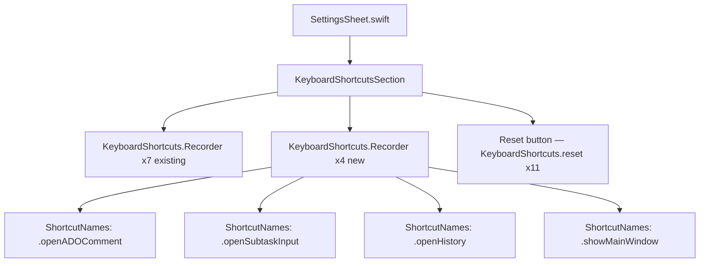

# Keyboard Shortcuts Settings

## Overview
Expose the four new keyboard shortcuts added by the keyboard-shortcuts-expansion feature (⌥W, ⌥R, ⌥H, ⌥B) inside the existing **Keyboard Shortcuts** settings section so users can inspect, remap, and reset them.

## UI / Flow

### Current state — 7 recorders, single reset button
```
┌─ Keyboard Shortcuts ──────────────────────────────────────┐
│ Toggle Task Timer              [⌘ I            ]           │
│ Quick Task Switcher            [⌘ L            ]           │
│ Set Timer                      [⌘ ⇧ T          ]           │
│ Open Notes                     [⌘ D            ]           │
│ Open Notes Viewer              [⌘ ⇧ D          ]           │
│ Complete Task                  [⌘ O            ]           │
│ Collapse Floating Task Window  [⌘ ⇧ E          ]           │
│                                                            │
│  [Reset shortcuts to defaults]                             │
└────────────────────────────────────────────────────────────┘
```

### New state — 11 recorders, same reset button covers all
```
┌─ Keyboard Shortcuts ──────────────────────────────────────┐
│ Toggle Task Timer              [⌘ I            ]           │
│ Quick Task Switcher            [⌘ L            ]           │
│ Set Timer                      [⌘ ⇧ T          ]           │
│ Open Notes                     [⌘ D            ]           │
│ Open Notes Viewer              [⌘ ⇧ D          ]           │
│ Complete Task                  [⌘ O            ]           │
│ Collapse Floating Task Window  [⌘ ⇧ E          ]           │
│ Open ADO Comment               [⌥ W            ]           │
│ Open Subtask Input             [⌥ R            ]           │
│ Open History                   [⌥ H            ]           │
│ Show Main Window               [⌥ B            ]           │
│                                                            │
│  [Reset shortcuts to defaults]                             │
└────────────────────────────────────────────────────────────┘
```

The 4 new recorders are appended after the existing 7, with no visual sub-grouping (keeps the section flat and consistent with the existing style).

## Architecture



Only `SettingsSheet.swift` changes — `ShortcutNames.swift` already has the four new names.

## Open Questions

_None — all decisions resolved._

---

## High-Level Steps

1. Add four `KeyboardShortcuts.Recorder` rows to `KeyboardShortcutsSection` (after the existing seven)
2. Add the four new shortcut names to the `KeyboardShortcuts.reset(...)` call in the Reset button

---

## Implementation Phases

### Phase 1 — Add 4 Recorders + Expand Reset Button
**What it covers:** Append four `KeyboardShortcuts.Recorder` rows to `KeyboardShortcutsSection` and include all four new names in the existing reset button call.

**Tests (Red) — write these first:**
```swift
// File: TimeControlTests/KeyboardShortcutManagerTests.swift
// Add inside KeyboardShortcutManagerTests

// Verifies that resetting the four new shortcuts restores their expected defaults
// without crashing. This is the only unit-testable surface for a pure UI addition.

func testResetNewShortcuts_restoresDefaults_doesNotCrash() {
    import KeyboardShortcuts

    // Overwrite each shortcut with a different binding
    KeyboardShortcuts.setShortcut(.init(.a, modifiers: .control), for: .openADOComment)
    KeyboardShortcuts.setShortcut(.init(.a, modifiers: .control), for: .openSubtaskInput)
    KeyboardShortcuts.setShortcut(.init(.a, modifiers: .control), for: .openHistory)
    KeyboardShortcuts.setShortcut(.init(.a, modifiers: .control), for: .showMainWindow)

    // Act — mirrors the reset call in the Reset button
    XCTAssertNoThrow(
        KeyboardShortcuts.reset(
            .openADOComment,
            .openSubtaskInput,
            .openHistory,
            .showMainWindow
        )
    )

    // Assert defaults restored
    XCTAssertEqual(KeyboardShortcuts.getShortcut(for: .openADOComment),   .init(.w, modifiers: .option))
    XCTAssertEqual(KeyboardShortcuts.getShortcut(for: .openSubtaskInput), .init(.r, modifiers: .option))
    XCTAssertEqual(KeyboardShortcuts.getShortcut(for: .openHistory),      .init(.h, modifiers: .option))
    XCTAssertEqual(KeyboardShortcuts.getShortcut(for: .showMainWindow),   .init(.b, modifiers: .option))
}
```

**Production code (Green):**

`SettingsSheet.swift` — replace `KeyboardShortcutsSection`:
```swift
struct KeyboardShortcutsSection: View {
    var body: some View {
        VStack(alignment: .leading, spacing: 12) {
            Text("Keyboard Shortcuts")
                .font(.title3)
                .fontWeight(.semibold)

            KeyboardShortcuts.Recorder("Toggle Task Timer",              name: .toggleTimer)
            KeyboardShortcuts.Recorder("Quick Task Switcher",            name: .taskSwitcher)
            KeyboardShortcuts.Recorder("Set Timer",                      name: .setTimer)
            KeyboardShortcuts.Recorder("Open Notes",                     name: .openNotes)
            KeyboardShortcuts.Recorder("Open Notes Viewer",              name: .openNotesViewer)
            KeyboardShortcuts.Recorder("Complete Task",                  name: .completeTask)
            KeyboardShortcuts.Recorder("Collapse Floating Task Window",  name: .toggleFloatingWindowCollapse)
            KeyboardShortcuts.Recorder("Open ADO Comment",               name: .openADOComment)
            KeyboardShortcuts.Recorder("Open Subtask Input",             name: .openSubtaskInput)
            KeyboardShortcuts.Recorder("Open History",                   name: .openHistory)
            KeyboardShortcuts.Recorder("Show Main Window",               name: .showMainWindow)

            Button("Reset shortcuts to defaults") {
                KeyboardShortcuts.reset(
                    .toggleTimer,
                    .taskSwitcher,
                    .setTimer,
                    .openNotes,
                    .openNotesViewer,
                    .completeTask,
                    .toggleFloatingWindowCollapse,
                    .openADOComment,
                    .openSubtaskInput,
                    .openHistory,
                    .showMainWindow
                )
            }
            .buttonStyle(.bordered)
            .padding(.top, 6)
        }
    }
}
```

**Done when:** `testResetNewShortcuts_restoresDefaults_doesNotCrash` passes; opening Settings in the running app shows all 11 shortcut rows; clicking Reset restores all defaults.

---

## Feature Acceptance Checklist

- [ ] Settings sheet shows 11 keyboard shortcut rows (the original 7 plus Open ADO Comment, Open Subtask Input, Open History, Show Main Window)
- [ ] Each new row displays its default binding (⌥W, ⌥R, ⌥H, ⌥B respectively)
- [ ] Each new row's recorder accepts a new binding when clicked and a key is pressed
- [ ] "Reset shortcuts to defaults" restores all 11 shortcuts to their defaults (including the 4 new ones)
- [ ] All existing keyboard shortcut tests pass (no regressions)

---

## How to Test

### Steps

1. Build and run the app (⌘R).
2. Open Settings (⚙ button in the main toolbar or floating window).
3. Scroll to the **Keyboard Shortcuts** section.

**Happy path**
4. Verify 11 recorder rows are visible, with the 4 new ones at the bottom showing ⌥W, ⌥R, ⌥H, ⌥B.
5. Click the **Open ADO Comment** recorder and press a different key (e.g. ⌥A). Verify the binding updates.
6. Click **Reset shortcuts to defaults**. Verify the recorder reverts to ⌥W.
7. Repeat step 5–6 for the other three new rows.

**Regression check**
- [ ] The original 7 recorders still show their default bindings after reset
- [ ] Pressing the remapped shortcuts in the app still triggers the correct actions
