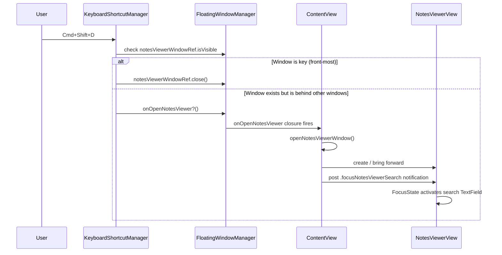

# Notes Viewer Keyboard Shortcut (Cmd+Shift+D)

## Overview
Add a global keyboard shortcut (Cmd+Shift+D) that opens the Notes Viewer window
(`NotesViewerView`) with the search field automatically focused. Pressing the shortcut
while the viewer is already open closes it. This is a separate shortcut from the existing
`openNotes` (Cmd+N), which controls the notes editor panel attached to the floating task
window.

## UI / Flow

### State 1 — Notes Viewer closed, shortcut pressed → opens with focus
```
┌─────────────────────────────────────────────────────┐
│  Notes                                         [x]  │
├──────────────────────────┬──────────────────────────┤
│ 🔍 [Search tasks...    ] │                          │
│  ← cursor focused here   │   Select a task to view  │
├──────────────────────────┤      its notes           │
│  Sort: Newest ▾          │                          │
├──────────────────────────┤                          │
│  Task A                  │                          │
│  Task B                  │                          │
│  Task C                  │                          │
└──────────────────────────┴──────────────────────────┘
         ^ window appears, search field receives focus
```

### State 2 — Notes Viewer is front-most window, shortcut pressed → closes
```
  [Notes Viewer is key window]
        Cmd+Shift+D
            ↓
  [Notes Viewer closed]
```

### State 3 — Notes Viewer open but behind other windows, shortcut pressed → brings to front + focuses search
```
  [Other window in front]   [Notes Viewer behind]
              Cmd+Shift+D
                    ↓
  [Notes Viewer comes to front, search field focused]
```

## Architecture



### New/changed components

| Component | Change |
|---|---|
| `ShortcutNames.swift` | Add `openNotesViewer` with default `Cmd+Shift+D` |
| `KeyboardShortcutManager.swift` | Register `openNotesViewer`; add `performToggleNotesViewer()` |
| `FloatingWindowManager.swift` | Add `weak var notesViewerWindowRef: NSWindow?` and `var onOpenNotesViewer: (() -> Void)?` |
| `ContentView.swift` | `openNotesViewerWindow()` stores ref + wires `onOpenNotesViewer`; posts notification; calls `makeKeyAndOrderFront` |
| `NotesViewerView.swift` | Add `@FocusState` on search field; observe `focusNotesViewerSearch` notification |
| `SettingsSheet.swift` | Add recorder row for the new shortcut |
| `KeyboardShortcutManagerTests.swift` | Tests for `performToggleNotesViewer()` |

### Focus mechanism

`NotesViewerView` declares:
```swift
@FocusState private var searchFocused: Bool
```
The search `TextField` is bound to it with `.focused($searchFocused)`.
On `.onReceive(NotificationCenter.default.publisher(for: .focusNotesViewerSearch))` it sets
`searchFocused = true`.

`openNotesViewerWindow()` calls `makeKeyAndOrderFront(nil)` (not `orderFrontRegardless`)
so the window becomes key and can accept keyboard input, then posts the notification on the
next run-loop tick so SwiftUI's focus engine has time to settle.

## High-Level Steps

1. Add `openNotesViewer` shortcut name to `ShortcutNames.swift` with default `Cmd+Shift+D`
2. Add `weak var notesViewerWindowRef: NSWindow?` and `var onOpenNotesViewer: (() -> Void)?` to `FloatingWindowManager`
3. Update `openNotesViewerWindow()` in `ContentView` to store the window ref, wire `onOpenNotesViewer`, and call `makeKeyAndOrderFront(nil)`
4. Add `Notification.Name.focusNotesViewerSearch` extension and post it from `openNotesViewerWindow()` on the next run-loop tick
5. Update `NotesViewerView` to add `@FocusState` on the search field and observe the focus notification
6. Add `performToggleNotesViewer()` to `KeyboardShortcutManager` implementing the three-state logic (key → close, behind → front+focus, closed → open+focus)
7. Register the new shortcut handler in `KeyboardShortcutManager.setup()`
8. Add the `openNotesViewer` recorder row to `SettingsSheet`
9. Write tests for `performToggleNotesViewer()` in `KeyboardShortcutManagerTests`

## Implementation Phases

### Phase 1 — ShortcutName + FloatingWindowManager + performToggleNotesViewer
**What it covers:** All backend wiring for the shortcut — the name, the FWM properties, and
the three-state action method. No UI changes yet; the action is fully testable in isolation.

**Tests (Red) — write these first:**
```swift
// In KeyboardShortcutManagerTests.swift

// Add to tearDown():
// FloatingWindowManager.shared.notesViewerWindowRef = nil
// FloatingWindowManager.shared.onOpenNotesViewer = nil

// MARK: - performToggleNotesViewer

func testPerformToggleNotesViewer_nilWindowRef_firesOpenCallback() {
    var fulfilled = false
    FloatingWindowManager.shared.notesViewerWindowRef = nil
    FloatingWindowManager.shared.onOpenNotesViewer = { fulfilled = true }

    sut.performToggleNotesViewer()

    XCTAssertTrue(fulfilled)
}

func testPerformToggleNotesViewer_windowNotVisible_firesOpenCallback() {
    var fulfilled = false
    let window = NSWindow(
        contentRect: NSRect(x: 0, y: 0, width: 100, height: 100),
        styleMask: [.titled],
        backing: .buffered,
        defer: true
    )
    FloatingWindowManager.shared.notesViewerWindowRef = window
    FloatingWindowManager.shared.onOpenNotesViewer = { fulfilled = true }

    sut.performToggleNotesViewer()

    XCTAssertTrue(fulfilled)
}

func testPerformToggleNotesViewer_windowVisibleAndKey_doesNotFireCallback() {
    // A window ordered on screen becomes key. We verify the callback is NOT fired —
    // the close path is taken instead.
    var fulfilled = false
    let window = NSWindow(
        contentRect: NSRect(x: 0, y: 0, width: 100, height: 100),
        styleMask: [.titled],
        backing: .buffered,
        defer: false
    )
    window.orderFrontRegardless()
    window.makeKey()
    FloatingWindowManager.shared.notesViewerWindowRef = window
    FloatingWindowManager.shared.onOpenNotesViewer = { fulfilled = true }

    sut.performToggleNotesViewer()

    XCTAssertFalse(fulfilled)
    window.close()
}
```

**Production code (Green):**

`ShortcutNames.swift` — add one line inside the extension:
```swift
// File: TimeControl/Services/ShortcutNames.swift
import KeyboardShortcuts

extension KeyboardShortcuts.Name {
    static let toggleTimer  = Self("toggleTimer",  default: .init(.i, modifiers: .command))
    static let taskSwitcher = Self("taskSwitcher", default: .init(.l, modifiers: .command))
    static let setTimer     = Self("setTimer",     default: .init(.t, modifiers: [.command, .shift]))
    static let openNotes    = Self("openNotes",    default: .init(.n, modifiers: .command))
    static let completeTask = Self("completeTask", default: .init(.o, modifiers: .command))
    static let toggleFloatingWindowCollapse = Self("toggleFloatingWindowCollapse", default: .init(.e, modifiers: [.command, .shift]))
    static let openNotesViewer = Self("openNotesViewer", default: .init(.d, modifiers: [.command, .shift]))
}
```

`FloatingWindowManager.swift` — add two properties after `notesWindowRef`:
```swift
// After: weak var notesWindowRef: NSWindow?
weak var notesViewerWindowRef: NSWindow?
var onOpenNotesViewer: (() -> Void)?
```

`KeyboardShortcutManager.swift` — add `performToggleNotesViewer()` and register in `setup()`:
```swift
// File: TimeControl/Services/KeyboardShortcutManager.swift
import AppKit
import KeyboardShortcuts

final class KeyboardShortcutManager {
    static let shared = KeyboardShortcutManager()

    private let hud = HUDToastPanel()

    func setup(viewModel: TodoViewModel) {
        KeyboardShortcuts.onKeyDown(for: .toggleTimer) { [weak self] in
            DispatchQueue.main.asyncAfter(deadline: .now() + 0.05) { self?.performToggleTimerKeepWindow(viewModel: viewModel) }
        }
        KeyboardShortcuts.onKeyDown(for: .taskSwitcher) { [weak self] in
            DispatchQueue.main.async { self?.performShowTaskSwitcher(viewModel: viewModel) }
        }
        KeyboardShortcuts.onKeyDown(for: .setTimer) { [weak self] in
            DispatchQueue.main.async { self?.performShowQuickTimer(viewModel: viewModel) }
        }
        KeyboardShortcuts.onKeyDown(for: .openNotes) { [weak self] in
            DispatchQueue.main.async { self?.performToggleNotes() }
        }
        KeyboardShortcuts.onKeyDown(for: .completeTask) { [weak self] in
            DispatchQueue.main.async { self?.performCompleteTask(viewModel: viewModel) }
        }
        KeyboardShortcuts.onKeyDown(for: .toggleFloatingWindowCollapse) { [weak self] in
            DispatchQueue.main.async { self?.performToggleFloatingWindowCollapse() }
        }
        KeyboardShortcuts.onKeyDown(for: .openNotesViewer) { [weak self] in
            DispatchQueue.main.async { self?.performToggleNotesViewer() }
        }
    }

    func performToggleNotesViewer() {
        let mgr = FloatingWindowManager.shared
        if let viewer = mgr.notesViewerWindowRef, viewer.isVisible {
            if viewer.isKeyWindow {
                viewer.close()
            } else {
                mgr.onOpenNotesViewer?()
            }
        } else {
            mgr.onOpenNotesViewer?()
        }
    }

    // ... (all existing methods unchanged) ...
}
```

**Done when:** `performToggleNotesViewer()` exists; pressing Cmd+Shift+D is registered (even
if `onOpenNotesViewer` is not yet wired, the method is callable). All three new tests pass.

---

### Phase 2 — NotesViewerView focus support
**What it covers:** The view gains the ability to auto-focus its search field on demand via
a `Notification`. No window wiring yet — just the view-side plumbing.

**Tests (Red) — write these first:**
```swift
// NotesViewerView focus is a SwiftUI FocusState interaction — not unit-testable without
// a running host. Acceptance is verified manually:
//   1. Post Notification.Name.focusNotesViewerSearch from lldb or a test button.
//   2. Confirm the search TextField cursor appears without clicking.
// No new XCTest file for this phase.
```

**Production code (Green):**

Add the notification name (new file or append to an existing constants file):
```swift
// File: TimeControl/Services/NotificationNames.swift
import Foundation

extension Notification.Name {
    static let focusNotesViewerSearch = Notification.Name("focusNotesViewerSearch")
}
```

`NotesViewerView.swift` — add `@FocusState`, bind it to the TextField, and observe the notification:
```swift
// File: TimeControl/Views/NotesViewerView.swift
import SwiftUI
import AppKit

struct NotesViewerView: View {
    @ObservedObject var viewModel: TodoViewModel
    @State private var selectedTaskId: UUID? = nil
    @State private var searchText: String = ""
    @State private var sortOption: TaskSortOption = .creationDateNewest
    @FocusState private var searchFocused: Bool          // ← new

    // ... (filteredTodos, sortItems, selectedTodo unchanged) ...

    var body: some View {
        HSplitView {
            VStack(spacing: 0) {
                // Search bar
                HStack(spacing: 6) {
                    Image(systemName: "magnifyingglass")
                        .foregroundColor(.secondary)
                    TextField("Search tasks or notes…", text: $searchText)
                        .textFieldStyle(.plain)
                        .focused($searchFocused)          // ← new
                    if !searchText.isEmpty {
                        Button(action: { searchText = "" }) {
                            Image(systemName: "xmark.circle.fill")
                                .foregroundColor(.secondary)
                        }
                        .buttonStyle(.plain)
                    }
                }
                .padding(8)
                .background(Color(NSColor.controlBackgroundColor))

                // ... (Divider, sort picker, list — all unchanged) ...
            }
            .frame(minWidth: 200, idealWidth: 240, maxWidth: 320)

            // ... (detail pane unchanged) ...
        }
        .onChange(of: filteredTodos.map { $0.id }) { newIds in
            if let id = selectedTaskId, !newIds.contains(id) { selectedTaskId = nil }
            if selectedTaskId == nil, let first = newIds.first { selectedTaskId = first }
        }
        .onAppear {
            if selectedTaskId == nil { selectedTaskId = filteredTodos.first?.id }
        }
        .onReceive(NotificationCenter.default.publisher(for: .focusNotesViewerSearch)) { _ in  // ← new
            searchFocused = true
        }
    }
}
```

**Done when:** Manually posting `Notification.Name.focusNotesViewerSearch` from anywhere
causes the search field cursor to appear without the user clicking.

---

### Phase 3 — ContentView wiring + SettingsSheet
**What it covers:** `openNotesViewerWindow()` is updated to store the window ref, use
`makeKeyAndOrderFront`, and post the focus notification. `onOpenNotesViewer` is registered
in `onAppear` so the shortcut can reach it. The new shortcut appears in Settings.

**Tests (Red) — write these first:**
```swift
// No new unit tests — the wiring is end-to-end AppKit/SwiftUI glue that is not
// unit-testable without a full app host. Acceptance is verified manually (see Done when).
```

**Production code (Green):**

`ContentView.swift` — update `openNotesViewerWindow()` and add to `.onAppear`:
```swift
// File: TimeControl/ContentView.swift

// In the first .onAppear block, add:
FloatingWindowManager.shared.onOpenNotesViewer = {
    openNotesViewerWindow()
}

// Replace openNotesViewerWindow() entirely:
private func openNotesViewerWindow() {
    if let existing = notesViewerWindow, existing.isVisible {
        existing.makeKeyAndOrderFront(nil)
        DispatchQueue.main.async {
            NotificationCenter.default.post(name: .focusNotesViewerSearch, object: nil)
        }
        return
    }
    notesViewerWindow?.close()

    let windowWidth: CGFloat = 800
    let windowHeight: CGFloat = 520

    let xPos: CGFloat
    let yPos: CGFloat
    if let screen = NSScreen.main {
        xPos = screen.visibleFrame.midX - windowWidth / 2
        yPos = screen.visibleFrame.midY - windowHeight / 2
    } else {
        xPos = 200
        yPos = 200
    }

    let contentView = NotesViewerView(viewModel: viewModel)
    let hostingView = NSHostingView(rootView: contentView)

    let window = NSPanel(
        contentRect: NSRect(x: xPos, y: yPos, width: windowWidth, height: windowHeight),
        styleMask: [.nonactivatingPanel, .titled, .closable, .resizable],
        backing: .buffered,
        defer: false
    )
    window.title = "Notes"
    window.contentView = hostingView
    window.level = .floating
    window.collectionBehavior = [.canJoinAllSpaces, .fullScreenAuxiliary]
    window.isFloatingPanel = true
    window.becomesKeyOnlyIfNeeded = true
    window.hidesOnDeactivate = false
    window.minSize = NSSize(width: 500, height: 300)

    FloatingWindowManager.shared.notesViewerWindowRef = window   // ← new
    notesViewerWindow = window
    window.makeKeyAndOrderFront(nil)                              // ← changed from orderFrontRegardless
    DispatchQueue.main.async {                                    // ← new
        NotificationCenter.default.post(name: .focusNotesViewerSearch, object: nil)
    }
}
```

`SettingsSheet.swift` — add recorder row and include in reset:
```swift
// File: TimeControl/Views/SettingsSheet.swift

struct KeyboardShortcutsSection: View {
    var body: some View {
        VStack(alignment: .leading, spacing: 12) {
            Text("Keyboard Shortcuts")
                .font(.title3)
                .fontWeight(.semibold)

            KeyboardShortcuts.Recorder("Toggle Task Timer", name: .toggleTimer)
            KeyboardShortcuts.Recorder("Quick Task Switcher", name: .taskSwitcher)
            KeyboardShortcuts.Recorder("Set Timer", name: .setTimer)
            KeyboardShortcuts.Recorder("Open Notes", name: .openNotes)
            KeyboardShortcuts.Recorder("Open Notes Viewer", name: .openNotesViewer)   // ← new
            KeyboardShortcuts.Recorder("Complete Task", name: .completeTask)
            KeyboardShortcuts.Recorder("Collapse Floating Task Window", name: .toggleFloatingWindowCollapse)

            Button("Reset shortcuts to defaults") {
                KeyboardShortcuts.reset(
                    .toggleTimer,
                    .taskSwitcher,
                    .setTimer,
                    .openNotes,
                    .openNotesViewer,                              // ← new
                    .completeTask,
                    .toggleFloatingWindowCollapse
                )
            }
            .buttonStyle(.bordered)
            .padding(.top, 6)
        }
    }
}
```

**Done when:**
- Pressing Cmd+Shift+D with the viewer closed opens it with the search field focused.
- Pressing Cmd+Shift+D while the viewer is the key window closes it.
- Pressing Cmd+Shift+D while the viewer is open but behind another window brings it forward with the search field focused.
- "Open Notes Viewer" row appears in Settings → Keyboard Shortcuts and can be rebound.
- Reset button restores Cmd+Shift+D as the default.

## Open Questions
_(none — all resolved below)_

- **Separate shortcut vs. reuse `openNotes`?** → Separate. `openNotes` (Cmd+N) opens the
  task-notes editor panel attached to the floating task window. This feature targets the
  standalone Notes Viewer. Both coexist.
- **Close-if-visible or bring-to-front-if-behind?** → Close only if the window is already
  the key (front-most) window. If it's open but behind other windows, bring it forward and
  focus the search field instead.
- **`becomesKeyOnlyIfNeeded` on the viewer window?** → Change to `false` only when
  opened via shortcut (by calling `makeKeyAndOrderFront`). The window config itself keeps
  `becomesKeyOnlyIfNeeded = true` for mouse-click interactions to remain non-intrusive.
