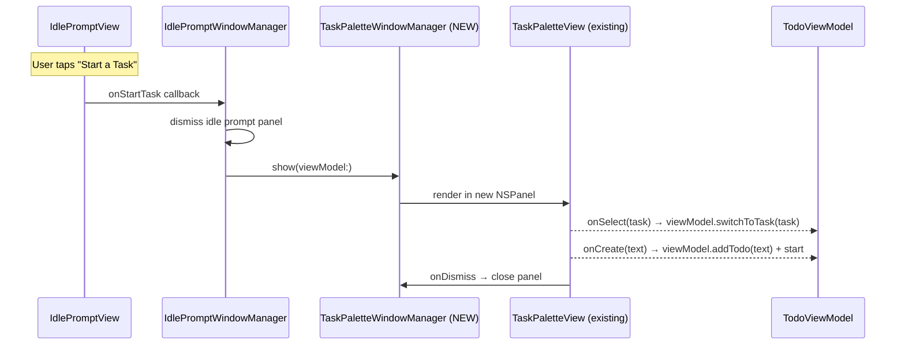
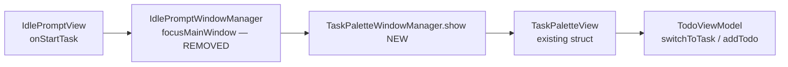
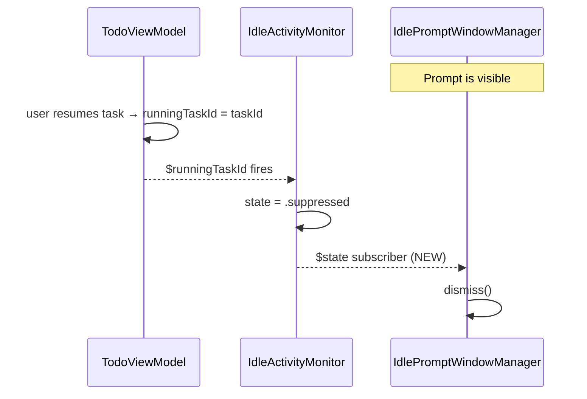

# Start Task Prompt Reliability Fix

## Overview

The idle-activity prompt ("No task is running. Want to track what you're working on?") should fire
whenever the user is active with no task running. The current bug is that when the app's main window
is **minimized** (and no floating "Current Task" window is visible), the prompt may not reliably
appear. When it does appear, tapping "Start a Task" focuses the main app window — but the desired
behaviour is to open a **spotlight-style task search** (identical to the command palette in the
floating window) so the user can start or create a task without needing the main window.

Note: when the floating window is open and a task is paused/completed, the prompt should still
appear alongside the floating window — both UIs at the same time is intentional.

"Start a Task" **always** opens the Task Palette — whether triggered from the idle prompt, or any
other future entry point. `focusMainWindowAndNewTaskInput` is removed entirely.

---

## UI / Flow

### State: App minimized, no task running — prompt fires (fix target)
```
 ╔══════════════════════════════════════╗
 ║  No task is running.                 ║
 ║  You've been active. Want to track   ║
 ║  what you're working on?             ║
 ║                                      ║
 ║  [Start a Task]  [Not Now ▾]         ║
 ╚══════════════════════════════════════╝
```
→ Tapping "Start a Task" opens the Task Palette panel below.

### Task Palette Panel (new — opened by "Start a Task")
```
 ╔════════════════════════════════════╗
 ║  🔍 Search tasks…                  ║
 ╠════════════════════════════════════╣
 ║  ▶ Fix login bug          [ADO]    ║  ← currently running (if any)
 ║    Write unit tests                ║  ← selected (highlighted)
 ║    Update design doc               ║
 ║    + Create "my search term"       ║  ← italic, shown when no match
 ╚════════════════════════════════════╝
```
- 320pt wide, same look and keyboard behaviour as the existing palette in the floating window
- Appears as a floating `NSPanel` (`orderFrontRegardless`) in the bottom-right or centre of screen
- Escape or clicking outside dismisses it
- Selecting a task starts it and dismisses the panel
- Creating a task adds it and starts it

### State: Floating window open, task paused — BOTH prompt and floating window visible (unchanged)
```
 ╔══════════════════════╗   ╔══════════════════════════════════════╗
 ║  Current Task        ║   ║  No task is running.                 ║
 ║  ───────────────     ║   ║  You've been active. Want to track   ║
 ║  ▶ Resume  [pause]  ║   ║  what you're working on?             ║
 ╚══════════════════════╝   ║  [Start a Task]  [Not Now ▾]         ║
                            ╚══════════════════════════════════════╝
```
→ Both windows shown simultaneously — this is intentional and correct.
  "Start a Task" still opens the Task Palette (not the main window).

---

## Root Cause of Minimized-App Bug

`IdleActivityMonitor` uses global + local `NSEvent` monitors for mouse/keyboard activity, and a
5-second poll timer calling `evaluateState()`. The logic is correct in principle — global monitors
fire even when the app is minimized. However:

1. When a task is paused, `runningTaskId = nil` → state goes `.suppressed → .idle` ✓
2. Activity is recorded, state goes `.active` ✓
3. After `activityThresholdSeconds`, `onShowPrompt()` fires ✓
4. `IdlePromptWindowManager.show()` calls `orderFrontRegardless()` ✓

The most likely failure mode when minimized: if the floating window was previously open and the
user closed it, the monitor may be in `.promptShown` (from a prior prompt that was shown while the
window was open) and never transitions back to `.idle` — because `handleDismiss()` /
`handleStartTask()` aren't called if the prompt panel was obscured or missed. This needs
investigation during implementation.

The confirmed scope of this design is:
- **Fix "Start a Task" action** — open task palette instead of main window
- **Verify prompt surfaces correctly** when app is minimized (investigate `promptShown` state
  stuck after a missed prompt)

---

## Architecture

### New: `TaskPaletteWindowManager`

A new singleton that shows `TaskPaletteView` in a standalone `NSPanel`. This reuses the existing
`TaskPaletteView` struct (already clean and self-contained in `FloatingTaskWindowView.swift`) and
the `availableTasks` sort/filter logic, moved to `TodoViewModel` as a computed property.





### Auto-dismiss when task resumes

If the user resumes a task (via the floating window or main list) while the idle prompt is visible,
the prompt should automatically dismiss. `IdleActivityMonitor` already transitions to `.suppressed`
when `runningTaskId` becomes non-nil, but `IdlePromptWindowManager` currently only dismisses from
its own button callbacks. The fix: `IdlePromptWindowManager` subscribes to
`IdleActivityMonitor.$state` and calls `dismiss()` whenever state becomes `.suppressed`.



### Changes Required

| File | Change |
|---|---|
| `TaskPaletteWindowManager.swift` | **New file** — singleton NSPanel manager hosting `TaskPaletteView` |
| `FloatingTaskWindowView.swift` | Move `availableTasks` sort logic → `TodoViewModel` (or duplicate inline in TPWM — simpler) |
| `IdlePromptWindowManager.swift` | Replace `focusMainWindowAndNewTaskInput` with `TaskPaletteWindowManager.shared.show(viewModel:)`; delete `focusMainWindowAndNewTaskInput` entirely; add `$state` subscription to `IdleActivityMonitor` to auto-dismiss when `.suppressed` |
| `TodoViewModel.swift` | Delete `requestFocusNewTaskInput()` (only called from the removed method) |
| `IdlePromptView.swift` | No changes needed (callbacks unchanged) |
| `IdleActivityMonitor.swift` | Investigate + fix `.promptShown` state getting stuck when prompt is missed |

### `TaskPaletteWindowManager` sketch

```swift
final class TaskPaletteWindowManager {
    static let shared = TaskPaletteWindowManager()
    private var panel: NSPanel?

    func show(viewModel: TodoViewModel) {
        // dismiss any existing panel
        // build NSPanel with TaskPaletteView
        // tasks = viewModel.todos filtered & sorted (same logic as availableTasks)
        // onSelect → viewModel.switchToTask; dismiss
        // onCreate → viewModel.addTodo + start; dismiss
        // onDismiss → dismiss
        // panel.orderFrontRegardless()
    }

    func dismiss() { panel?.close(); panel = nil }
}
```

---

## Open Questions

- Where should the Task Palette panel appear when opened from the idle prompt — same
  bottom-right corner as the idle prompt, or centred on screen? Proposal: same corner as idle
  prompt (replaces it visually).
- When the user creates a new task via the palette, should the floating "Current Task" window
  open automatically? Proposal: yes — same behaviour as starting any task.
- Should the palette show **completed** tasks too (to allow restarting one)? Proposal: no —
  match existing floating window behaviour (incomplete only).

---

## Implementation Phases

### Phase 1 — Auto-dismiss idle prompt when a task resumes

**What it covers:** `IdlePromptWindowManager` subscribes to `IdleActivityMonitor.$state` and calls
`dismiss()` whenever state becomes `.suppressed`, so resuming a task while the prompt is visible
automatically hides it.

**Tests to write first (Red):**
- [ ] Test: monitor transitions to `.suppressed` when `runningTaskId` becomes non-nil while prompt is shown → `IdleActivityMonitor.state == .suppressed` (already passes; confirm existing test covers this)
- [ ] Test: `IdlePromptWindowManager` receives `.suppressed` state change → `dismiss()` is called → `panel` is nil
  *(test via a spy/mock on `IdlePromptWindowManager` or by checking `isVisible` on the panel)*

**Production code to write (Green):**
- [ ] In `IdlePromptWindowManager.swift`: add a `private var cancellables = Set<AnyCancellable>()` and a `subscribeToMonitor()` method called from `show(viewModel:)` that sinks on `IdleActivityMonitor.shared.$state` and calls `dismiss()` when `.suppressed`
- [ ] Cancel the subscription in `dismiss()` so it doesn't fire again after the panel is gone

**Done when:** Starting/resuming a task via the floating window or main list while the idle prompt is visible causes the prompt to disappear within one run-loop tick, with no crash or double-dismiss.

---

### Phase 2 — `TaskPaletteWindowManager` — standalone palette panel

**What it covers:** New `TaskPaletteWindowManager` singleton that shows `TaskPaletteView` in its own `NSPanel`, positioned at the bottom-right of the screen. Reuses the existing `TaskPaletteView` struct directly.

**Tests to write first (Red):**
- [ ] Test: `TaskPaletteFilter.filter` and `showCreateRow` — already tested in `TaskPaletteFilterTests.swift`; confirm they pass (no new tests needed here)
- [ ] Test: `TaskPaletteWindowManager.show(viewModel:)` — after calling `show`, `isVisible` is `true`
- [ ] Test: `TaskPaletteWindowManager.dismiss()` — after calling `dismiss`, `isVisible` is `false`
- [ ] Test: calling `show` twice doesn't stack two panels (second call replaces/ignores first)

**Production code to write (Green):**
- [ ] Create `TaskPaletteWindowManager.swift` as a new file in `WindowManagement/`
- [ ] `show(viewModel:)`: build `NSPanel` with `TaskPaletteView`, tasks from `viewModel.todos` filtered to incomplete and sorted by `viewModel.dropdownSortOption`; `onSelect` → `viewModel.switchToTask`; `onCreate` → `viewModel.addTodo` then start; `onDismiss` → `dismiss()`; `panel.orderFrontRegardless()`
- [ ] `dismiss()`: close panel, nil it out
- [ ] `var isVisible: Bool`: `panel?.isVisible ?? false`
- [ ] Position: bottom-right corner of screen containing mouse cursor (same helper as `IdlePromptWindowManager.screenForPrompt()`)
- [ ] Add outside-click global monitor to dismiss when user clicks away

**Done when:** Calling `TaskPaletteWindowManager.shared.show(viewModel:)` from anywhere shows a searchable task list panel; selecting a task starts it and closes the panel; Escape closes it; clicking outside closes it.

---

### Phase 3 — Wire "Start a Task" to the palette; remove old main-window focus

**What it covers:** Replace the existing `focusMainWindowAndNewTaskInput` call in `IdlePromptWindowManager` with `TaskPaletteWindowManager.shared.show(viewModel:)`, then delete `focusMainWindowAndNewTaskInput` and `requestFocusNewTaskInput` since nothing else calls them.

**Tests to write first (Red):**
- [ ] Test: calling the `onStartTask` callback on `IdlePromptView` causes `IdleActivityMonitor.handleStartTask()` to be called → state becomes `.suppressed` (verify the wiring, not the UI)
- [ ] Test: `requestFocusNewTaskInput` no longer exists on `TodoViewModel` → compile error if referenced (verified by deletion)

**Production code to write (Green):**
- [ ] In `IdlePromptWindowManager.show(viewModel:)`: replace the `onStartTask` closure body — remove `IdlePromptWindowManager.focusMainWindowAndNewTaskInput(viewModel:)`, add `TaskPaletteWindowManager.shared.show(viewModel: viewModel)`
- [ ] Delete `IdlePromptWindowManager.focusMainWindowAndNewTaskInput(_:)` (lines 84–92)
- [ ] Delete `TodoViewModel.requestFocusNewTaskInput()` (line 380)

**Done when:** Tapping "Start a Task" in the idle prompt dismisses the prompt and opens the task palette. The main window is never brought to front. No compiler errors or unused-method warnings.

---

### Phase 4 — Investigate and fix `.promptShown` state getting stuck

**What it covers:** If the idle prompt fires but the user never interacts with it (e.g. it appears while the app is minimized and is never seen), the monitor stays in `.promptShown` indefinitely and will never show the prompt again. Add a timeout that transitions back to `.idle` after a configurable interval so the prompt can re-fire.

**Tests to write first (Red):**
- [ ] Test: after `evaluateState()` fires the prompt (state = `.promptShown`), advancing clock by `promptTimeoutSeconds` and firing the poll timer transitions state back to `.idle`
- [ ] Test: if the user interacts with the prompt (`handleDismiss` / `handleStartTask`) before timeout, the timeout does NOT transition to `.idle` (those handlers already set their own state)
- [ ] Test: prompt fires again after re-entering active state following the `.promptShown → .idle` timeout

**Production code to write (Green):**
- [ ] In `IdleActivityMonitor`: add `private var promptShownAt: Date?` set when state becomes `.promptShown`
- [ ] In `evaluateState()`: at the top, check if state is `.promptShown` and `clock() - promptShownAt >= config.promptTimeoutSeconds`; if so, reset `promptShownAt = nil` and `state = .idle`
- [ ] Add `promptTimeoutSeconds: TimeInterval = 120` to `IdlePromptConfig` (2 minutes — enough to be seen, short enough to not stay stuck)
- [ ] Clear `promptShownAt` in `handleDismiss()`, `handleStartTask()`, `handleSnooze()`

**Done when:** A prompt that appears and is never interacted with will re-enter the `.idle` state after 2 minutes, allowing the prompt to fire again on the next active streak. No existing tests regress.
