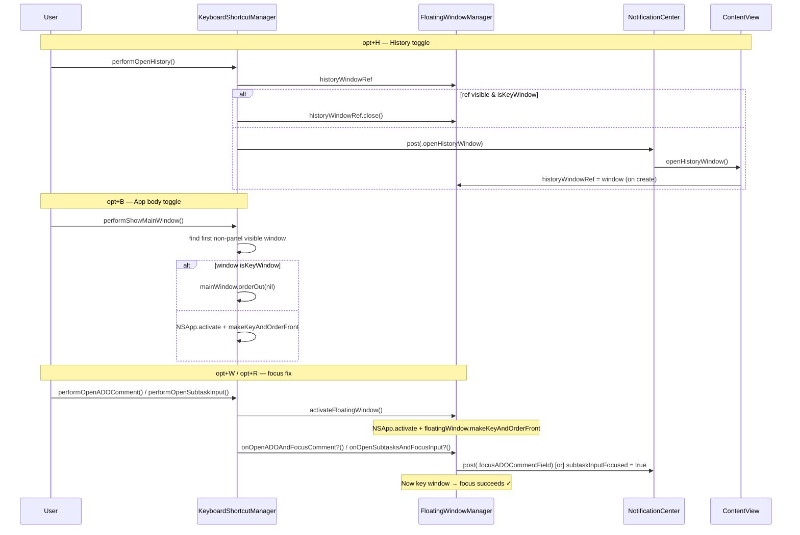

# Toggle App Body & History Shortcuts + Shortcut Focus Fixes

## Overview
Three related shortcut improvements:

1. **Toggle history window (opt+H)** — when the History window is already focused, pressing opt+H closes it instead of no-opping (mirrors the Notes Viewer shortcut pattern).
2. **Toggle main window (opt+B)** — same toggle behaviour for the app body window.
3. **Fix ADO comment + subtask shortcut focus** — pressing opt+W (ADO comment) or opt+R (subtask input) currently opens the correct tab but the cursor never lands in the text field, because the floating panel is `.nonactivatingPanel` and is never the key window. The fix activates the floating panel before firing the focus callbacks.

## UI / Flow

### Toggle behaviour (History + App body)

```
opt+H or opt+B pressed
  ├─ Window not visible          → open / create the window  (existing)
  ├─ Window visible, NOT focused → bring to front            (existing)
  └─ Window visible, IS focused  → close / hide it           (NEW)
```

### ADO comment / subtask focus fix

```
opt+W pressed (ADO comment)
  Before fix: tab switches to Comments, text box never focused
  After fix:  floating panel activated → tab switches → cursor in text box ✓

opt+R pressed (subtask input)
  Before fix: tab switches to Subtasks, input field never focused
  After fix:  floating panel activated → tab switches → cursor in input ✓
```

## Architecture



### Root cause of focus bug
The floating `NSPanel` is created with `.nonactivatingPanel` so it never automatically becomes the key window. Both `tv.window?.makeFirstResponder(tv)` (ADO) and `@FocusState` assignment (subtask) silently fail unless the window is the key window. The fix adds `activateFloatingWindow()` to `FloatingWindowManager`, which explicitly activates the app and makes the panel the key window before the focus callbacks run.

### What changes

| File | Change |
|---|---|
| `FloatingWindowManager.swift` | Add `weak var historyWindowRef: NSWindow?`; add `func activateFloatingWindow()` |
| `ContentView.swift` | Set `FloatingWindowManager.shared.historyWindowRef` when creating the history window |
| `KeyboardShortcutManager.swift` | `performOpenHistory()` toggle; `performShowMainWindow()` toggle; `performOpenADOComment()` + `performOpenSubtaskInput()` activate window first |
| `KeyboardShortcutManagerTests.swift` | New tests for toggle branches; tearDown clears `historyWindowRef` |

### Why `orderOut` (not `close`) for the main window
`close()` on the SwiftUI-managed main window may trigger `applicationShouldTerminateAfterLastWindowClosed`. `orderOut(nil)` hides the window without releasing it or triggering termination — the safe hide-to-tray pattern.

## Open Questions
_(none)_

---

## High-Level Steps

1. Add `weak var historyWindowRef: NSWindow?` and `func activateFloatingWindow()` to `FloatingWindowManager`
2. Set `FloatingWindowManager.shared.historyWindowRef` in `ContentView.openHistoryWindow()` when a new window is created
3. Update `performOpenHistory()` to close the window when visible and key, otherwise post the notification
4. Update `performShowMainWindow()` to `orderOut` the main window when visible and key, otherwise bring it to front
5. Update `performOpenADOComment()` to call `activateFloatingWindow()` before invoking the callback
6. Update `performOpenSubtaskInput()` to call `activateFloatingWindow()` before invoking the callback
7. Clear `historyWindowRef` in `KeyboardShortcutManagerTests.tearDown` and add new tests

---

## Implementation Phases

### Phase 1 — FloatingWindowManager: historyWindowRef + activateFloatingWindow

**What it covers:** Two new members on `FloatingWindowManager` — a weak window ref for the history window (mirrors `notesViewerWindowRef`) and a method that makes the floating panel the key window before focus callbacks run.

**Tests (Red) — write these first:**
```swift
// In KeyboardShortcutManagerTests.swift  tearDown, add:
// FloatingWindowManager.shared.historyWindowRef = nil

// MARK: - FloatingWindowManager.activateFloatingWindow

func testActivateFloatingWindow_noWindow_doesNotCrash() {
    FloatingWindowManager.shared.closeFloatingWindow()
    XCTAssertNoThrow(FloatingWindowManager.shared.activateFloatingWindow())
}

func testActivateFloatingWindow_withWindow_doesNotCrash() {
    let (vm, _, _) = makeViewModel()
    let task = makeTodo(text: "Task")
    vm.todos = [task]
    FloatingWindowManager.shared.showFloatingWindow(for: task, viewModel: vm)
    XCTAssertNoThrow(FloatingWindowManager.shared.activateFloatingWindow())
}
```

**Production code (Green):**

In [FloatingWindowManager.swift](TimeControl/TimeControl/WindowManagement/FloatingWindowManager.swift), add after `weak var notesViewerWindowRef: NSWindow?`:
```swift
weak var historyWindowRef: NSWindow?
```

Add new public method (after `closeFloatingWindow()`):
```swift
func activateFloatingWindow() {
    NSApp.activate(ignoringOtherApps: true)
    floatingWindow?.makeKeyAndOrderFront(nil)
}
```

In [KeyboardShortcutManagerTests.swift](TimeControl/TimeControlTests/KeyboardShortcutManagerTests.swift) `tearDown`, add:
```swift
FloatingWindowManager.shared.historyWindowRef = nil
```

**Done when:** `FloatingWindowManager.shared.historyWindowRef` is settable; `FloatingWindowManager.shared.activateFloatingWindow()` can be called without crashing.

---

### Phase 2 — History window toggle

**What it covers:** `performOpenHistory()` closes the history window when it is visible and focused, mirrors `performToggleNotesViewer()`. ContentView wires the `historyWindowRef` on window creation.

**Tests (Red) — write these first:**
```swift
// MARK: - performOpenHistory (toggle)

func testPerformOpenHistory_nilWindowRef_postsNotification() {
    FloatingWindowManager.shared.historyWindowRef = nil
    let expectation = XCTestExpectation(description: "openHistoryWindow notification posted")
    let token = NotificationCenter.default.addObserver(
        forName: .openHistoryWindow, object: nil, queue: .main
    ) { _ in expectation.fulfill() }

    sut.performOpenHistory()

    wait(for: [expectation], timeout: 1.0)
    NotificationCenter.default.removeObserver(token)
}

func testPerformOpenHistory_windowNotVisible_postsNotification() {
    let window = NSWindow(
        contentRect: NSRect(x: 0, y: 0, width: 100, height: 100),
        styleMask: [.titled],
        backing: .buffered,
        defer: true
    )
    FloatingWindowManager.shared.historyWindowRef = window
    let expectation = XCTestExpectation(description: "openHistoryWindow notification posted")
    let token = NotificationCenter.default.addObserver(
        forName: .openHistoryWindow, object: nil, queue: .main
    ) { _ in expectation.fulfill() }

    sut.performOpenHistory()

    wait(for: [expectation], timeout: 1.0)
    NotificationCenter.default.removeObserver(token)
}

func testPerformOpenHistory_windowVisibleNotKey_postsNotification() {
    let window = NSWindow(
        contentRect: NSRect(x: 0, y: 0, width: 100, height: 100),
        styleMask: [.titled],
        backing: .buffered,
        defer: false
    )
    window.orderFrontRegardless()
    XCTAssertFalse(window.isKeyWindow)
    FloatingWindowManager.shared.historyWindowRef = window
    let expectation = XCTestExpectation(description: "openHistoryWindow notification posted")
    let token = NotificationCenter.default.addObserver(
        forName: .openHistoryWindow, object: nil, queue: .main
    ) { _ in expectation.fulfill() }

    sut.performOpenHistory()

    wait(for: [expectation], timeout: 1.0)
    NotificationCenter.default.removeObserver(token)
    window.close()
}

func testPerformOpenHistory_windowVisibleAndKey_closesWindow_doesNotPostNotification() throws {
    let window = NSWindow(
        contentRect: NSRect(x: 0, y: 0, width: 100, height: 100),
        styleMask: [.titled],
        backing: .buffered,
        defer: false
    )
    window.orderFrontRegardless()
    window.makeKey()
    try XCTSkipUnless(window.isKeyWindow, "Window could not become key in this environment")
    FloatingWindowManager.shared.historyWindowRef = window
    var notificationFired = false
    let token = NotificationCenter.default.addObserver(
        forName: .openHistoryWindow, object: nil, queue: .main
    ) { _ in notificationFired = true }

    sut.performOpenHistory()

    XCTAssertFalse(notificationFired)
    XCTAssertFalse(window.isVisible)
    NotificationCenter.default.removeObserver(token)
}
```

**Production code (Green):**

In [KeyboardShortcutManager.swift](TimeControl/TimeControl/Services/KeyboardShortcutManager.swift), replace `performOpenHistory()`:
```swift
func performOpenHistory() {
    let mgr = FloatingWindowManager.shared
    if let win = mgr.historyWindowRef, win.isVisible {
        if win.isKeyWindow {
            win.close()
        } else {
            NotificationCenter.default.post(name: .openHistoryWindow, object: nil)
        }
    } else {
        NotificationCenter.default.post(name: .openHistoryWindow, object: nil)
    }
}
```

In [ContentView.swift](TimeControl/TimeControl/ContentView.swift), inside `openHistoryWindow()` after `historyWindow = window`:
```swift
FloatingWindowManager.shared.historyWindowRef = window
```

**Done when:** opt+H when History window is focused closes it; when not focused or not open, opens/focuses it.

---

### Phase 3 — Main window toggle

**What it covers:** `performShowMainWindow()` hides the main app window when it is already the key window, using `orderOut(nil)` to avoid triggering app termination.

**Tests (Red) — write these first:**
```swift
// MARK: - performShowMainWindow (toggle)

func testPerformShowMainWindow_noVisibleNonPanelWindow_doesNotCrash() {
    XCTAssertNoThrow(sut.performShowMainWindow())
}

func testPerformShowMainWindow_windowVisibleAndKey_hidesWindow() throws {
    let window = NSWindow(
        contentRect: NSRect(x: 0, y: 0, width: 200, height: 200),
        styleMask: [.titled],
        backing: .buffered,
        defer: false
    )
    window.orderFrontRegardless()
    window.makeKey()
    try XCTSkipUnless(window.isKeyWindow, "Window could not become key in this environment")
    XCTAssertTrue(window.isVisible)

    sut.performShowMainWindow()

    XCTAssertFalse(window.isVisible)
    window.close()
}
```

**Production code (Green):**

In [KeyboardShortcutManager.swift](TimeControl/TimeControl/Services/KeyboardShortcutManager.swift), replace `performShowMainWindow()`:
```swift
func performShowMainWindow() {
    guard let mainWindow = NSApp.windows.first(where: { !($0 is NSPanel) && $0.isVisible }) else { return }
    if mainWindow.isKeyWindow {
        mainWindow.orderOut(nil)
    } else {
        NSApp.activate(ignoringOtherApps: true)
        mainWindow.makeKeyAndOrderFront(nil)
    }
}
```

**Done when:** opt+B when the main task list window is focused hides it; pressing again brings it back.

---

### Phase 4 — Fix shortcut focus: ADO comment + subtask input

**What it covers:** Calls `activateFloatingWindow()` in `performOpenADOComment()` and `performOpenSubtaskInput()` before invoking their callbacks, so the floating panel is the key window when `makeFirstResponder` (ADO) and `@FocusState` (subtask) fire.

**Tests (Red) — write these first:**
```swift
// MARK: - performOpenADOComment activates window (Phase 4)

func testPerformOpenADOComment_windowOpen_taskHasADOId_activatesAndFiresCallback() {
    let (vm, _, _) = makeViewModel()
    let task = makeTodo(text: "ADO Task", adoWorkItemId: "1234")
    vm.todos = [task]
    FloatingWindowManager.shared.showFloatingWindow(for: task, viewModel: vm)
    var fired = false
    FloatingWindowManager.shared.onOpenADOAndFocusComment = { fired = true }

    sut.performOpenADOComment()

    // Callback must still fire after activation
    XCTAssertTrue(fired)
}

func testPerformOpenSubtaskInput_windowOpen_activatesAndFiresCallback() {
    let (vm, _, _) = makeViewModel()
    let task = makeTodo(text: "Task")
    vm.todos = [task]
    FloatingWindowManager.shared.showFloatingWindow(for: task, viewModel: vm)
    var fired = false
    FloatingWindowManager.shared.onOpenSubtasksAndFocusInput = { fired = true }

    sut.performOpenSubtaskInput()

    XCTAssertTrue(fired)
}
```

**Production code (Green):**

In [KeyboardShortcutManager.swift](TimeControl/TimeControl/Services/KeyboardShortcutManager.swift), update `performOpenADOComment()`:
```swift
func performOpenADOComment() {
    let mgr = FloatingWindowManager.shared
    guard mgr.isWindowOpen else { return }
    guard let task = mgr.currentTask,
          let adoId = task.adoWorkItemId, !adoId.isEmpty else {
        hud.show(message: "No ADO link on this task")
        return
    }
    mgr.activateFloatingWindow()
    mgr.onOpenADOAndFocusComment?()
}
```

Update `performOpenSubtaskInput()`:
```swift
func performOpenSubtaskInput() {
    let mgr = FloatingWindowManager.shared
    guard mgr.isWindowOpen else { return }
    mgr.activateFloatingWindow()
    mgr.onOpenSubtasksAndFocusInput?()
}
```

**Done when:** Pressing opt+W places the cursor in the ADO comment text box; pressing opt+R places the cursor in the new subtask input field — without requiring a prior click on the floating panel.

---

## Feature Acceptance Checklist

- [ ] Pressing opt+H when the History window is open and focused closes it
- [ ] Pressing opt+H when the History window is open but not focused brings it to front
- [ ] Pressing opt+H when the History window is closed opens it (existing behaviour preserved)
- [ ] Pressing opt+B when the main app window is open and focused hides it
- [ ] Pressing opt+B when the main app window is open but not focused brings it to front
- [ ] Pressing opt+B when the main app window is hidden brings it back (existing behaviour preserved)
- [ ] Pressing opt+W when a task with an ADO link is running places the cursor in the comment text box
- [ ] Pressing opt+R places the cursor in the new subtask input field
- [ ] Notes Viewer shortcut (opt+shift+D) behaviour is unchanged
- [ ] All existing keyboard shortcut tests pass with no regressions
