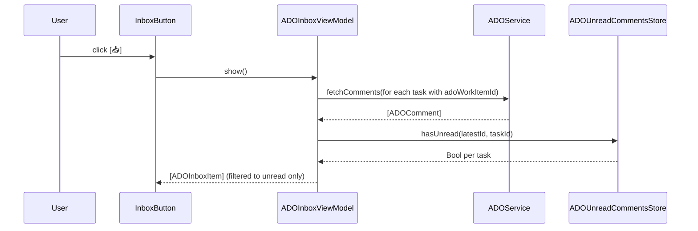
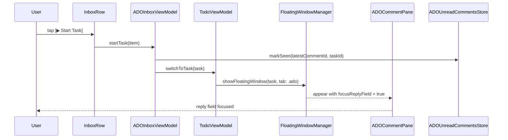
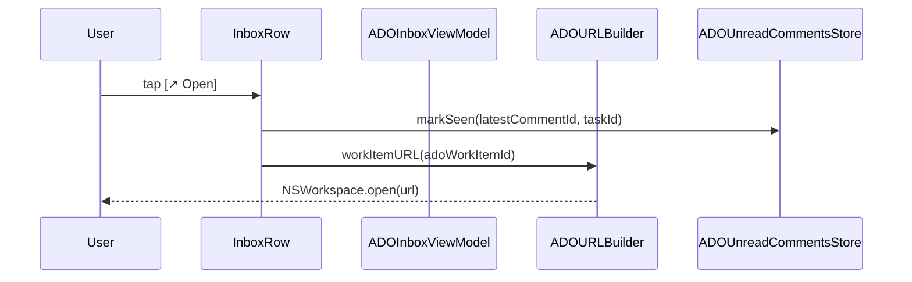

# ADO Comment Inbox Widget + Advanced Mode Declutter

## Overview

Two related improvements: (1) collapse the noisy advanced-mode toolbar into a compact icon row so the main app body feels lighter, and (2) add a new "ADO Comment Inbox" panel — a scrollable list of tasks that have unread ADO comments, with one-click actions to start the task (auto-focusing the ADO comment reply field) or open the work item in the browser, both of which mark the comments as read.

---

## UI / Flow

### Advanced Mode — Before (current)

```
┌─────────────────────────────────────────────────────────────────┐
│ [Add or filter tasks...]                     [+]  [↻ ADO]       │
│ Advanced mode ●──  [Collapse All] [Mass Ops] [Export] [Settings]│
│                    [Notes] [History] [Import from ADO]          │
│ Sort by: [Newest First ▾]                                       │
│─────────────────────────────────────────────────────────────────│
```

### Advanced Mode — After (proposed)

```
┌─────────────────────────────────────────────────────────────────┐
│ [Add or filter tasks...]            [+]  [↻ ADO]  [📥]  [•••] │
│ Advanced mode ●──                                               │
│ Sort by: [Newest First ▾]                                       │
│─────────────────────────────────────────────────────────────────│
```

All 7 advanced action buttons collapse into a single `[•••]` ellipsis menu button (using SwiftUI `Menu`). Each item retains its icon and label inside the dropdown. The ADO Comment Inbox button `[📥]` lives in the top row alongside the refresh button — always visible, not gated behind advanced mode. The Sort picker stays as its own compact row below the toggle (unchanged layout, just no longer next to a row of buttons).

Ellipsis menu items:
```
•••  opens:
┌─────────────────────────┐
│ ⇅  Expand / Collapse All│
│ ⊞  Mass Operations      │
│ ↑  Export All Tasks     │
│─────────────────────────│
│ ⚙  Settings             │
│ ♪  Notes                │
│ □  History              │
│ ↓  Import from ADO      │
└─────────────────────────┘
```

---

### ADO Comment Inbox — Popover, Empty State

```
┌──────────────────────────────────────┐
│  ADO Comment Inbox                   │
│──────────────────────────────────────│
│                                      │
│      ✓  No unread ADO comments       │
│                                      │
└──────────────────────────────────────┘
  ▲ popover anchored to [📥] button
```

### ADO Comment Inbox — Popover, Idle State (on open)

```
┌──────────────────────────────────────┐
│  ADO Comment Inbox                   │
│──────────────────────────────────────│
│                                      │
│      Showing last fetched results.   │
│         [↻ Refresh comments]         │
│                                      │
└──────────────────────────────────────┘
  ▲ popover anchored to [📥] button
```

When opened with no prior fetch, shows a prompt to refresh. When opened after a previous fetch, shows the last results with a `[↻ Refresh]` button in the header to re-fetch on demand.

### ADO Comment Inbox — Popover, Loading State (after Refresh tapped)

```
┌──────────────────────────────────────┐
│  ADO Comment Inbox           [↻ ◌]  │
│──────────────────────────────────────│
│                                      │
│         ◌  Fetching comments…        │
│                                      │
└──────────────────────────────────────┘
```

### ADO Comment Inbox — Popover, Loaded State (3 items)

```
┌──────────────────────────────────────┐
│  ADO Comment Inbox (3)       [↻]    │
│──────────────────────────────────────│
│  #4521  Fix login timeout            │
│  3 unread                            │
│  Sarah Chen · 2m — "Can you update  │
│  the retry count…"                  │
│              [▶ Start Task] [↗ Open] │
│──────────────────────────────────────│
│  #3890  Refactor auth middleware     │
│  1 unread                            │
│  James K · 1h — "Looks good, just   │
│  one nit about naming…"             │
│              [▶ Start Task] [↗ Open] │
│──────────────────────────────────────│
│  #4102  Update API docs              │
│  2 unread                            │
│  You · 3h — "Don't forget to add    │
│  examples for each endpoint…"       │
│              [▶ Start Task] [↗ Open] │
└──────────────────────────────────────┘
```

The popover is a `.popover` attached to the inbox button. It does **not** auto-fetch on open — instead it shows last-fetched results (or a prompt if never fetched) with a `[↻]` refresh button in the header. Each row shows: ADO work item ID + task title, unread count badge, latest unread comment author + relative time + preview (2-line truncation). Two action buttons per row:
- **Start Task** — switches to / starts the linked task, opens the floating window on the ADO tab with the comment reply field focused, marks all comments read.
- **Open** — opens the ADO work item in the browser, marks all comments read.

### ADO Tab in Floating Window — After "Start Task"

```
┌─────────────────────────────────────────┐
│  Fix login timeout             [⚙] [♪]  │
│  Focus │ Timers │ Subtasks │ Notes │ ADO │
│─────────────────────────────────────────│
│  #4521                         [↗ Copy] │
│  ▼ Comments (3)                    [↻]  │
│  Sarah Chen · 2 min ago                 │
│  "Can you update the retry count…"      │
│  ─────────────────────────────────────  │
│  [Reply…                             ]  │  ← auto-focused here
│  [📎] [Send]                            │
└─────────────────────────────────────────┘
```

---

## Architecture

### Data Flow — Inbox Population



### Data Flow — "Start Task" Action



### Data Flow — "Open" Action



### New Components

```mermaid
graph TD
    A[TaskListToolbar] --> B[ADOInboxButton — always visible in top row]
    B --> C[ADOInboxPanel — NSPanel / popover]
    C --> D[ADOInboxViewModel — @MainActor ObservableObject]
    D --> E[ADOService — existing, fetchComments()]
    D --> F[ADOUnreadCommentsStore — existing, hasUnread / markSeen]
    D --> G[TodoViewModel — existing, switchToTask()]
    C --> H[ADOInboxRow — per-item SwiftUI view]
    H --> I[ADOCommentPane — existing, gains focusReplyField param]
```

### Changes to Existing Components

| Component | Change |
|---|---|
| `TaskListToolbar` | Advanced-mode buttons become icon-only; sort label removed; inbox button added to always-visible top row |
| `ADOCommentPane` | Add `@FocusState` + `focusReplyField: Bool` param; auto-focus reply field on appear when flag is true |
| `FloatingWindowManager` | Add `showFloatingWindow(task:tab:)` overload that selects a specific tab on open |
| `FloatingTaskWindowView` | Accept initial tab selection; expose `selectedTab` binding or use environment |

---

## Decisions

- **Inbox UI**: Popover anchored to the `[📥]` button — auto-dismisses on click-outside.
- **Refresh strategy**: Manual refresh — popover opens showing last-fetched results (or an idle prompt if never fetched). A `[↻]` button in the header triggers a fresh fetch on demand.
- **Multiple unread comments**: Show unread count + preview of the latest comment (author, relative time, 2-line truncation).

---

## High-Level Steps

1. Replace the 7 individual advanced-mode buttons in `TaskListToolbar` with a single SwiftUI `Menu` ellipsis button containing all 7 as menu items (with divider between task actions and app actions)
2. Move the ADO inbox button into the always-visible top row of `TaskListToolbar` (alongside `+` and refresh ADO)
3. Create `ADOInboxItem` model — wraps a `TodoItem` with its fetched comments, unread count, and latest unread comment
4. Create `ADOInboxViewModel` — fetches comments for all ADO-linked tasks on explicit refresh, caches results across opens, computes unread items, exposes `markSeen` for both actions
5. Create `ADOInboxRow` view — displays task title, ADO ID, unread count, latest comment preview, and Start Task / Open action buttons
6. Create `ADOInboxPopover` view — title bar, scroll list of `ADOInboxRow`, empty/loading/error states; wired to `ADOInboxViewModel`
7. Add `focusReplyField` parameter to `ADOCommentPane` and auto-focus the reply text field on appear when it is true
8. Add a `showFloatingWindow(for:selectingTab:)` overload to `FloatingWindowManager` that opens (or brings forward) the floating window on a specified tab
9. Wire `ADOInboxViewModel.startTask(_:)` to call `switchToTask`, then `showFloatingWindow(for:selectingTab: .ado)`, then dismiss the popover

---

## Implementation Phases

### Phase 1 — Collapse advanced-mode buttons into a `Menu`

**What it covers:** Replace the 7 individual bordered buttons in `TaskListToolbar` with a single SwiftUI `Menu` ellipsis button; move the ADO inbox button stub into the always-visible top row.

**Tests (Red) — write these first:**

```swift
// TaskListToolbarTests.swift
import XCTest
import SwiftUI
@testable import TimeControl

final class TaskListToolbarTests: XCTestCase {

    // Verifies the ellipsis button is present in advanced mode
    func test_advancedMode_showsEllipsisMenuButton() {
        // The old 7 individual buttons should be gone; a single Menu trigger should exist.
        // Because SwiftUI Menus are hard to inspect directly, we test the absence of
        // the old button labels and the presence of the new menu label.
        let toolbar = makeToolbar(advancedMode: true)
        let mirror = String(describing: toolbar.body)
        // Old standalone bordered buttons must be gone
        XCTAssertFalse(mirror.contains("Mass Operations"))
        XCTAssertFalse(mirror.contains("Export All Tasks"))
        XCTAssertFalse(mirror.contains("Import from ADO"))
        // New menu trigger present
        XCTAssertTrue(mirror.contains("ellipsis.circle") || mirror.contains("ellipsis"))
    }

    // Verifies that the ADO inbox button is always in the top row
    func test_inboxButton_alwaysVisible_regardlessOfAdvancedMode() {
        let basicToolbar = makeToolbar(advancedMode: false)
        let advancedToolbar = makeToolbar(advancedMode: true)
        let basicMirror = String(describing: basicToolbar.body)
        let advancedMirror = String(describing: advancedToolbar.body)
        XCTAssertTrue(basicMirror.contains("tray.and.arrow.down.fill"))
        XCTAssertTrue(advancedMirror.contains("tray.and.arrow.down.fill"))
    }

    // Verifies the sort row still appears in advanced mode
    func test_sortPicker_stillVisible_inAdvancedMode() {
        let toolbar = makeToolbar(advancedMode: true)
        let mirror = String(describing: toolbar.body)
        XCTAssertTrue(mirror.contains("Sort"))
    }

    // Verifies nothing advanced leaks into basic mode
    func test_basicMode_hidesEllipsisMenu() {
        let toolbar = makeToolbar(advancedMode: false)
        let mirror = String(describing: toolbar.body)
        XCTAssertFalse(mirror.contains("ellipsis.circle") || mirror.contains("ellipsis"))
    }

    // MARK: - Helpers

    private func makeToolbar(advancedMode: Bool) -> TaskListToolbar {
        TaskListToolbar(
            filterText: .constant(""),
            isAdvancedMode: .constant(advancedMode),
            areAllTasksExpanded: .constant(false),
            showingMassOperations: .constant(false),
            showingSettings: .constant(false),
            showingADOImport: .constant(false),
            sortOption: .constant(.creationDateNewest),
            isRefreshingADO: false,
            unreadADOCount: 0,
            showingADOInbox: .constant(false),
            onAddTodo: {},
            onToggleExpandAll: {},
            onExportAllTasks: {},
            onOpenNotesViewer: {},
            onOpenHistory: {}
        )
    }
}
```

**Production code (Green):**

In [TaskListToolbar.swift](TimeControl/TimeControl/Views/TaskListToolbar.swift), replace the `if isAdvancedMode { ... }` block's 7 bordered buttons with a single `Menu`, and add the inbox button to the top `HStack`:

```swift
// TaskListToolbar.swift — full replacement

import SwiftUI

struct TaskListToolbar: View {
    @Binding var filterText: String
    @Binding var isAdvancedMode: Bool
    @Binding var areAllTasksExpanded: Bool
    @Binding var showingMassOperations: Bool
    @Binding var showingSettings: Bool
    @Binding var showingADOImport: Bool
    @Binding var sortOption: TaskSortOption
    @Binding var showingADOInbox: Bool
    var newTaskInputFocused: FocusState<Bool>.Binding? = nil
    var isRefreshingADO: Bool = false
    var unreadADOCount: Int = 0

    let onAddTodo: () -> Void
    let onToggleExpandAll: () -> Void
    let onExportAllTasks: () -> Void
    let onOpenNotesViewer: () -> Void
    let onOpenHistory: () -> Void
    var onRefreshADO: (() -> Void)? = nil

    var body: some View {
        VStack(spacing: 0) {
            HStack {
                NewTaskTextField(text: $filterText, focused: newTaskInputFocused, onSubmit: onAddTodo)

                Button(action: onAddTodo) {
                    Image(systemName: "plus.circle.fill")
                        .font(.title)
                }
                .buttonStyle(.plain)
                .disabled(filterText.trimmingCharacters(in: .whitespaces).isEmpty)

                if let onRefreshADO {
                    Button(action: onRefreshADO) {
                        ZStack {
                            if isRefreshingADO {
                                ProgressView()
                                    .controlSize(.small)
                                    .frame(width: 20, height: 20)
                            } else {
                                ZStack(alignment: .topTrailing) {
                                    Image(systemName: "arrow.clockwise.circle")
                                        .font(.title2)
                                        .foregroundColor(.secondary)
                                    if unreadADOCount > 0 {
                                        Circle()
                                            .fill(Color.orange)
                                            .frame(width: 8, height: 8)
                                            .offset(x: 2, y: -2)
                                    }
                                }
                            }
                        }
                    }
                    .buttonStyle(.plain)
                    .disabled(isRefreshingADO)
                    .help(unreadADOCount > 0
                          ? "Refresh ADO comments (\(unreadADOCount) task\(unreadADOCount == 1 ? "" : "s") with new comments)"
                          : "Refresh ADO comments")
                }

                // ADO Comment Inbox — always visible
                Button(action: { showingADOInbox = true }) {
                    ZStack(alignment: .topTrailing) {
                        Image(systemName: "tray.and.arrow.down.fill")
                            .font(.title2)
                            .foregroundColor(.secondary)
                        if unreadADOCount > 0 {
                            Circle()
                                .fill(Color.orange)
                                .frame(width: 8, height: 8)
                                .offset(x: 2, y: -2)
                        }
                    }
                }
                .buttonStyle(.plain)
                .help(unreadADOCount > 0
                      ? "ADO Comment Inbox (\(unreadADOCount) unread)"
                      : "ADO Comment Inbox")
                .popover(isPresented: $showingADOInbox, arrowEdge: .top) {
                    ADOInboxPopover(showingADOInbox: $showingADOInbox)
                }

                if isAdvancedMode {
                    Menu {
                        Button(action: onToggleExpandAll) {
                            Label(areAllTasksExpanded ? "Collapse All" : "Expand All",
                                  systemImage: areAllTasksExpanded
                                    ? "arrow.up.left.and.arrow.down.right"
                                    : "arrow.down.right.and.arrow.up.left")
                        }
                        Button(action: { showingMassOperations = true }) {
                            Label("Mass Operations", systemImage: "square.grid.3x3.fill")
                        }
                        Button(action: onExportAllTasks) {
                            Label("Export All Tasks", systemImage: "square.and.arrow.up")
                        }
                        Divider()
                        Button(action: { showingSettings = true }) {
                            Label("Settings", systemImage: "gear")
                        }
                        Button(action: onOpenNotesViewer) {
                            Label("Notes", systemImage: "note.text")
                        }
                        Button(action: onOpenHistory) {
                            Label("History", systemImage: "calendar")
                        }
                        Button(action: { showingADOImport = true }) {
                            Label("Import from ADO", systemImage: "arrow.down.circle")
                        }
                    } label: {
                        Image(systemName: "ellipsis.circle")
                            .font(.title2)
                            .foregroundColor(.secondary)
                    }
                    .menuStyle(.borderlessButton)
                    .fixedSize()
                    .help("More options")
                }
            }
            .padding()
            .padding(.bottom, -8)

            HStack {
                Toggle("Advanced mode", isOn: $isAdvancedMode)
                    .toggleStyle(.switch)
                    .font(.body)
                Spacer()
            }
            .padding(.horizontal)
            .padding(.bottom, 8)

            if isAdvancedMode {
                HStack {
                    Text("Sort by:")
                        .font(.body)
                        .foregroundColor(.secondary)
                    Picker("Sort", selection: $sortOption) {
                        ForEach(TaskSortOption.allCases) { option in
                            Text(option.rawValue).tag(option)
                        }
                    }
                    .pickerStyle(.menu)
                    .font(.body)
                    Spacer()
                }
                .padding(.horizontal)
                .padding(.bottom)
            }

            Divider()
        }
    }
}

// MARK: - NewTaskTextField

private struct NewTaskTextField: View {
    @Binding var text: String
    var focused: FocusState<Bool>.Binding?
    let onSubmit: () -> Void

    @FocusState private var localFocus: Bool

    var body: some View {
        TextField("Add or filter tasks...", text: $text)
            .textFieldStyle(.roundedBorder)
            .focused(focused ?? $localFocus)
            .onSubmit(onSubmit)
    }
}
```

Also update [ContentView.swift](TimeControl/TimeControl/ContentView.swift) to add the new `showingADOInbox` binding (add `@State private var showingADOInbox = false` and pass `showingADOInbox: $showingADOInbox` to `TaskListToolbar`).

**Done when:** The toolbar in advanced mode shows a single `•••` ellipsis button instead of 7 individual buttons. Clicking it opens a dropdown with all 7 actions. The `[📥]` inbox button is always visible. Sort row still appears below the toggle in advanced mode.

---

### Phase 2 — `ADOInboxItem` model

**What it covers:** A lightweight value type that bundles a task with its fetched comments and pre-computed unread metadata, ready to be displayed in the inbox.

**Tests (Red) — write these first:**

```swift
// ADOInboxItemTests.swift
import XCTest
@testable import TimeControl

final class ADOInboxItemTests: XCTestCase {

    func test_unreadCount_whenAllCommentsUnread() {
        let task = TodoItem.makeStub(adoWorkItemId: "100")
        let comments = [makeComment(id: 3), makeComment(id: 2), makeComment(id: 1)]
        // lastSeenId = nil → all are unread
        let item = ADOInboxItem(task: task, comments: comments, lastSeenCommentId: nil)
        XCTAssertEqual(item.unreadCount, 3)
    }

    func test_unreadCount_whenSomeCommentsRead() {
        let task = TodoItem.makeStub(adoWorkItemId: "100")
        let comments = [makeComment(id: 5), makeComment(id: 4), makeComment(id: 3)]
        // lastSeenId = 3 → ids 4 and 5 are unread
        let item = ADOInboxItem(task: task, comments: comments, lastSeenCommentId: 3)
        XCTAssertEqual(item.unreadCount, 2)
    }

    func test_unreadCount_whenAllRead() {
        let task = TodoItem.makeStub(adoWorkItemId: "100")
        let comments = [makeComment(id: 5), makeComment(id: 4)]
        let item = ADOInboxItem(task: task, comments: comments, lastSeenCommentId: 5)
        XCTAssertEqual(item.unreadCount, 0)
    }

    func test_latestUnreadComment_returnsHighestIdUnread() {
        let task = TodoItem.makeStub(adoWorkItemId: "100")
        let newest = makeComment(id: 5, author: "Alice")
        let comments = [newest, makeComment(id: 4), makeComment(id: 3)]
        let item = ADOInboxItem(task: task, comments: comments, lastSeenCommentId: 3)
        XCTAssertEqual(item.latestUnreadComment?.id, 5)
        XCTAssertEqual(item.latestUnreadComment?.authorDisplayName, "Alice")
    }

    func test_latestUnreadComment_nilWhenNoneUnread() {
        let task = TodoItem.makeStub(adoWorkItemId: "100")
        let comments = [makeComment(id: 2), makeComment(id: 1)]
        let item = ADOInboxItem(task: task, comments: comments, lastSeenCommentId: 2)
        XCTAssertNil(item.latestUnreadComment)
    }

    func test_hasUnread_trueWhenUnreadCountPositive() {
        let task = TodoItem.makeStub(adoWorkItemId: "100")
        let item = ADOInboxItem(task: task, comments: [makeComment(id: 1)], lastSeenCommentId: nil)
        XCTAssertTrue(item.hasUnread)
    }

    // MARK: - Helpers

    private func makeComment(id: Int, author: String = "Dev") -> ADOComment {
        ADOComment(id: id, text: "comment \(id)", authorDisplayName: author, createdDate: Date())
    }
}

// Test helper extension — add to a TestHelpers file
extension TodoItem {
    static func makeStub(adoWorkItemId: String? = nil) -> TodoItem {
        var item = TodoItem(text: "Stub task")
        item.adoWorkItemId = adoWorkItemId
        return item
    }
}
```

**Production code (Green):**

Create [ADOInboxItem.swift](TimeControl/TimeControl/Models/ADOInboxItem.swift):

```swift
// ADOInboxItem.swift
import Foundation

struct ADOInboxItem: Identifiable {
    let task: TodoItem
    let comments: [ADOComment]   // newest-first (as returned by ADOService.fetchComments)
    let lastSeenCommentId: Int?

    var id: UUID { task.id }

    var unreadCount: Int {
        guard let seen = lastSeenCommentId else { return comments.count }
        return comments.filter { $0.id > seen }.count
    }

    var hasUnread: Bool { unreadCount > 0 }

    /// The most recent comment whose id > lastSeenCommentId (i.e. newest unread).
    var latestUnreadComment: ADOComment? {
        guard let seen = lastSeenCommentId else { return comments.first }
        return comments.first { $0.id > seen }
    }

    /// The id of the newest comment overall — used to mark all as seen.
    var latestCommentId: Int? { comments.first?.id }
}
```

**Done when:** All `ADOInboxItemTests` pass. The model computes unread counts and latest-unread comment correctly for all edge cases.

---

### Phase 3 — `ADOInboxViewModel`

**What it covers:** The `@MainActor ObservableObject` that fetches comments for every ADO-linked task, filters to those with unread comments, and exposes `markSeen` used by both row actions.

**Tests (Red) — write these first:**

```swift
// ADOInboxViewModelTests.swift
import XCTest
@testable import TimeControl

@MainActor
final class ADOInboxViewModelTests: XCTestCase {

    func test_fetch_populatesUnreadItemsOnly() async {
        let tasks = [
            TodoItem.makeStub(id: uuid(1), adoWorkItemId: "10"),  // has unread
            TodoItem.makeStub(id: uuid(2), adoWorkItemId: "20"),  // all read
            TodoItem.makeStub(id: uuid(3), adoWorkItemId: nil),   // no ADO link → skipped
        ]
        let service = MockADOService()
        service.commentsByWorkItemId = [
            "10": [makeComment(id: 3), makeComment(id: 2)],
            "20": [makeComment(id: 1)],
        ]
        let store = MockADOUnreadCommentsStore()
        store.lastSeen = [uuid(2): 1]   // task 2: comment 1 already seen

        let vm = ADOInboxViewModel(tasks: tasks, service: service, store: store)
        await vm.fetch()

        if case .loaded(let items) = vm.state {
            XCTAssertEqual(items.count, 1)
            XCTAssertEqual(items.first?.task.id, uuid(1))
            XCTAssertEqual(items.first?.unreadCount, 2)
        } else {
            XCTFail("Expected loaded state, got \(vm.state)")
        }
    }

    func test_fetch_emptyWhenNoUnread() async {
        let tasks = [TodoItem.makeStub(id: uuid(1), adoWorkItemId: "10")]
        let service = MockADOService()
        service.commentsByWorkItemId = ["10": [makeComment(id: 5)]]
        let store = MockADOUnreadCommentsStore()
        store.lastSeen = [uuid(1): 5]

        let vm = ADOInboxViewModel(tasks: tasks, service: service, store: store)
        await vm.fetch()

        if case .loaded(let items) = vm.state {
            XCTAssertTrue(items.isEmpty)
        } else {
            XCTFail("Expected loaded state")
        }
    }

    func test_markSeen_updatesStore() async {
        let task = TodoItem.makeStub(id: uuid(1), adoWorkItemId: "10")
        let store = MockADOUnreadCommentsStore()
        let vm = ADOInboxViewModel(tasks: [task], service: MockADOService(), store: store)

        vm.markSeen(latestCommentId: 7, for: task.id)

        XCTAssertEqual(store.lastSeen[uuid(1)], 7)
    }

    func test_fetch_setsLoadingStateFirst() async {
        let tasks = [TodoItem.makeStub(id: uuid(1), adoWorkItemId: "10")]
        let service = MockADOService()
        service.commentsByWorkItemId = ["10": []]
        let vm = ADOInboxViewModel(tasks: tasks, service: service, store: MockADOUnreadCommentsStore())

        var states: [ADOInboxViewModel.State] = []
        let cancellable = vm.$state.sink { states.append($0) }
        await vm.fetch()
        cancellable.cancel()

        XCTAssertTrue(states.contains(.loading))
    }

    func test_initialState_isIdle() {
        let vm = ADOInboxViewModel(tasks: [], service: MockADOService(), store: MockADOUnreadCommentsStore())
        if case .idle = vm.state { } else {
            XCTFail("Expected idle initial state, got \(vm.state)")
        }
    }

    func test_openingPopover_doesNotAutoFetch() async {
        // VM should stay idle until fetch() is explicitly called
        let tasks = [TodoItem.makeStub(id: uuid(1), adoWorkItemId: "10")]
        let service = MockADOService()
        service.commentsByWorkItemId = ["10": [makeComment(id: 1)]]
        let vm = ADOInboxViewModel(tasks: tasks, service: service, store: MockADOUnreadCommentsStore())

        // Simulate popover appearing without calling fetch
        // State must remain idle — no network call triggered
        if case .idle = vm.state { } else {
            XCTFail("VM should not auto-fetch on init")
        }
    }

    // MARK: - Helpers

    private func uuid(_ n: Int) -> UUID { UUID(uuidString: "00000000-0000-0000-0000-\(String(format: "%012d", n))")! }
    private func makeComment(id: Int) -> ADOComment {
        ADOComment(id: id, text: "text", authorDisplayName: "Dev", createdDate: Date())
    }
}

// MARK: - Mocks

final class MockADOService: ADOServiceProtocol {
    var commentsByWorkItemId: [String: [ADOComment]] = [:]

    func fetchComments(org: String, project: String, id: Int, pat: String) async throws -> [ADOComment] {
        commentsByWorkItemId[String(id)] ?? []
    }
}

final class MockADOUnreadCommentsStore: ADOUnreadCommentsStoreProtocol {
    var lastSeen: [UUID: Int] = [:]

    func lastSeenCommentId(for taskId: UUID) -> Int? { lastSeen[taskId] }

    func markSeen(commentId: Int, for taskId: UUID) { lastSeen[taskId] = commentId }

    func hasUnread(latestCommentId: Int, for taskId: UUID) -> Bool {
        guard let seen = lastSeen[taskId] else { return latestCommentId > 0 }
        return latestCommentId > seen
    }
}
```

**Production code (Green):**

First, extract protocols so the mocks compile. Add to [ADOService.swift](TimeControl/TimeControl/Services/ADOService.swift):

```swift
// Add near top of ADOService.swift
protocol ADOServiceProtocol {
    func fetchComments(org: String, project: String, id: Int, pat: String) async throws -> [ADOComment]
}
extension ADOService: ADOServiceProtocol {}
```

Add to [ADOCommentStore.swift](TimeControl/TimeControl/Services/ADOCommentStore.swift):

```swift
// Add near top of ADOCommentStore.swift
protocol ADOUnreadCommentsStoreProtocol {
    func lastSeenCommentId(for taskId: UUID) -> Int?
    func markSeen(commentId: Int, for taskId: UUID)
    func hasUnread(latestCommentId: Int, for taskId: UUID) -> Bool
}
extension ADOUnreadCommentsStore: ADOUnreadCommentsStoreProtocol {}
```

Then also add to [TodoItem.swift](TimeControl/TimeControl/Models/TodoItem.swift) a convenience `init` for tests (or in a test helper file):

```swift
// In test helpers only — not production:
extension TodoItem {
    static func makeStub(id: UUID = UUID(), adoWorkItemId: String? = nil) -> TodoItem {
        var item = TodoItem(text: "Stub")
        item.adoWorkItemId = adoWorkItemId
        return item
    }
}
```

Create [ADOInboxViewModel.swift](TimeControl/TimeControl/ViewModels/ADOInboxViewModel.swift):

```swift
// ADOInboxViewModel.swift
import Foundation
import Combine

@MainActor
final class ADOInboxViewModel: ObservableObject {

    enum State: Equatable {
        case idle
        case loading
        case loaded([ADOInboxItem])
        case error(String)

        static func == (lhs: State, rhs: State) -> Bool {
            switch (lhs, rhs) {
            case (.idle, .idle), (.loading, .loading): return true
            case (.loaded(let a), .loaded(let b)): return a.map(\.id) == b.map(\.id)
            case (.error(let a), .error(let b)): return a == b
            default: return false
            }
        }
    }

    @Published var state: State = .idle

    private let tasks: [TodoItem]
    private let service: ADOServiceProtocol
    private let store: ADOUnreadCommentsStoreProtocol
    private let settings: ADOSettingsStore

    init(
        tasks: [TodoItem],
        service: ADOServiceProtocol = ADOService(),
        store: ADOUnreadCommentsStoreProtocol = ADOUnreadCommentsStore(),
        settings: ADOSettingsStore = ADOSettingsStore()
    ) {
        self.tasks = tasks
        self.service = service
        self.store = store
        self.settings = settings
    }

    func fetch() async {
        state = .loading
        let adoTasks = tasks.filter { $0.adoWorkItemId != nil }

        do {
            var items: [ADOInboxItem] = []
            for task in adoTasks {
                guard let workItemId = task.adoWorkItemId, let id = Int(workItemId) else { continue }
                let comments = try await service.fetchComments(
                    org: settings.organization,
                    project: settings.project,
                    id: id,
                    pat: settings.pat
                )
                let lastSeen = store.lastSeenCommentId(for: task.id)
                let item = ADOInboxItem(task: task, comments: comments, lastSeenCommentId: lastSeen)
                if item.hasUnread {
                    items.append(item)
                }
            }
            state = .loaded(items)
        } catch {
            state = .error(error.localizedDescription)
        }
    }

    func markSeen(latestCommentId: Int, for taskId: UUID) {
        store.markSeen(commentId: latestCommentId, for: taskId)
        // Remove the now-read item from the loaded list immediately
        if case .loaded(var items) = state {
            items.removeAll { $0.task.id == taskId }
            state = .loaded(items)
        }
    }
}
```

**Done when:** All `ADOInboxViewModelTests` pass. The VM correctly skips tasks with no ADO link, only surfaces tasks with unread comments, and `markSeen` both persists to the store and removes the item from the live list.

---

### Phase 4 — `ADOInboxRow` and `ADOInboxPopover` views

**What it covers:** The SwiftUI views for the popover — one row per unread task and the container popover with header, scroll list, and empty/loading/error states.

**Tests (Red) — write these first:**

```swift
// ADOInboxRowTests.swift
import XCTest
import SwiftUI
@testable import TimeControl

final class ADOInboxRowTests: XCTestCase {

    func test_row_showsTaskTitle() {
        var task = TodoItem(text: "Fix login timeout")
        task.adoWorkItemId = "4521"
        let comment = ADOComment(id: 3, text: "Can you update the retry count?",
                                 authorDisplayName: "Sarah Chen", createdDate: Date())
        let item = ADOInboxItem(task: task, comments: [comment], lastSeenCommentId: nil)

        let row = ADOInboxRow(item: item, onStartTask: {}, onOpen: {})
        let mirror = String(describing: row.body)

        XCTAssertTrue(mirror.contains("Fix login timeout") || mirror.contains("4521"))
    }

    func test_row_showsUnreadCount() {
        var task = TodoItem(text: "Task")
        task.adoWorkItemId = "1"
        let comments = [
            ADOComment(id: 3, text: "c3", authorDisplayName: "A", createdDate: Date()),
            ADOComment(id: 2, text: "c2", authorDisplayName: "B", createdDate: Date()),
        ]
        let item = ADOInboxItem(task: task, comments: comments, lastSeenCommentId: nil)
        let row = ADOInboxRow(item: item, onStartTask: {}, onOpen: {})
        let mirror = String(describing: row.body)
        XCTAssertTrue(mirror.contains("2") || mirror.contains("unread"))
    }

    func test_startTask_callsCallback() {
        var task = TodoItem(text: "Task")
        task.adoWorkItemId = "1"
        let comment = ADOComment(id: 1, text: "x", authorDisplayName: "A", createdDate: Date())
        let item = ADOInboxItem(task: task, comments: [comment], lastSeenCommentId: nil)

        var startCalled = false
        let row = ADOInboxRow(item: item, onStartTask: { startCalled = true }, onOpen: {})
        // Trigger the callback directly (simulating button tap)
        row.triggerStartTask()
        XCTAssertTrue(startCalled)
    }

    func test_open_callsCallback() {
        var task = TodoItem(text: "Task")
        task.adoWorkItemId = "1"
        let comment = ADOComment(id: 1, text: "x", authorDisplayName: "A", createdDate: Date())
        let item = ADOInboxItem(task: task, comments: [comment], lastSeenCommentId: nil)

        var openCalled = false
        let row = ADOInboxRow(item: item, onStartTask: {}, onOpen: { openCalled = true })
        row.triggerOpen()
        XCTAssertTrue(openCalled)
    }
}
```

**Production code (Green):**

Create [ADOInboxRow.swift](TimeControl/TimeControl/Views/ADOInboxRow.swift):

```swift
// ADOInboxRow.swift
import SwiftUI

struct ADOInboxRow: View {
    let item: ADOInboxItem
    let onStartTask: () -> Void
    let onOpen: () -> Void

    // Exposed for testing
    func triggerStartTask() { onStartTask() }
    func triggerOpen() { onOpen() }

    var body: some View {
        VStack(alignment: .leading, spacing: 6) {
            // Title + ADO chip
            HStack(spacing: 6) {
                if let adoId = item.task.adoWorkItemId {
                    Text("#\(adoId)")
                        .font(.caption)
                        .fontWeight(.semibold)
                        .foregroundColor(.accentColor)
                }
                Text(item.task.text)
                    .font(.subheadline)
                    .fontWeight(.medium)
                    .lineLimit(1)
                Spacer()
            }

            // Unread count
            Text("\(item.unreadCount) unread")
                .font(.caption)
                .foregroundColor(.orange)
                .fontWeight(.semibold)

            // Latest unread comment preview
            if let comment = item.latestUnreadComment {
                HStack(spacing: 4) {
                    Text(comment.authorDisplayName)
                        .font(.caption)
                        .fontWeight(.semibold)
                    Text("·")
                        .font(.caption)
                        .foregroundColor(.secondary)
                    Text(comment.relativeTimeString)
                        .font(.caption)
                        .foregroundColor(.secondary)
                }
                Text(comment.text)
                    .font(.caption)
                    .foregroundColor(.secondary)
                    .lineLimit(2)
                    .fixedSize(horizontal: false, vertical: true)
            }

            // Actions
            HStack {
                Spacer()
                Button(action: onStartTask) {
                    Label("Start Task", systemImage: "play.fill")
                        .font(.caption)
                        .fontWeight(.medium)
                }
                .buttonStyle(.bordered)
                .controlSize(.small)

                Button(action: onOpen) {
                    Label("Open", systemImage: "arrow.up.right.square")
                        .font(.caption)
                }
                .buttonStyle(.bordered)
                .controlSize(.small)
            }
        }
        .padding(.vertical, 8)
        .padding(.horizontal, 12)
    }
}
```

Create [ADOInboxPopover.swift](TimeControl/TimeControl/Views/ADOInboxPopover.swift):

```swift
// ADOInboxPopover.swift
import SwiftUI
import AppKit

struct ADOInboxPopover: View {
    @Binding var showingADOInbox: Bool
    @EnvironmentObject var todoViewModel: TodoViewModel

    @StateObject private var vm: ADOInboxViewModel

    init(showingADOInbox: Binding<Bool>) {
        self._showingADOInbox = showingADOInbox
        // VM is initialised in onAppear with live tasks from environment
        self._vm = StateObject(wrappedValue: ADOInboxViewModel(tasks: []))
    }

    private var title: String {
        if case .loaded(let items) = vm.state, !items.isEmpty {
            return "ADO Comment Inbox (\(items.count))"
        }
        return "ADO Comment Inbox"
    }

    var body: some View {
        VStack(spacing: 0) {
            // Header
            HStack {
                Text(title)
                    .font(.headline)
                Spacer()
                Button(action: { Task { await vm.updateTasksAndFetch(todoViewModel.todos) } }) {
                    if case .loading = vm.state {
                        ProgressView().controlSize(.small)
                    } else {
                        Image(systemName: "arrow.clockwise")
                            .font(.body)
                            .foregroundColor(.secondary)
                    }
                }
                .buttonStyle(.plain)
                .disabled({ if case .loading = vm.state { return true }; return false }())
                .help("Refresh ADO comments")
            }
            .padding(.horizontal, 12)
            .padding(.vertical, 10)

            Divider()

            // Content
            switch vm.state {
            case .idle:
                // Never fetched yet — prompt the user
                VStack(spacing: 10) {
                    Spacer()
                    Text("Tap ↻ to check for unread comments.")
                        .font(.subheadline)
                        .foregroundColor(.secondary)
                        .multilineTextAlignment(.center)
                    Button("Refresh comments") {
                        Task { await vm.updateTasksAndFetch(todoViewModel.todos) }
                    }
                    .buttonStyle(.bordered)
                    .controlSize(.small)
                    Spacer()
                }
                .frame(height: 120)
                .padding(.horizontal, 12)

            case .loading:
                VStack {
                    Spacer()
                    HStack(spacing: 8) {
                        ProgressView().controlSize(.small)
                        Text("Fetching comments…")
                            .font(.subheadline)
                            .foregroundColor(.secondary)
                    }
                    Spacer()
                }
                .frame(height: 120)

            case .error(let message):
                VStack(spacing: 8) {
                    Text(message)
                        .font(.caption)
                        .foregroundColor(.secondary)
                        .multilineTextAlignment(.center)
                    Button("Retry") { Task { await vm.updateTasksAndFetch(todoViewModel.todos) } }
                        .buttonStyle(.plain)
                        .foregroundColor(.blue)
                        .font(.caption)
                }
                .padding()
                .frame(height: 120)

            case .loaded(let items) where items.isEmpty:
                VStack {
                    Spacer()
                    HStack(spacing: 6) {
                        Image(systemName: "checkmark.circle.fill")
                            .foregroundColor(.green)
                        Text("No unread ADO comments")
                            .font(.subheadline)
                            .foregroundColor(.secondary)
                    }
                    Spacer()
                }
                .frame(height: 120)

            case .loaded(let items):
                ScrollView {
                    LazyVStack(spacing: 0) {
                        ForEach(items) { item in
                            ADOInboxRow(
                                item: item,
                                onStartTask: { handleStartTask(item) },
                                onOpen: { handleOpen(item) }
                            )
                            if item.id != items.last?.id {
                                Divider()
                            }
                        }
                    }
                }
                .frame(maxHeight: 400)
            }
        }
        .frame(width: 320)
        // No onAppear fetch — user triggers refresh explicitly via the [↻] button
    }

    private func handleStartTask(_ item: ADOInboxItem) {
        if let latestId = item.latestCommentId {
            vm.markSeen(latestCommentId: latestId, for: item.task.id)
        }
        showingADOInbox = false
        todoViewModel.switchToTask(item.task)
        FloatingWindowManager.shared.openADOTabAndFocusComment()
    }

    private func handleOpen(_ item: ADOInboxItem) {
        if let latestId = item.latestCommentId {
            vm.markSeen(latestCommentId: latestId, for: item.task.id)
        }
        let builder = ADOURLBuilder()
        if let adoId = item.task.adoWorkItemId, let url = builder.buildURL(id: adoId) {
            NSWorkspace.shared.open(url)
        }
    }
}
```

Also add `updateTasks` to `ADOInboxViewModel`:

```swift
// Add to ADOInboxViewModel
func updateTasks(_ newTasks: [TodoItem]) async {
    // Replace tasks list and re-fetch
    // We can't reassign self.tasks (let), so promote to var in the struct or use a different approach.
    // Simplest: re-fetch is handled by the popover calling fetch() directly after init.
}
```

Because `tasks` is a `let`, change it to `var` in `ADOInboxViewModel` and add:

```swift
func updateTasksAndFetch(_ newTasks: [TodoItem]) async {
    tasks = newTasks
    await fetch()
}
```

And update the popover's `onAppear` to call `vm.updateTasksAndFetch(todoViewModel.todos)`.

**Done when:** The popover opens anchored to the `[📥]` button, shows a spinner while loading, renders each unread task as a row with unread count + latest comment preview, and shows the empty state when nothing is unread.

---

### Phase 5 — Auto-focus reply field on "Start Task" + FloatingWindowManager wiring

**What it covers:** Add `openADOTabAndFocusComment()` to `FloatingWindowManager` (reusing the existing `onOpenADOAndFocusComment` callback), so the inbox can trigger tab switch + focus in one call without knowing about floating window internals.

**Tests (Red) — write these first:**

```swift
// FloatingWindowManagerInboxTests.swift
import XCTest
@testable import TimeControl

@MainActor
final class FloatingWindowManagerInboxTests: XCTestCase {

    func test_openADOTabAndFocusComment_invokesCallback() {
        let manager = FloatingWindowManager()
        var callbackFired = false
        manager.onOpenADOAndFocusComment = { callbackFired = true }

        manager.openADOTabAndFocusComment()

        XCTAssertTrue(callbackFired)
    }

    func test_openADOTabAndFocusComment_doesNotCrashWhenNoCallback() {
        let manager = FloatingWindowManager()
        manager.onOpenADOAndFocusComment = nil
        // Should not crash
        manager.openADOTabAndFocusComment()
    }
}
```

**Production code (Green):**

Add to [FloatingWindowManager.swift](TimeControl/TimeControl/WindowManagement/FloatingWindowManager.swift):

```swift
// Add inside FloatingWindowManager class body

/// Called by the ADO inbox "Start Task" action. Switches the floating window
/// to the ADO tab and focuses the reply field, reusing the existing keyboard-shortcut path.
func openADOTabAndFocusComment() {
    onOpenADOAndFocusComment?()
}
```

**Done when:** `FloatingWindowManagerInboxTests` pass. Tapping "Start Task" in the inbox switches the floating window to the ADO tab with the reply field focused (same behaviour as the existing keyboard shortcut).

---

## Feature Acceptance Checklist

- [ ] Advanced mode toolbar shows a single `•••` ellipsis button instead of 7 individual buttons
- [ ] Clicking `•••` opens a dropdown containing all 7 actions with icons, in two groups separated by a divider
- [ ] `[📥]` inbox button is visible in both basic and advanced mode (always in top row)
- [ ] Sort picker row still appears below the advanced mode toggle (unchanged)
- [ ] Clicking `[📥]` opens a popover showing last-fetched results (or an idle prompt if never fetched) — no automatic network call
- [ ] Popover header has a `[↻]` refresh button; tapping it fetches fresh comments for all ADO-linked tasks and shows a spinner while loading
- [ ] Tasks with no unread comments are not listed; empty state shows "No unread ADO comments"
- [ ] Each inbox row shows: ADO ID, task title, unread count, latest unread comment author + relative time + 2-line preview
- [ ] "Start Task" marks the task's comments read, dismisses the popover, switches to the task, and opens the floating window on the ADO tab with the reply field focused
- [ ] "Open" marks the task's comments read and opens the work item in the browser
- [ ] After either action, the row disappears from the inbox immediately (optimistic update)
