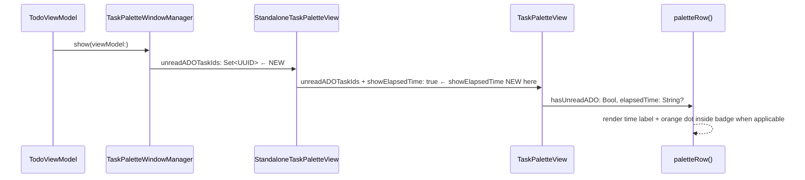

# Task Switcher — Elapsed Time + Unread ADO Comment Indicator

## Overview
Two improvements to the standalone task switcher panel (opened via keyboard shortcut / `TaskPaletteWindowManager`):

1. **Elapsed time** — show each task's running time next to its name, identical to the floating window's popover switcher which already has `showElapsedTime: true`. The standalone panel currently passes nothing, so time is never shown.
2. **Unread ADO dot** — when a task has an unread ADO comment, show the same orange dot that appears on the ADO chip in the main task list, giving a quick visual cue of pending activity.

## UI / Flow

### Before (current standalone panel)
```
┌─────────────────────────────────────────────────────┐
│  ▶  Test user story 1                       [ADO]   │
│     Some task                                        │
│     Another one                                      │
└─────────────────────────────────────────────────────┘
       No time. No unread dot.
```

### After — elapsed time + unread dot (dot inside the ADO badge with spacing)
```
┌─────────────────────────────────────────────────────┐
│  ▶  Test user story 1          0:28  ┌─────────┐    │
│                                      │ ADO  ●  │    │
│     Some task                  1:14  └─────────┘    │
│     Another one                0:05  ┌─────┐        │
│                                      │ ADO │        │
│                                      └─────┘        │
└─────────────────────────────────────────────────────┘
       ● = 6×6 Color.orange circle rendered inline
           inside the badge HStack as a sibling to ADO Text
           with spacing: 4 on each side of the dot
           (HStack(spacing: 4) { Text("ADO"); Circle(); })
```

### Row with no ADO link (no badge, no dot)
```
┌─────────────────────────────────────────────────────┐
│     Some task                  1:14                  │
└─────────────────────────────────────────────────────┘
```

## Architecture



### Change surface
| File | Change |
|------|--------|
| `FloatingTaskWindowView.swift` — `TaskPaletteView` struct | Add `unreadADOTaskIds: Set<UUID>` param (default `[]`); pass `hasUnreadADO` to `paletteRow` |
| `FloatingTaskWindowView.swift` — `paletteRow()` | Add `hasUnreadADO: Bool = false`; replace the `Text("ADO")` badge with an `HStack(spacing: 4)` containing `Text("ADO")` + `Circle().fill(.orange).frame(width:6,height:6)` when `hasUnreadADO` |
| `FloatingTaskWindowView.swift` call site (~L236) | Pass `viewModel.unreadADOTaskIds` (popover already has `showElapsedTime: true`) |
| `TaskPalettePanel.swift` call site (~L116) | Pass `viewModel.unreadADOTaskIds` |
| `TaskPaletteWindowManager.swift` — `StandaloneTaskPaletteView` | Add `unreadADOTaskIds: Set<UUID>`; pass it + `showElapsedTime: true` to `TaskPaletteView` |
| `TaskPaletteWindowManager.swift` — `_showPanel` | Pass `viewModel.unreadADOTaskIds` when constructing `StandaloneTaskPaletteView` |

No model changes needed — `unreadADOTaskIds: Set<UUID>` already exists on `TodoViewModel`.

## Open Questions
_(none)_

## Implementation Phases

### Phase 1 — Add `unreadADOTaskIds` parameter to `TaskPaletteView`
**What it covers:** Wire the unread set into the view so downstream render logic can use it.

**Tests (Red) — write these first:**
```swift
// TaskPaletteViewUnreadTests.swift  (new file in TimeControlTests)
import XCTest
@testable import TimeControl

// TaskPaletteView is a SwiftUI view — we test its data-shaping logic
// by verifying that the unreadADOTaskIds parameter is accepted with a
// default of [] and that paletteRow receives the correct hasUnreadADO value.
// We expose this via a lightweight view-model extraction helper.

@MainActor
final class TaskPaletteViewUnreadTests: XCTestCase {

    func test_hasUnreadADO_trueWhenTaskIdInUnreadSet() {
        let task = makeTodo(text: "Story", adoWorkItemId: "42")
        let unread: Set<UUID> = [task.id]
        // hasUnreadADO is computed inline in TaskPaletteView.body's ForEach:
        //   unreadADOTaskIds.contains(task.id)
        XCTAssertTrue(unread.contains(task.id))
    }

    func test_hasUnreadADO_falseWhenTaskIdNotInUnreadSet() {
        let task = makeTodo(text: "Story", adoWorkItemId: "42")
        let unread: Set<UUID> = []
        XCTAssertFalse(unread.contains(task.id))
    }

    func test_hasUnreadADO_falseWhenNoADOLink() {
        let task = makeTodo(text: "No ADO")   // adoWorkItemId = nil
        let unread: Set<UUID> = [task.id]
        // Even if ID is in the set, isADO gate must be false
        XCTAssertNil(task.adoWorkItemId)
    }

    func test_defaultUnreadSet_isEmpty() {
        // Verify that a TaskPaletteView constructed without unreadADOTaskIds
        // compiles and treats all tasks as having no unread dot.
        // (Compile-time check — if the default is missing this test won't build.)
        let (vm, _, _) = makeViewModel()
        let task = makeTodo(text: "T", adoWorkItemId: "1")
        vm.todos = [task]
        // Default initialiser must not require unreadADOTaskIds
        _ = TaskPaletteView(
            tasks: [task],
            searchText: .constant(""),
            selectedIndex: .constant(0),
            currentTaskId: task.id,
            onSelect: { _ in },
            onCreate: { _ in },
            onDismiss: {}
        )
    }
}
```

**Production code (Green):**
```swift
// In FloatingTaskWindowView.swift — TaskPaletteView struct
// Add one property with a default:

var unreadADOTaskIds: Set<UUID> = []

// In the ForEach inside body, pass it to paletteRow:
paletteRow(
    label: task.text,
    isSelected: selectedIndex == index,
    isCurrent: task.id == currentTaskId,
    isADO: task.adoWorkItemId != nil,
    isCreate: false,
    elapsedTime: showElapsedTime ? TaskPaletteElapsedTime.label(task: task) : nil,
    hasUnreadADO: unreadADOTaskIds.contains(task.id)   // ← ADD
) {
    onSelect(task)
}
```

**Done when:** `TaskPaletteView` compiles with and without `unreadADOTaskIds`; passing a set containing a task's ID results in `hasUnreadADO: true` for that row.

---

### Phase 2 — Render the orange dot inside the ADO badge in `paletteRow`
**What it covers:** The visual change — dot appears inline inside the badge when `hasUnreadADO` is true.

**Tests (Red) — write these first:**
```swift
// Append to TaskPaletteViewUnreadTests.swift

    func test_paletteRowBadgeLabel_noUnread_isADO() {
        // When hasUnreadADO is false, badge text is "ADO" (no extra space)
        let label = PaletteRowBadgeHelper.badgeLabel(hasUnreadADO: false)
        XCTAssertEqual(label, "ADO")
    }

    func test_paletteRowBadgeLabel_withUnread_hasExtraSpace() {
        // When hasUnreadADO is true, badge text is " ADO " (1 space each side)
        let label = PaletteRowBadgeHelper.badgeLabel(hasUnreadADO: true)
        XCTAssertEqual(label, " ADO ")
    }
```

```swift
// Also add this helper in FloatingTaskWindowView.swift (internal, testable):
// Extracted so the label logic is unit-testable without instantiating a View.

enum PaletteRowBadgeHelper {
    static func badgeLabel(hasUnreadADO: Bool) -> String {
        hasUnreadADO ? " ADO " : "ADO"
    }
}
```

**Production code (Green):**
```swift
// In FloatingTaskWindowView.swift — paletteRow() signature, add parameter:
private func paletteRow(
    label: String,
    isSelected: Bool,
    isCurrent: Bool,
    isADO: Bool,
    isCreate: Bool,
    elapsedTime: String? = nil,
    hasUnreadADO: Bool = false,      // ← ADD
    action: @escaping () -> Void
) -> some View {

// Replace the existing ADO badge block:
//   BEFORE:
//   if isADO {
//       Text("ADO")
//           .font(.caption2).bold()
//           .foregroundColor(.blue)
//           .padding(.horizontal, 6)
//           .padding(.vertical, 3)
//           .background(Color.blue.opacity(0.14))
//           .cornerRadius(6)
//   }

//   AFTER:
    if isADO {
        HStack(spacing: 4) {
            Text(PaletteRowBadgeHelper.badgeLabel(hasUnreadADO: hasUnreadADO))
                .font(.caption2).bold()
                .foregroundColor(.blue)
            if hasUnreadADO {
                Circle()
                    .fill(Color.orange)
                    .frame(width: 6, height: 6)
            }
        }
        .padding(.horizontal, 6)
        .padding(.vertical, 3)
        .background(Color.blue.opacity(0.14))
        .cornerRadius(6)
    }
```

**Done when:** A palette row with `isADO: true, hasUnreadADO: true` renders `" ADO "` text with an orange dot; `hasUnreadADO: false` renders `"ADO"` with no dot.

---

### Phase 3 — Thread `unreadADOTaskIds` through `TaskPaletteWindowManager`
**What it covers:** The standalone panel opened via keyboard shortcut picks up the unread set at show-time and `StandaloneTaskPaletteView` forwards it.

**Tests (Red) — write these first:**
```swift
// Append to TaskPaletteWindowManagerTests.swift

    func test_standaloneView_forwardsUnreadADOTaskIds() {
        // StandaloneTaskPaletteView must accept unreadADOTaskIds and pass it
        // to TaskPaletteView. Verified by constructing it — compile failure
        // means the parameter is missing.
        let task = makeTodo(text: "T", adoWorkItemId: "7")
        let unread: Set<UUID> = [task.id]
        _ = StandaloneTaskPaletteViewTestWrapper(
            tasks: [task],
            currentTaskId: task.id,
            unreadADOTaskIds: unread,
            onSelect: { _ in },
            onCreate: { _ in },
            onDismiss: {}
        )
    }

    func test_showPanel_passesUnreadADOTaskIdsFromViewModel() {
        let (vm, _, _) = makeViewModel()
        let task = makeTodo(text: "T", adoWorkItemId: "5")
        vm.todos = [task]
        vm.unreadADOTaskIds = [task.id]
        // show() must not crash when unreadADOTaskIds is non-empty
        let manager = TaskPaletteWindowManager()
        XCTAssertNoThrow(manager.show(viewModel: vm))
        manager.dismiss()
    }
```

**Production code (Green):**
```swift
// In TaskPaletteWindowManager.swift — StandaloneTaskPaletteView, add property:
private struct StandaloneTaskPaletteView: View {
    let tasks: [TodoItem]
    let currentTaskId: UUID
    let unreadADOTaskIds: Set<UUID>        // ← ADD
    let onSelect: (TodoItem) -> Void
    let onCreate: (String) -> Void
    let onDismiss: () -> Void

    @State private var searchText: String = ""
    @State private var selectedIndex: Int = 0

    var body: some View {
        TaskPaletteView(
            tasks: tasks,
            searchText: $searchText,
            selectedIndex: $selectedIndex,
            currentTaskId: currentTaskId,
            showElapsedTime: true,             // ← ADD (was missing)
            unreadADOTaskIds: unreadADOTaskIds, // ← ADD
            onSelect: onSelect,
            onCreate: onCreate,
            onDismiss: onDismiss
        )
        .background(
            RoundedRectangle(cornerRadius: 12, style: .continuous)
                .fill(Color(NSColor.windowBackgroundColor))
                .shadow(color: .black.opacity(0.25), radius: 16, x: 0, y: 6)
        )
        .clipShape(RoundedRectangle(cornerRadius: 12, style: .continuous))
        .padding(1)
    }
}

// In _showPanel, pass unreadADOTaskIds when constructing StandaloneTaskPaletteView:
let paletteView = StandaloneTaskPaletteView(
    tasks: tasks,
    currentTaskId: currentTaskId,
    unreadADOTaskIds: viewModel.unreadADOTaskIds,   // ← ADD
    onSelect: { [weak self] task in ... },
    onCreate: { [weak self] text in ... },
    onDismiss: { [weak self] in ... }
)
```

**Done when:** The standalone panel compiles; `show(viewModel:)` passes `viewModel.unreadADOTaskIds` into the view; tests pass.

---

### Phase 4 — Thread `unreadADOTaskIds` through remaining call sites
**What it covers:** The floating window popover and `TaskPalettePanel` call sites pass the unread set so all three entry points are consistent.

**Tests (Red) — write these first:**
```swift
// Append to TaskPalettePanelTests.swift

    func test_palettePanelContent_passesUnreadADOTaskIds() {
        // TaskPalettePanelContent observes viewModel — when unreadADOTaskIds
        // is set on the vm it must be forwarded to TaskPaletteView.
        // Verified structurally: if the call site omits the param, compile fails.
        let (vm, _, _) = makeViewModel()
        let task = makeTodo(text: "T", adoWorkItemId: "3")
        vm.todos = [task]
        vm.unreadADOTaskIds = [task.id]
        let manager = TaskPalettePanelManager()
        // show() uses TaskPalettePanelContent which must forward unreadADOTaskIds
        XCTAssertNoThrow(manager.show(viewModel: vm))
        manager.dismiss()
    }
```

**Production code (Green):**
```swift
// In TaskPalettePanel.swift — TaskPalettePanelContent.body,
// update the TaskPaletteView initialiser:
TaskPaletteView(
    tasks: tasks,
    searchText: $searchText,
    selectedIndex: $selectedIndex,
    currentTaskId: currentTaskId,
    showElapsedTime: true,
    unreadADOTaskIds: viewModel.unreadADOTaskIds,   // ← ADD
    onSelect: { task in ... },
    onCreate: { title in ... },
    onDismiss: onDismiss
)

// In FloatingTaskWindowView.swift — taskSwitcherButton popover call site (~L236),
// update the TaskPaletteView initialiser:
TaskPaletteView(
    tasks: availableTasks,
    searchText: $paletteSearch,
    selectedIndex: $paletteSelectedIndex,
    currentTaskId: localTask.id,
    unreadADOTaskIds: viewModel.unreadADOTaskIds,   // ← ADD
    onSelect: { selectedTask in ... },
    onCreate: { title in ... },
    onDismiss: { showTaskPalette = false }
)
```

**Done when:** All three call sites compile; `viewModel.unreadADOTaskIds` flows into every `TaskPaletteView` instantiation; all existing palette tests still pass.

---

## Feature Acceptance Checklist

- [ ] Opening the standalone task switcher panel shows elapsed time for tasks that have been run
- [ ] A task with an unread ADO comment shows an orange dot inside the ADO badge in the switcher
- [ ] A task without an unread ADO comment shows the ADO badge with no dot
- [ ] A task with no ADO link shows neither badge nor dot
- [ ] Triggering "Refresh ADO comments" in the main window while the panel is open updates the dot live (appears/disappears without closing the panel)
- [ ] The floating window's task switcher popover also shows the dot correctly
- [ ] All existing palette and panel tests pass with no regressions

## High-Level Steps

1. Add `unreadADOTaskIds: Set<UUID>` parameter to `TaskPaletteView` (default `[]`)
2. Add `hasUnreadADO: Bool` parameter to `paletteRow()` and update the ADO badge to render the orange dot inline
3. Update the `ForEach` call site inside `TaskPaletteView.body` to pass `hasUnreadADO` per task
4. Update `StandaloneTaskPaletteView` in `TaskPaletteWindowManager.swift` to accept and forward `unreadADOTaskIds` and `showElapsedTime: true`
5. Update `_showPanel` in `TaskPaletteWindowManager` to pass `viewModel.unreadADOTaskIds` when constructing `StandaloneTaskPaletteView`
6. Update the floating window popover call site in `FloatingTaskWindowView.swift` to pass `viewModel.unreadADOTaskIds`
7. Update the `TaskPalettePanel` call site to pass `viewModel.unreadADOTaskIds`
